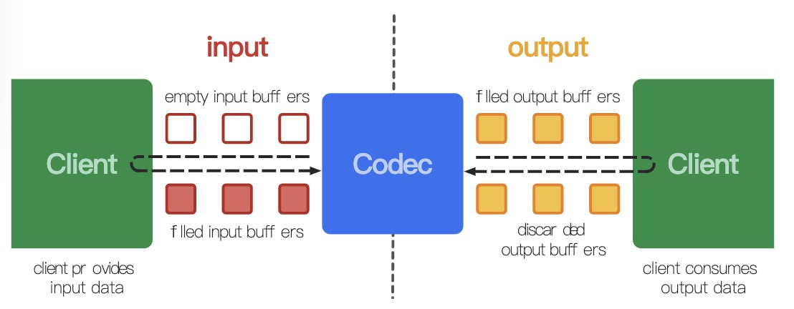
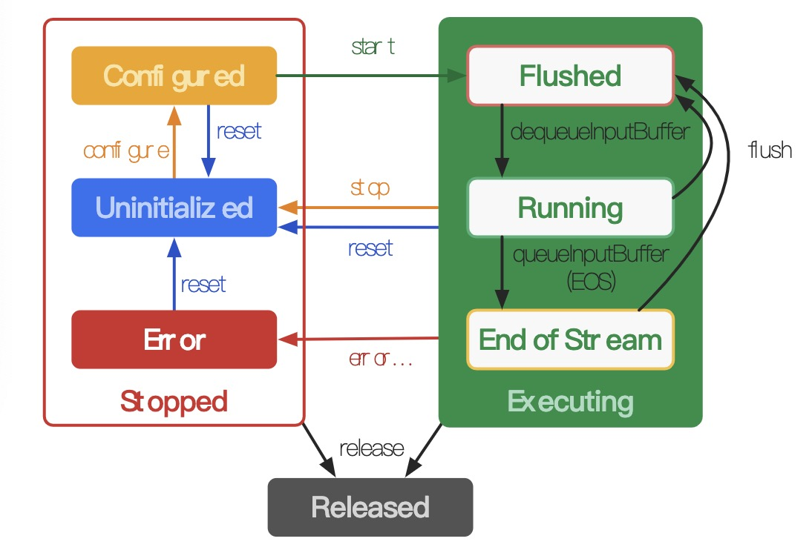

# MediaCodec学习记录

官方API：https://developer.android.google.cn/reference/android/media/MediaCodec

供参考的中文翻译：https://www.jianshu.com/p/06dfc5cf95a2

## MediaCodec 介绍

MediaCodec是一个Codec，通过硬件加速解码和编码。它为芯片厂商和应用开发者搭建了一个统一接口。

一个编解码器可以处理输入的数据来产生输出的数据，编解码器使用一组输入和输出缓冲器来异步处理数据。你可以创建一个空的输入缓冲区，填充数据后发送到编解码器进行处理。编解码器使用输入的数据进行转换，然后输出到一个空的输出缓冲区。最后你获取到输出缓冲区的数据，消耗掉里面的数据，释放回编解码器。

MediaCodec采用异步方式处理数据，并且使用了一组输入输出buffer（ByteBuffer）。

1. 使用者从MediaCodec请求一个空的输入buffer（ByteBuffer），填充满数据后将它传递给MediaCodec处理。
2. MediaCodec处理完这些数据并将处理结果输出至一个空的输出buffer（ByteBuffer）中。
3. 使用者从MediaCodec获取输出buffer的数据，消耗掉里面的数据，使用完输出buffer的数据之后，将其释放回编解码器。



## 编解码器支持的数据类型：

codec 处理3种类型的数据， compressed data （待解码的数据 或 编码后的数据）、raw audio data （待编码或解码后的数据）和 raw video data （待编码或解码后的数据）。

**注意：**

- 数据通过`ByteBuffers`类来表示。还可以用 `Surface` 来处理  raw video data 来提高性能。
- 可以设置`Surface`来获取/呈现原始的视频数据，因为 `Surface` 可以直接使用 native video buffers （在 native 层分配的 buffer）而不需要映射或拷贝到 `ByteBuffers` （ByteBuffers 是分配在 JVM 堆中的缓冲区） 中。
- 通常在使用`Surface`的时候，无法访问原始的视频数据，但是可以使用`ImageReader`访问解码后的原始视频帧。在使用ByteBuffer的模式下，可以使用`Image`类和`getInput/OutputImage(int)`获取原始视频帧。

### 压缩数据

- `MediaFormat#KEY_MIME`格式类型。
- 对于视频类型，通常是一个单独的压缩视频帧。
- 对于音频数据，通常是一个单独的访问单元(一个编码的音频段通常包含由格式类型决定的几毫秒的音频)，但是这个要求稍微宽松一些，因为一个buffer可能包含多个编码的音频访问单元。
- 在这两种情况下，buffer都不会在任意字节边界上开始或结束，而是在帧/访问单元边界上开始或结束，除非它们被`BUFFER_FLAG_PARTIAL_FRAME`标记。

### 原始音频buffer

原始音频buffer包含PCM音频数据的整个帧，这是每个通道按通道顺序的一个样本。每个样本都是一个 `AudioFormat#ENCODING_PCM_16BIT`。

### 原始视频buffer

在ByteBuffer模式下，视频buffer根据它们的`MediaFormat#KEY_COLOR_FORMAT`进行布局。可以从`getCodecInfo().` `MediaCodecInfo.getCapabilitiesForType.CodecCapability.colorFormats`获取支持的颜色格式。视频编解码器可以支持三种颜色格式:

- **native raw video format**: `CodecCapabilities.COLOR_FormatSurface`，可以与输入/输出的Surface一起使用。
- **flexible YUV buffers** 例如`CodecCapabilities.COLOR_FormatYUV420Flexible`， 可以使用`getInput/OutputImage(int)`与输入/输出`一起使用，也可以在ByteBuffer模式下使用。
- **other, specific formats:** 通常只支持`ByteBuffer`模式。有些颜色格式是厂商特有的，其他定义在`CodecCapabilities`。对于等价于flexible格式的颜色格式，可以使用`getInput/OutputImage(int)`。

从`Build.VERSION_CODES.LOLLIPOP_MR1.`开始，所有视频编解码器都支持flexible的YUV 4:2:0 buffer。

## MediaCodec的生命周期

MediaCodec的生命周期有三种状态：Stopped、Executing、Released。

- Stopped，包含三种子状态：Uninitialized、Configured、Error。
- Executing，包含三种子状态：Flushed、Running、End-of-Stream。



**Stopped**的三种子状态：

1. Uninitialized：当创建了一个MediaCodec对象，此时处于Uninitialized状态。可以在任何状态调用reset()方法使MediaCodec返回到Uninitialized状态。
2. Configured：使用configure(…)方法对MediaCodec进行配置转为Configured状态。
3. Error：MediaCodec遇到错误时进入Error状态。错误可能是在队列操作时返回的错误或者异常导致的。

**Executing**的三种子状态：

1. Flushed：在调用start()方法后MediaCodec立即进入Flushed子状态，此时MediaCodec会拥有所有的缓存。可以在Executing状态的任何时候通过调用flush()方法返回到Flushed子状态。
2. Running：一旦第一个输入缓存（input buffer）被移出队列，MediaCodec就转入Running子状态，这种状态占据了MediaCodec的大部分生命周期。通过调用stop()方法转移到Uninitialized状态。
3. End-of-Stream：将一个带有end-of-stream标记的输入buffer入队列时，MediaCodec将转入End-of-Stream子状态。在这种状态下，MediaCodec不再接收之后的输入buffer，但它仍然产生输出buffer直到end-of-stream标记输出。

**Released**

1. 当使用完MediaCodec后，必须调用release()方法释放其资源。调用 release()方法进入最终的Released状态。

### asynchronous mode

```java
 MediaCodec codec = MediaCodec.createByCodecName(name); //创建编解码器
 MediaFormat mOutputFormat; // member variable
 codec.setCallback(new MediaCodec.Callback() {//设置callback，使用异步模式完成
  @Override
  void onInputBufferAvailable(MediaCodec mc, int inputBufferId) {//可以开始入队
    ByteBuffer inputBuffer = codec.getInputBuffer(inputBufferId);
    // fill inputBuffer with valid data
    …
    codec.queueInputBuffer(inputBufferId, …);
  }
 
  @Override
  void onOutputBufferAvailable(MediaCodec mc, int outputBufferId, …) {//开始出队
    ByteBuffer outputBuffer = codec.getOutputBuffer(outputBufferId);
    MediaFormat bufferFormat = codec.getOutputFormat(outputBufferId); // option A
    // bufferFormat is equivalent to mOutputFormat
    // outputBuffer is ready to be processed or rendered.
    …
    codec.releaseOutputBuffer(outputBufferId, …);
  }
 
  @Override
  void onOutputFormatChanged(MediaCodec mc, MediaFormat format) {//输出格式发生变化
    // Subsequent data will conform to new format.
    // Can ignore if using getOutputFormat(outputBufferId)
    mOutputFormat = format; // option B
  }
 
  @Override
  void onError(…) {//出现异常
    …
  }
 });
 codec.configure(format, …);//配置格式
 mOutputFormat = codec.getOutputFormat(); // option B
 codec.start();//启动
 // wait for processing to complete
 codec.stop();//停止
 codec.release();//清空
```

### Synchronous mode

```java
MediaCodec codec = MediaCodec.createByCodecName(name);//创建编解码器
 codec.configure(format, …);//配置
 MediaFormat outputFormat = codec.getOutputFormat(); // option B
 codec.start();//启动
 for (;;) {
  int inputBufferId = codec.dequeueInputBuffer(timeoutUs);//从输入队列中取出一个ByteBuffer，并插入原始数据
  if (inputBufferId >= 0) {
    ByteBuffer inputBuffer = codec.getInputBuffer(…);
    // fill inputBuffer with valid data
    …
    codec.queueInputBuffer(inputBufferId, …);
  }
  int outputBufferId = codec.dequeueOutputBuffer(…);//从输出队列中取出一个ByteBuffer，获取编解码后的数据
  if (outputBufferId >= 0) {
    ByteBuffer outputBuffer = codec.getOutputBuffer(outputBufferId);
    MediaFormat bufferFormat = codec.getOutputFormat(outputBufferId); // option A
    // bufferFormat is identical to outputFormat
    // outputBuffer is ready to be processed or rendered.
    …
    codec.releaseOutputBuffer(outputBufferId, …);
  } else if (outputBufferId == MediaCodec.INFO_OUTPUT_FORMAT_CHANGED) {
    // Subsequent data will conform to new format.
    // Can ignore if using getOutputFormat(outputBufferId)
    outputFormat = codec.getOutputFormat(); // option B
  }
 }
 codec.stop();
 codec.release();
```

## MediaCodec API简介

### `MediaCodec`创建：

- `createDecoderByType`/createEncoderByType：根据特定MIME类型(如"video/avc")创建codec。
- `createByCodecName`：知道组件的确切名称(如OMX.google.mp3.decoder)的时候，根据组件名创建codec。使用`MediaCodecList`可以获取组件的名称。

### buffer处理的接口：

- `dequeueInputBuffer`：从输入流队列中取数据进行编码操作。
- `queueInputBuffer`：输入流入队列。
- `dequeueOutputBuffer`：从输出队列中取出编码操作之后的数据。
- `releaseOutputBuffer`：处理完成，释放ByteBuffer数据。
- `getInputBuffers`：获取需要编码数据的输入流队列，返回的是一个ByteBuffer数组。
- `getOutputBuffers`：获取编解码之后的数据输出流队列，返回的是一个ByteBuffer数组。

### `MediaCodec`控制接口

- `configure`：配置解码器或者编码器。
- `start`：成功配置组件后调用start。
- `flush`：清空的输入和输出端口。
- `stop`：终止decode/encode会话
- `release`：释放编解码器实例使用的资源。

## MediaCodec 流控

一般编码器都可以设置一个目标码率，但编码器的实际输出码率不会完全符合设置，因为在编码过程中实际可以控制的并不是最终输出的码率，而是编码过程中的一个量化参数（Quantization Parameter，QP），它和码率并没有固定的关系，而是取决于图像内容。

MediaCodec 流控相关的接口并不多，一是配置时设置目标码率和码率控制模式，二是动态调整目标码率(Android 19 版本以上)。

配置时指定目标码率和码率控制模式：

```java
mediaFormat.setInteger(MediaFormat.KEY_BIT_RATE, bitRate);
mediaFormat.setInteger(MediaFormat.KEY_BITRATE_MODE,
MediaCodecInfo.EncoderCapabilities.BITRATE_MODE_VBR);
mVideoCodec.configure(mediaFormat, null, null, MediaCodec.CONFIGURE_FLAG_ENCODE);
```

码率控制模式有三种：

- CQ  表示完全不控制码率，尽最大可能保证图像质量；
- CBR 表示编码器会尽量把输出码率控制为设定值，即我们前面提到的“不为所动”；
- VBR 表示编码器会根据图像内容的复杂度（实际上是帧间变化量的大小）来动态调整输出码率，图像复杂则码率高，图像简单则码率低；

动态调整目标码率：

```java
Bundle param = new Bundle();
param.putInt(MediaCodec.PARAMETER_KEY_VIDEO_BITRATE, bitrate);
mediaCodec.setParameters(param);
```

 Android 流控策略选择:

- 质量要求高、不在乎带宽、解码器支持码率剧烈波动的情况下，可以选择 CQ 码率控制策略。
- VBR 输出码率会在一定范围内波动，对于小幅晃动，方块效应会有所改善，但对剧烈晃动仍无能为力；连续调低码率则会导致码率急剧下降，如果无法接受这个问题，那 VBR 就不是好的选择。
- CBR 的优点是稳定可控，这样对实时性的保证有帮助。所以 WebRTC 开发中一般使用的是CBR。

## 参考链接：

https://www.jianshu.com/p/d9bd92fca0c6

https://www.jianshu.com/p/06dfc5cf95a2

https://developer.android.google.cn/reference/android/media/MediaCodec