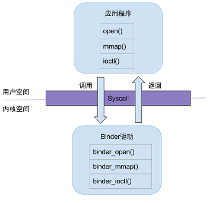

# Binder通讯原理

*基于Android 11的源码剖析，笔记记录binder通讯原理的实现过程*；

根据网络上的各路大神案例，都是从典型的mediaserver进程开始分析，binder服务的注册注册过程；

mediaserver进程启动的main函数开始分析，至于init.rc的注册启动进程就跳过了；main函数代码如下：

```c
int main(int argc __unused, char **argv __unused)
{
    signal(SIGPIPE, SIG_IGN);

    //创建与binder驱动交互和binder线程池的管理者
    sp<ProcessState> proc(ProcessState::self());
    //获取ServiceManager的客户端BpServiceManager
    sp<IServiceManager> sm(defaultServiceManager());
    ALOGI("ServiceManager: %p", sm.get());
    //创建MediaPlayerService服务，和向ServiceManager注册服务
    MediaPlayerService::instantiate();
    ResourceManagerService::instantiate();
    registerExtensions();
    ::android::hardware::configureRpcThreadpool(16, false);
    //启动binder线程池
    ProcessState::self()->startThreadPool();
    IPCThreadState::self()->joinThreadPool();
    ::android::hardware::joinRpcThreadpool();
}
```

## Binder线程池的注册

每个采用 Binder 的进程会有一个或多个用于处理接收数据的线程，位于 Binder 线程池。采用 Binder 机制的进程最典型的就是应用程序进程了。那应用程序进程的 Binder 线程池是在什么时候启动的呢？

### `ProcessState`

源码位置：frameworks/native/libs/binder/ProcessState.cpp

**`ProcessState` 是 Binder 机制核心之一**，它是 Binder 通信的基础，负责与 Binder 驱动的交互与 Binder 线程池的管理。它实现了单例模式，通过 `self()` 函数获取实例，每个进程仅有一个。

#### `ProcessState`创建

实现了单例模式，通过 `self()` 函数获取实例。来看看它的构造函数，如下：

```c
ProcessState::ProcessState(const char *driver)
    : mDriverName(String8(driver))
    , mDriverFD(open_driver(driver))//访问binder设备，并与binder驱动交互
    , mVMStart(MAP_FAILED)
    , mThreadCountLock(PTHREAD_MUTEX_INITIALIZER)
    , mThreadCountDecrement(PTHREAD_COND_INITIALIZER)
    , mExecutingThreadsCount(0)
    , mMaxThreads(DEFAULT_MAX_BINDER_THREADS)
    , mStarvationStartTimeMs(0)
    , mBinderContextCheckFunc(nullptr)
    , mBinderContextUserData(nullptr)
    , mThreadPoolStarted(false)
    , mThreadPoolSeq(1)
    , mCallRestriction(CallRestriction::NONE)
{

// TODO(b/139016109): enforce in build system
#if defined(__ANDROID_APEX__)
    LOG_ALWAYS_FATAL("Cannot use libbinder in APEX (only system.img libbinder) since it is not stable.");
#endif

    if (mDriverFD >= 0) {
        //映射binder驱动，提供通讯的虚拟空间
        // mmap the binder, providing a chunk of virtual address space to receive transactions.
        mVMStart = mmap(nullptr, BINDER_VM_SIZE, PROT_READ, MAP_PRIVATE | MAP_NORESERVE, mDriverFD, 0);
        if (mVMStart == MAP_FAILED) {
            // *sigh*
            ALOGE("Using %s failed: unable to mmap transaction memory.\n", mDriverName.c_str());
            close(mDriverFD);
            mDriverFD = -1;
            mDriverName.clear();
        }
    }

#ifdef __ANDROID__
    LOG_ALWAYS_FATAL_IF(mDriverFD < 0, "Binder driver '%s' could not be opened.  Terminating.", driver);
#endif
}
```

ProcessState创建是主要步骤是：

1. 访问binder设备，并与binder驱动交互；
2. 映射binder驱动，提供通讯基础的虚拟空间；

**其中提供通讯基础的虚拟空间默认大小是由`BINDER_VM_SIZE`这个宏来决定的，宏定义如下：**

```c
//binder分配的默认内存大小为1M-8k
#define BINDER_VM_SIZE ((1 * 1024 * 1024) - sysconf(_SC_PAGE_SIZE) * 2)
```

下面来主要看看`open_driver`函数，函数内容如下：

```c
static int open_driver(const char *driver)
{
    int fd = open(driver, O_RDWR | O_CLOEXEC);//访问binder设备
    if (fd >= 0) {
        int vers = 0;
        status_t result = ioctl(fd, BINDER_VERSION, &vers);//进行版本比对
        if (result == -1) {
            ALOGE("Binder ioctl to obtain version failed: %s", strerror(errno));
            close(fd);
            fd = -1;
        }
        if (result != 0 || vers != BINDER_CURRENT_PROTOCOL_VERSION) {
          ALOGE("Binder driver protocol(%d) does not match user space protocol(%d)! ioctl() return value: %d",
                vers, BINDER_CURRENT_PROTOCOL_VERSION, result);
            close(fd);
            fd = -1;
        }
        size_t maxThreads = DEFAULT_MAX_BINDER_THREADS;
        result = ioctl(fd, BINDER_SET_MAX_THREADS, &maxThreads);//设置binder线程池最大线程数
        if (result == -1) {
            ALOGE("Binder ioctl to set max threads failed: %s", strerror(errno));
        }
    } else {
        ALOGW("Opening '%s' failed: %s\n", driver, strerror(errno));
    }
    return fd;
}
```

在`open_driver`函数中主要处理：

1. 访问binder设备，通过open函数来实现，具体现在不做详细说明；

2. 通过ioctl进行binder的版本比较

3. 通知binder驱动binder线程池的默认最大线程数，而这个最大线程数由`DEFAULT_MAX_BINDER_THREADS`宏来决定；宏定义如下：

   ```c
   //默认binder线程池的最大线程数,那加上本身binder默认的最大可并发访问的线程数为16
   #define DEFAULT_MAX_BINDER_THREADS 15
   ```

#### 启动binder线程池

`ProcessState` 实例后调用其 `startThreadPool` 函数，以启动进程的 Binder 线程池。

```c
void ProcessState::startThreadPool()
{
    AutoMutex _l(mLock);
    if (!mThreadPoolStarted) {
        mThreadPoolStarted = true;
        spawnPooledThread(true);
    }
}
void ProcessState::spawnPooledThread(bool isMain)
{
    if (mThreadPoolStarted) {
        String8 name = makeBinderThreadName();
        ALOGV("Spawning new pooled thread, name=%s\n", name.string());
        sp<Thread> t = new PoolThread(isMain);//创建线程
        t->run(name.string());//启动线程
    }
}
```

`mThreadPoolStarted` 用于标识线程池是否已经启动过，以确保 Binder 线程池仅初始化一次。`spawnPooledThread()` 函数启动了一个 Binder 线程，类型为 `PoolThread`，函数参数表示这是 Binder 线程池中的第一线程。

```c
class PoolThread : public Thread
{
public:
    explicit PoolThread(bool isMain)
        : mIsMain(isMain)
    {
    }

protected:
  //PoolThread继承Thread类。t->run()方法最终调用内部类 PoolThread的threadLoop()方法。
    virtual bool threadLoop()
    {
        IPCThreadState::self()->joinThreadPool(mIsMain);
        return false;
    }

    const bool mIsMain;
};
```

`PoolThread`继承`Thread`类。`t->run()`方法最终调用内部类 `PoolThread`的`threadLoop`()方法。在主要创建了`IPCThreadState`和执行了`IPCThreadState`的`joinThreadPool`函数；

在mediaserver的main函数中后面又执行了一次`IPCThreadState`的`joinThreadPool`函数，这两次的区别是一个在子线程执行，一个是在进程主线程执行，**mediaserver默认binder的事件监听线程数是2吗？**这样binder线程池算基本完成！

### `IPCThreadState`

源码位置：frameworks/native/libs/binder/IPCThreadState.cpp

`IPCThreadState` 同样是 Binder 机制的核心之一，它用于管理与 Binder 通信相关线程的状态，每个 Binder 线程都会通过此将自己注册到 Binder 驱动。一个具有多个线程的进程里应该会有多个IPCThreadState对象了，只不过每个线程只需一个IPCThreadState对象而已。所以要放在binder线程池中统一管理。

#### `IPCThreadState`创建

`IPCThreadState`同样是通过 `self()` 函数获取实例的。

```c
IPCThreadState* IPCThreadState::self()
{
    if (gHaveTLS.load(std::memory_order_acquire)) {
restart:
        const pthread_key_t k = gTLS;
        //获取当前线程是否创建了IPCThreadState，如果创建了直接返回,类似Looper里的ThreadLocal
        IPCThreadState* st = (IPCThreadState*)pthread_getspecific(k);
        if (st) return st;
        return new IPCThreadState;
    }

    // Racey, heuristic test for simultaneous shutdown.
    if (gShutdown.load(std::memory_order_relaxed)) {
        ALOGW("Calling IPCThreadState::self() during shutdown is dangerous, expect a crash.\n");
        return nullptr;
    }

    pthread_mutex_lock(&gTLSMutex);
    if (!gHaveTLS.load(std::memory_order_relaxed)) {
        //创建线程唯一的标签
        int key_create_value = pthread_key_create(&gTLS, threadDestructor);
        if (key_create_value != 0) {
            pthread_mutex_unlock(&gTLSMutex);
            ALOGW("IPCThreadState::self() unable to create TLS key, expect a crash: %s\n",
                    strerror(key_create_value));
            return nullptr;
        }
        gHaveTLS.store(true, std::memory_order_release);
    }
    pthread_mutex_unlock(&gTLSMutex);
    goto restart;//回到开始根据线程唯一标记创建IPCThreadState
}
```

`self()` 函数是一个工厂函数，用于获取 `IPCThreadState` 实例。`self()` 根据 `pthread_getspecific()` 管理每个参与 Binder 通信线程的实例，类似`Looper`里的`ThreadLocal`，每个参与 Binder 通信的线程其 `IPCThreadState` 对象都是相互独立的，保证了后续操作的线程安全。构造函数内容其实，很简单主要是绑定线程唯一标记和初始化输入输出缓冲区；

```c
IPCThreadState::IPCThreadState()
    : mProcess(ProcessState::self()),
      mServingStackPointer(nullptr),
      mWorkSource(kUnsetWorkSource),
      mPropagateWorkSource(false),
      mStrictModePolicy(0),
      mLastTransactionBinderFlags(0),
      mCallRestriction(mProcess->mCallRestriction)
{
    //将线程唯一标签保存的内容设置为自身
    pthread_setspecific(gTLS, this);
    //获取当前进程的pid和uid信息
    clearCaller();
    //设置输入缓冲区大小，默认256
    mIn.setDataCapacity(256);
    //设置输出缓冲区大小，默认256
    mOut.setDataCapacity(256);
}
```

#### `IPCThreadState::joinThreadPool`函数

`joinThreadPool`函数就是一个死循环，不断从驱动获取数据;

```c
void IPCThreadState::joinThreadPool(bool isMain)
{
    LOG_THREADPOOL("**** THREAD %p (PID %d) IS JOINING THE THREAD POOL\n", (void*)pthread_self(), getpid());

    mOut.writeInt32(isMain ? BC_ENTER_LOOPER : BC_REGISTER_LOOPER);

    status_t result;
    do {
        //清除上一次通讯的输入缓冲区
        processPendingDerefs();
        //处理下一条信息或者等待
        // now get the next command to be processed, waiting if necessary
        result = getAndExecuteCommand();

        if (result < NO_ERROR && result != TIMED_OUT && result != -ECONNREFUSED && result != -EBADF) {
            LOG_ALWAYS_FATAL("getAndExecuteCommand(fd=%d) returned unexpected error %d, aborting",
                  mProcess->mDriverFD, result);
        }

        // Let this thread exit the thread pool if it is no longer
        // needed and it is not the main process thread.
        if(result == TIMED_OUT && !isMain) {
            break;
        }
    } while (result != -ECONNREFUSED && result != -EBADF);

    LOG_THREADPOOL("**** THREAD %p (PID %d) IS LEAVING THE THREAD POOL err=%d\n",
        (void*)pthread_self(), getpid(), result);

    mOut.writeInt32(BC_EXIT_LOOPER);
    talkWithDriver(false);
}
```

如此看来`IPCThreadState`是通过`getAndExecuteCommand`来不断获取通讯数据的；

```c
status_t IPCThreadState::getAndExecuteCommand()
{
    status_t result;
    int32_t cmd;
    //从bender驱动中获取数据
    result = talkWithDriver();
    if (result >= NO_ERROR) {
        size_t IN = mIn.dataAvail();
        if (IN < sizeof(int32_t)) return result;
        cmd = mIn.readInt32();//读取命令字段
        IF_LOG_COMMANDS() {
            alog << "Processing top-level Command: "
                 << getReturnString(cmd) << endl;
        }

        pthread_mutex_lock(&mProcess->mThreadCountLock);
        mProcess->mExecutingThreadsCount++;
        if (mProcess->mExecutingThreadsCount >= mProcess->mMaxThreads &&
                mProcess->mStarvationStartTimeMs == 0) {
            mProcess->mStarvationStartTimeMs = uptimeMillis();
        }
        pthread_mutex_unlock(&mProcess->mThreadCountLock);
        //进行binder命令解析
        result = executeCommand(cmd);

        pthread_mutex_lock(&mProcess->mThreadCountLock);
        mProcess->mExecutingThreadsCount--;
        if (mProcess->mExecutingThreadsCount < mProcess->mMaxThreads &&
                mProcess->mStarvationStartTimeMs != 0) {
            int64_t starvationTimeMs = uptimeMillis() - mProcess->mStarvationStartTimeMs;
            if (starvationTimeMs > 100) {
                ALOGE("binder thread pool (%zu threads) starved for %" PRId64 " ms",
                      mProcess->mMaxThreads, starvationTimeMs);
            }
            mProcess->mStarvationStartTimeMs = 0;
        }
        pthread_cond_broadcast(&mProcess->mThreadCountDecrement);
        pthread_mutex_unlock(&mProcess->mThreadCountLock);
    }

    return result;
}
```

`getAndExecuteCommand`的执行步骤：

1. 通过`talkWithDriver`向binder驱动获取通讯数据；
2. 读取命令字段，并通过`executeCommand`函数进行不同命令字段的解析和处理

## 获取`ServiceManager`

获取Service Manager是通过`defaultServiceManager`方法来完成，当进程注册服务(addService)或 获取服务(getService)的过程之前，都需要先调用defaultServiceManager()方法来获取`gDefaultServiceManager`对象。

大概流程图如下：


`defaultServiceManager`函数代码如下：

```c
sp<IServiceManager> defaultServiceManager()
{
    std::call_once(gSmOnce, []() {
        sp<AidlServiceManager> sm = nullptr;
        //避免ServiceManager未启动完成，重复请求
        while (sm == nullptr) {
            //获取BpServiceManager
            sm = interface_cast<AidlServiceManager>(ProcessState::self()->getContextObject(nullptr));
            if (sm == nullptr) {
                ALOGE("Waiting 1s on context object on %s.", ProcessState::self()->getDriverName().c_str());
                sleep(1);
            }
        }
        //创建BpServiceManager代理对象
        gDefaultServiceManager = new ServiceManagerShim(sm);
    });

    return gDefaultServiceManager;
}
```

`ServiceManager`的对象获取也采用了一个单例模式，一个进程中只要获取一次即可，对象存储在`gDefaultServiceManager`中。

主要流程如下：

1. 获取`ProcessState`对象---`ProcessState::self()`，在上面的流程中可知`ProcessState`已获取，存入了全局变量中
2. 获取`BpBinder`对象 --`ProcessState::getContextObject(nullptr)`
3. 获取`BpServiceManager`对象----`interface_cast<IServiceManager>`
4. 创建`ServiceManagerShim`对象对`BpServiceManager`对象进行接管

在`ProcessState::getContextObject(nullptr)`函数中，主要调用`getStrongProxyForHandle`进行处理，传入handle=0，那主要看看`getStrongProxyForHandle`函数；

```c
sp<IBinder> ProcessState::getStrongProxyForHandle(int32_t handle)
{
    sp<IBinder> result;

    AutoMutex _l(mLock);
    //查找handle对应的资源项
    handle_entry* e = lookupHandleLocked(handle);

    if (e != nullptr) {
        // We need to create a new BpBinder if there isn't currently one, OR we
        // are unable to acquire a weak reference on this current one.  The
        // attemptIncWeak() is safe because we know the BpBinder destructor will always
        // call expungeHandle(), which acquires the same lock we are holding now.
        // We need to do this because there is a race condition between someone
        // releasing a reference on this BpBinder, and a new reference on its handle
        // arriving from the driver.
        IBinder* b = e->binder;
        if (b == nullptr || !e->refs->attemptIncWeak(this)) {
            if (handle == 0) {
                // Special case for context manager...
                // The context manager is the only object for which we create
                // a BpBinder proxy without already holding a reference.
                // Perform a dummy transaction to ensure the context manager
                // is registered before we create the first local reference
                // to it (which will occur when creating the BpBinder).
                // If a local reference is created for the BpBinder when the
                // context manager is not present, the driver will fail to
                // provide a reference to the context manager, but the
                // driver API does not return status.
                //
                // Note that this is not race-free if the context manager
                // dies while this code runs.
                //
                // TODO: add a driver API to wait for context manager, or
                // stop special casing handle 0 for context manager and add
                // a driver API to get a handle to the context manager with
                // proper reference counting.

                Parcel data;
                //测试binder是否准备就绪
                status_t status = IPCThreadState::self()->transact(
                        0, IBinder::PING_TRANSACTION, data, nullptr, 0);
                if (status == DEAD_OBJECT)
                   return nullptr;
            }
            //当handle值所对应的IBinder不存在或弱引用无效时，创建一个BpBinder，handle=0
                 //create的实现其实就是  new BpBinder(0,trackedUid)
            b = BpBinder::create(handle);
            e->binder = b;
            if (b) e->refs = b->getWeakRefs();
            result = b;
        } else {
            // This little bit of nastyness is to allow us to add a primary
            // reference to the remote proxy when this team doesn't have one
            // but another team is sending the handle to us.
            result.force_set(b);
            e->refs->decWeak(this);
        }
    }

    return result;
}
```

`getStrongProxyForHandle`的过程也很简单，当`handle=0`所对应的`IBinder`不存在或弱引用无效时，先看下Binder是否已经准备就绪，即`ServiceManager`是否已经就绪，准备好后，创建一个`BpBinder(0,trackedUid)`，创建`BpBinder`对象中会将`handle`相对应`Binder`的弱引用增加1，最终返回一个`BpBiner`的对象。

真正获取`ServiceManager`的代理对象的是 `interface_cast<AidlServiceManager>` 方法。零号引用的 `BpBinder` 对象传入 `interface_cast()` 模版函数，会最终通过 `IMPLEMENT_META_INTERFACE()` 宏，生成 `BpServiceManager` 对象。该对象被传入 `ServiceManagerShim` 的构造函数中，成为其成员变量 `mTheRealServiceManager`。

```c
#define DO_NOT_DIRECTLY_USE_ME_IMPLEMENT_META_INTERFACE(INTERFACE, NAME)\
    const ::android::StaticString16                                     \
        I##INTERFACE##_descriptor_static_str16(__IINTF_CONCAT(u, NAME));\
    const ::android::String16 I##INTERFACE::descriptor(                 \
        I##INTERFACE##_descriptor_static_str16);                        \
    const ::android::String16&                                          \
            I##INTERFACE::getInterfaceDescriptor() const {              \
        return I##INTERFACE::descriptor;                                \
    }                                                                   \
    ::android::sp<I##INTERFACE> I##INTERFACE::asInterface(              \
            const ::android::sp<::android::IBinder>& obj)               \
    {                                                                   \
        ::android::sp<I##INTERFACE> intr;                               \
        if (obj != nullptr) {                                           \
            intr = static_cast<I##INTERFACE*>(                          \
                obj->queryLocalInterface(                               \
                        I##INTERFACE::descriptor).get());               \
            if (intr == nullptr) {                                      \
                intr = new Bp##INTERFACE(obj);                          \
            }                                                           \
        }                                                               \
        return intr;                                                    \
    }                                                                   \
    std::unique_ptr<I##INTERFACE> I##INTERFACE::default_impl;           \
    bool I##INTERFACE::setDefaultImpl(std::unique_ptr<I##INTERFACE> impl)\
    {                                                                   \
        /* Only one user of this interface can use this function     */ \
        /* at a time. This is a heuristic to detect if two different */ \
        /* users in the same process use this function.              */ \
        assert(!I##INTERFACE::default_impl);                            \
        if (impl) {                                                     \
            I##INTERFACE::default_impl = std::move(impl);               \
            return true;                                                \
        }                                                               \
        return false;                                                   \
    }                                                                   \
    const std::unique_ptr<I##INTERFACE>& I##INTERFACE::getDefaultImpl() \
    {                                                                   \
        return I##INTERFACE::default_impl;                              \
    }                                                                   \
    I##INTERFACE::I##INTERFACE() { }                                    \
    I##INTERFACE::~I##INTERFACE() { }                                   \
```

Android 10在此之后，`BpServiceManager` 不再通过手动实现，而是采用 AIDL（文件为 `IServiceManager.aidl`），生成 `IServiceManager`、`BnServiceManager`、`BpServiceManager` 的头文件及具体实现。

关于通过 AIDL 生成 C++ 代码，详见 [Generating C++ Binder Interfaces with aidl-cpp](https://android.googlesource.com/platform/system/tools/aidl/+/brillo-m10-dev/docs/aidl-cpp.md)

`BpServiceManager`的继承关系图如下：


## Binder 数据传输流程

### Binder 数据发送过程

从`addService`函数来分析Binder的数据传输流程；从获取servicemanage的章节我们得知，servicemanage的Client端是`BpServiceManager`，那我们直接来看`BpServiceManager`中的`addService`函数，如下：

```c
    virtual status_t addService(const String16& name, const sp<IBinder>& service,
                                bool allowIsolated, int dumpsysPriority) {
        Parcel data, reply;
        data.writeInterfaceToken(IServiceManager::getInterfaceDescriptor());
        data.writeString16(name);
        data.writeStrongBinder(service);
        data.writeInt32(allowIsolated ? 1 : 0);
        data.writeInt32(dumpsysPriority);
        status_t err = remote()->transact(ADD_SERVICE_TRANSACTION, data, &reply);
        return err == NO_ERROR ? reply.readExceptionCode() : err;
    }
//Parcel
status_t Parcel::writeStrongBinder(const sp<IBinder>& val)
{
    return flattenBinder(val);
}
status_t Parcel::flattenBinder(const sp<IBinder>& binder)
{
    flat_binder_object obj;

    if (IPCThreadState::self()->backgroundSchedulingDisabled()) {
        /* minimum priority for all nodes is nice 0 */
        obj.flags = FLAT_BINDER_FLAG_ACCEPTS_FDS;
    } else {
        /* minimum priority for all nodes is MAX_NICE(19) */
        obj.flags = 0x13 | FLAT_BINDER_FLAG_ACCEPTS_FDS;
    }

    if (binder != nullptr) {
        BBinder *local = binder->localBinder();
        if (!local) {
            BpBinder *proxy = binder->remoteBinder();
            if (proxy == nullptr) {
                ALOGE("null proxy");
            }
            const int32_t handle = proxy ? proxy->handle() : 0;
            obj.hdr.type = BINDER_TYPE_HANDLE;
            obj.binder = 0; /* Don't pass uninitialized stack data to a remote process */
            obj.handle = handle;
            obj.cookie = 0;
        } else {
            if (local->isRequestingSid()) {
                obj.flags |= FLAT_BINDER_FLAG_TXN_SECURITY_CTX;
            }
            obj.hdr.type = BINDER_TYPE_BINDER;//type被赋值为BINDER_TYPE_BINDER，即表示此时的obj是一个Binder实体对象
            obj.binder = reinterpret_cast<uintptr_t>(local->getWeakRefs());//记录Binder弱引用指针地址
            obj.cookie = reinterpret_cast<uintptr_t>(local);//记录Binder实体的指针
        }
    } else {
        obj.hdr.type = BINDER_TYPE_BINDER;
        obj.binder = 0;
        obj.cookie = 0;
    }

    return finishFlattenBinder(binder, obj);
}
```

从代码分析`Parcel`通过`writeStrongBinder`函数把`service`封装成`flat_binder_object`结构体，其中保存了`service`的Binder弱引用指针地址和Binder实体的指针；`flat_binder_object`结构体定义如下：

```c
struct flat_binder_object {
	struct binder_object_header	hdr;
	__u32				flags;

	/* 8 bytes of data. */
	union {
		binder_uintptr_t	binder;	/* local object *///记录Binder弱引用指针地址
		__u32			handle;	/* remote object *///这个在binder驱动中查找Binder弱引用指针用的关键key，目前这样理解
	};

	/* extra data associated with local object */
	binder_uintptr_t	cookie;//记录binder的实体指针
};

```

 `remote()->transact()`将传出，从`defaultServiceManager`分析总结`remote`对应的是在`getStrongProxyForHandle`函数中创建的`BpBinder`;而在`BpBinder`的`transact`函数中，主要是执行了`status_t status = IPCThreadState::self()->transact( mHandle, code, data, reply, flags);`,接下来我们就分析一下`IPCThreadState`的`transact`函数；

```c
status_t IPCThreadState::transact(int32_t handle,
                                  uint32_t code, const Parcel& data,
                                  Parcel* reply, uint32_t flags)
{
    status_t err;

    flags |= TF_ACCEPT_FDS;

    IF_LOG_TRANSACTIONS() {
        TextOutput::Bundle _b(alog);
        alog << "BC_TRANSACTION thr " << (void*)pthread_self() << " / hand "
            << handle << " / code " << TypeCode(code) << ": "
            << indent << data << dedent << endl;
    }

    LOG_ONEWAY(">>>> SEND from pid %d uid %d %s", getpid(), getuid(),
        (flags & TF_ONE_WAY) == 0 ? "READ REPLY" : "ONE WAY");
    //将数据打包塞到 mOut 里
    err = writeTransactionData(BC_TRANSACTION, flags, handle, code, data, nullptr);

    if (err != NO_ERROR) {
        if (reply) reply->setError(err);
        return (mLastError = err);
    }

    if ((flags & TF_ONE_WAY) == 0) {
        if (UNLIKELY(mCallRestriction != ProcessState::CallRestriction::NONE)) {
            if (mCallRestriction == ProcessState::CallRestriction::ERROR_IF_NOT_ONEWAY) {
                ALOGE("Process making non-oneway call (code: %u) but is restricted.", code);
                CallStack::logStack("non-oneway call", CallStack::getCurrent(10).get(),
                    ANDROID_LOG_ERROR);
            } else /* FATAL_IF_NOT_ONEWAY */ {
                LOG_ALWAYS_FATAL("Process may not make oneway calls (code: %u).", code);
            }
        }

        #if 0
        if (code == 4) { // relayout
            ALOGI(">>>>>> CALLING transaction 4");
        } else {
            ALOGI(">>>>>> CALLING transaction %d", code);
        }
        #endif
        if (reply) { //不是 one way 调用，需要等待回复
            err = waitForResponse(reply);
        } else {//one way 调用，不用等待回复
            Parcel fakeReply;
            err = waitForResponse(&fakeReply);
        }
        #if 0
        if (code == 4) { // relayout
            ALOGI("<<<<<< RETURNING transaction 4");
        } else {
            ALOGI("<<<<<< RETURNING transaction %d", code);
        }
        #endif

        IF_LOG_TRANSACTIONS() {
            TextOutput::Bundle _b(alog);
            alog << "BR_REPLY thr " << (void*)pthread_self() << " / hand "
                << handle << ": ";
            if (reply) alog << indent << *reply << dedent << endl;
            else alog << "(none requested)" << endl;
        }
    } else {
        err = waitForResponse(nullptr, nullptr);
    }

    return err;
}
```

`IPCThreadState` 中有 mIn、mOut 两个 `Parcel` 数据，mIn 用来存放从别处读取而来的数据，mOut 存放要写入到别处的数据，而在`transact`函数中关键代码只有两行（`writeTransactionData`和`waitForResponse`），从命名上来看就是一次请求和接收应答的过程。在 `writeTransactionData`函数中将一堆参数组装进`binder_transaction_data`结构体并存放到 mOut，准备写入到 binder 驱动;

```c
status_t IPCThreadState::writeTransactionData(int32_t cmd, uint32_t binderFlags,
    int32_t handle, uint32_t code, const Parcel& data, status_t* statusBuffer)
{
    binder_transaction_data tr;

    tr.target.ptr = 0; /* Don't pass uninitialized stack data to a remote process */
    tr.target.handle = handle;
    tr.code = code;
    tr.flags = binderFlags;
    tr.cookie = 0;
    tr.sender_pid = 0;
    tr.sender_euid = 0;
    //检查数据是否有效
    const status_t err = data.errorCheck();
    if (err == NO_ERROR) {
        tr.data_size = data.ipcDataSize();
        tr.data.ptr.buffer = data.ipcData();
        tr.offsets_size = data.ipcObjectsCount()*sizeof(binder_size_t);
        tr.data.ptr.offsets = data.ipcObjects();
    } else if (statusBuffer) {
        tr.flags |= TF_STATUS_CODE;
        *statusBuffer = err;
        tr.data_size = sizeof(status_t);
        tr.data.ptr.buffer = reinterpret_cast<uintptr_t>(statusBuffer);
        tr.offsets_size = 0;
        tr.data.ptr.offsets = 0;
    } else {
        return (mLastError = err);
    }

    mOut.writeInt32(cmd);
    mOut.write(&tr, sizeof(tr));

    return NO_ERROR;
}
```

`binder_transaction_data`结构体在中组装的`Parcel`数据：


​															[图片来源](http://palanceli.com/2016/05/08/2016/0514BinderLearning3/ )

`binder_transaction_data`结构体定义如下：

```c
struct binder_transaction_data {
	/* The first two are only used for bcTRANSACTION and brTRANSACTION,
	 * identifying the target and contents of the transaction.
	 */
	union {
		/* target descriptor of command transaction */
		__u32	handle;
		/* target descriptor of return transaction */
		binder_uintptr_t ptr;
	} target;
	binder_uintptr_t	cookie;	/* target object cookie */
	__u32		code;		/* transaction command */

	/* General information about the transaction. */
	__u32	        flags;
	pid_t		sender_pid;
	uid_t		sender_euid;
	binder_size_t	data_size;	/* number of bytes of data */
	binder_size_t	offsets_size;	/* number of bytes of offsets */

	/* If this transaction is inline, the data immediately
	 * follows here; otherwise, it ends with a pointer to
	 * the data buffer.
	 */
	union {
		struct {
			/* transaction data */
			binder_uintptr_t	buffer;
			/* offsets from buffer to flat_binder_object structs */
			binder_uintptr_t	offsets;
		} ptr;
		__u8	buf[8];
	} data;
};
```

`waitForResponse`函数去实际执行写入到 binder 驱动，简化后的 `waitForResponse`函数代码如下:

```c
status_t IPCThreadState::waitForResponse(Parcel *reply, status_t *acquireResult)
{
    uint32_t cmd;
    int32_t err;

    while (1) {
        //进一步调用 talkWithDriver 去执行写入数据到 binder 驱动
        if ((err=talkWithDriver()) < NO_ERROR) break;
        err = mIn.errorCheck();//检查数据有效性
        if (err < NO_ERROR) break;
        if (mIn.dataAvail() == 0) continue;//检查数据有效性

        cmd = (uint32_t)mIn.readInt32();//拿到 binder 驱动发过来的命令
        switch (cmd) { //处理命令
        case BR_TRANSACTION_COMPLETE:
            if (!reply && !acquireResult) goto finish;
            break;
        case BR_DEAD_REPLY:
            err = DEAD_OBJECT;
            goto finish;
        case BR_FAILED_REPLY:
            err = FAILED_TRANSACTION;
            goto finish;
        case BR_ACQUIRE_RESULT:
            {
              ...
            }
            goto finish;
        case BR_REPLY:
            {
              ...
            }
            goto finish;
        default://其他命令在 executeCommand 方法中处理
            err = executeCommand(cmd);
            if (err != NO_ERROR) goto finish;
            break;
        }
    }
finish:
    if (err != NO_ERROR) {
        if (acquireResult) *acquireResult = err;
        if (reply) reply->setError(err);
        mLastError = err;
    }
    return err;
}
```

可以看到 `waitForResponse`中并没有直接执行写入数据到 binder，而是进一步调用 `talkWithDriver` 去处理，随后 `waitForResponse`处理了由 binder 驱动发送过来的命令,因为在`BpServiceManager`传过来的reply不等于空，所以正常的逻辑是收到BR_REPLY才退出循环；

由 `transact`到 `waitForResponse`，已经将要发送的数据准备好，并对后续 binder 驱动的回复也做了处理，但还没看到真正写入数据给 binder 驱动的代码，但已经知道就在 `talkWithDriver`函数中，此函数中主要做了三个工作：

1. 将要发送的数据封装成`binder_write_read`结构体；
2. 通过ioctl把`binder_write_read`结构体数据写入binder驱动；
3. 处理驱动回复

```c
status_t IPCThreadState::talkWithDriver(bool doReceive)
{
    //binder驱动是否打开
    if (mProcess->mDriverFD < 0) {
        return -EBADF;
    }
    //binder 驱动接受的数据格式
    binder_write_read bwr;

    // Is the read buffer empty?
    const bool needRead = mIn.dataPosition() >= mIn.dataSize();
    const size_t outAvail = (!doReceive || needRead) ? mOut.dataSize() : 0;

    bwr.write_size = outAvail; //要写入的数据量
    bwr.write_buffer = (uintptr_t)mOut.data(); //要写入的数据

    // This is what we'll read.
    if (doReceive && needRead) {
        bwr.read_size = mIn.dataCapacity();//要读取的数据量
        bwr.read_buffer = (uintptr_t)mIn.data();//存放读取数据的内存空间
    } else {
        bwr.read_size = 0;
        bwr.read_buffer = 0;
    }
    // Return immediately if there is nothing to do.
    if ((bwr.write_size == 0) && (bwr.read_size == 0)) return NO_ERROR;

    bwr.write_consumed = 0;
    bwr.read_consumed = 0;
    status_t err;
    do {
       
#if defined(__ANDROID__)
        //通过ioctl写入binder驱动
        if (ioctl(mProcess->mDriverFD, BINDER_WRITE_READ, &bwr) >= 0) 
            err = NO_ERROR;
        else
            err = -errno;
#else
        err = INVALID_OPERATION;
#endif
        if (mProcess->mDriverFD < 0) {
            err = -EBADF;
        }
    } while (err == -EINTR);

    if (err >= NO_ERROR) {
        if (bwr.write_consumed > 0) { //成功写入了数据
            if (bwr.write_consumed < mOut.dataSize())
            else {
                //输出数据已经写入binder驱动，清空输出缓冲区
                mOut.setDataSize(0);
                processPostWriteDerefs();
            }
        }
        //存在回传数据，重置输入缓冲区的读取下标
        if (bwr.read_consumed > 0) {//成功读取到了数据
            mIn.setDataSize(bwr.read_consumed);
            mIn.setDataPosition(0);
        }
        return NO_ERROR;
    }

    return err;
}
```

在IPCThreadState.h定义`talkWithDriver` 函数时，`doReceive`的默认值为`true`,waitForResponse() 中没有传入参数，所以这里的 doReceive 为 true。

```c
 status_t            talkWithDriver(bool doReceive=true);
```

`binder_write_read` 是 binder 驱动与用户态共用的、存储读写操作的结构体，在 binder 驱动内部依赖 `binder_write_read` 决定是要读取还是写入数据：其内部变量 `read_size>0` 则代表要读取数据，`write_size>0` 代表要写入数据，若都大于 0 则先写入，后读取。`binder_write_read`结构体定义如下：

```c
struct binder_write_read {
	binder_size_t		write_size;	/* bytes to write */
	binder_size_t		write_consumed;	/* bytes consumed by driver */
	binder_uintptr_t	write_buffer;
	binder_size_t		read_size;	/* bytes to read */
	binder_size_t		read_consumed;	/* bytes consumed by driver */
	binder_uintptr_t	read_buffer;
};
```

这样基本完成了数据的发送过程，其中主要的数据类型结构体一定要记住，很重要；

1. `flat_binder_object`封装`service`的结构体，其中重要的参数是binder、handle、cookie
2. `binder_transaction_data`组装`Parcel`数据的结构体;
3. `binder_write_read` 是binder 驱动与用户态共用的、存储读写操作的结构体

### Binder 数据接收过程

Binder 线程用于在 Server 中接收处理从 Binder 驱动发送来的数据。`startThreadPool`提及的函数 `IPCThreadState.joinThreadPool` 将自己注册到 Binder 线程池，等待接收数据。

在`joinThreadPool` 函数中，循环执行`getAndExecuteCommand`,调用 `talkWithDriver` 从 `mIn` 窗口解析出需要执行的命令后，执行 `executeCommand`。在`executeCommand`的`BR_TRANSACTION`分支，其中 `the_context_object` 为 `BBinder` 对象，也就是 Server 的 Binder 本体。`BBinder.transact` 会再调用 `BBinder.onTransact` 函数，实现 Server 进程 Binder 的调用。

而在`ServiceManager`采用了`LooperCallback`方式监听binder数据，最终也是循环执行`getAndExecuteCommand`；这部分的分析会在创建`ServiceManager`进程详细分析；

接收数据时也在`talkWithDriver`中ioctl读写获取一个`binder_write_read`结构体，在`executeCommand`的`BR_TRANSACTION`分支中在把数据进一步解析`binder_transaction_data`结构体并将相应的输入数据转换`buffer`，`buffer`是`Parcel`对象，在 `BBinder` 的`onTransact`函数会在`BnServiceManager`重载`onTransact`函数；

```c
status_t BnServiceManager::onTransact(
    uint32_t code, const Parcel& data, Parcel* reply, uint32_t flags)
{
    //printf("ServiceManager received: "); data.print();
    switch(code) {
        case GET_SERVICE_TRANSACTION: {
            CHECK_INTERFACE(IServiceManager, data, reply);
            String16 which = data.readString16();
            sp<IBinder> b = const_cast<BnServiceManager*>(this)->getService(which);
            reply->writeStrongBinder(b);
            return NO_ERROR;
        } break;
        case CHECK_SERVICE_TRANSACTION: {
            CHECK_INTERFACE(IServiceManager, data, reply);
            String16 which = data.readString16();
            sp<IBinder> b = const_cast<BnServiceManager*>(this)->checkService(which);
            reply->writeStrongBinder(b);
            return NO_ERROR;
        } break;
        case ADD_SERVICE_TRANSACTION: {
            CHECK_INTERFACE(IServiceManager, data, reply);
            String16 which = data.readString16();
            sp<IBinder> b = data.readStrongBinder();
            status_t err = addService(which, b);
            reply->writeInt32(err);
            return NO_ERROR;
        } break;
        case LIST_SERVICES_TRANSACTION: {
            CHECK_INTERFACE(IServiceManager, data, reply);
            Vector<String16> list = listServices();
            const size_t N = list.size();
            reply->writeInt32(N);
            for (size_t i=0; i<N; i++) {
                reply->writeString16(list[i]);
            }
            return NO_ERROR;
        } break;
        default:
            return BBinder::onTransact(code, data, reply, flags);
    }
}
```

在`ADD_SERVICE_TRANSACTION`分支，会通过`Parcel`的`readStrongBinder`函数将数据读取`flat_binder_object`结构体，再获取IBinder弱引用指针地址；其中主要执行的函数是`unflattenBinder`;

```c
status_t Parcel::unflattenBinder(sp<IBinder>* out) const
{
    const flat_binder_object* flat = readObject(false);

    if (flat) {
        switch (flat->hdr.type) {
            case BINDER_TYPE_BINDER: {
                sp<IBinder> binder = reinterpret_cast<IBinder*>(flat->cookie);
                return finishUnflattenBinder(binder, out);
            }
            case BINDER_TYPE_HANDLE: {
                sp<IBinder> binder =
                    ProcessState::self()->getStrongProxyForHandle(flat->handle);
                return finishUnflattenBinder(binder, out);
            }
        }
    }
    return BAD_TYPE;
}
```

最后会调用`ServiceManager`的`addService`函数；

```c
Status ServiceManager::addService(const std::string& name, const sp<IBinder>& binder, bool allowIsolated, int32_t dumpPriority) {
    auto ctx = mAccess->getCallingContext();

    // apps cannot add services
    if (multiuser_get_app_id(ctx.uid) >= AID_APP) {
        return Status::fromExceptionCode(Status::EX_SECURITY);
    }

    if (!mAccess->canAdd(ctx, name)) {
        return Status::fromExceptionCode(Status::EX_SECURITY);
    }

    if (binder == nullptr) {
        return Status::fromExceptionCode(Status::EX_ILLEGAL_ARGUMENT);
    }

    if (!isValidServiceName(name)) {
        LOG(ERROR) << "Invalid service name: " << name;
        return Status::fromExceptionCode(Status::EX_ILLEGAL_ARGUMENT);
    }

    // implicitly unlinked when the binder is removed
    if (binder->remoteBinder() != nullptr && binder->linkToDeath(this) != OK) {
        LOG(ERROR) << "Could not linkToDeath when adding " << name;
        return Status::fromExceptionCode(Status::EX_ILLEGAL_STATE);
    }

    auto entry = mNameToService.emplace(name, Service {
        .binder = binder,
        .allowIsolated = allowIsolated,
        .dumpPriority = dumpPriority,
        .debugPid = ctx.debugPid,
    });

    auto it = mNameToRegistrationCallback.find(name);
    if (it != mNameToRegistrationCallback.end()) {
        for (const sp<IServiceCallback>& cb : it->second) {
            entry.first->second.guaranteeClient = true;
            // permission checked in registerForNotifications
            cb->onRegistration(name, binder);
        }
    }

    return Status::ok();
}
```

`addService`函数中主要执行的是将Ibinder对象封装成`Service`结构体，并于`name`为key插入`mNameToService`中，而`mNameToService`是一个`std::map<std::string, Service>`；这样`addService`在除了内核部分的代码算是基本完成;binder驱动中的数据传递会在binder驱动分析中进行解析；

数据传递过程如下：


## `ServiceManager`进程创建

启动的`main`函数在`frameworks/native/cmds/servicemanager/main.cpp`中，其中关键步骤和media进行类型；

1. 创建`ProcessState`,`ServiceManager`进程没有调用`self`，而是通过`initWithDriver` 创建，其实关键代码还是一样的，实现了单例模式，通过`initWithDriver` 获取实例；并通过`setThreadPoolMaxThreadCount`设置最大线程数为0；
2. 创建`ServiceManager`实例，同样使用`addService`函数同样把`ServiceManager`插入`mNameToService`中；并创建`IPCThreadState`实通过`setTheContextObject`设置the_context_object为`ServiceManager` ;
3. 通过`ProcessState`的`becomeContextManager`函数设置`ServiceManager`进程为binder驱动的上下文管理者；
4. 通过`Looper::prepare`创建`Looper`,`Looper`也是和`IPCThreadState`一样线程单例，这里可以理解成是java中`handle`事件中的`looper`,后续会再对native层的`Looper`进行详细分析；并`BinderCallback`的`setupTo`注册`Looper`的事件监听和`ClientCallbackCallback`的`setupTo`注册`Looper`的事件；
5. 进入死循环，调用 `looper->pollAll`函数，实则是在`epoll_wait`等待消息;

```c
int main(int argc, char** argv) {
    if (argc > 2) {
        LOG(FATAL) << "usage: " << argv[0] << " [binder driver]";
    }

    const char* driver = argc == 2 ? argv[1] : "/dev/binder";
  	//创建ProcessState，并打开binder驱动
    sp<ProcessState> ps = ProcessState::initWithDriver(driver);
  	//设置最大线程数为了0
    ps->setThreadPoolMaxThreadCount(0);
    ps->setCallRestriction(ProcessState::CallRestriction::FATAL_IF_NOT_ONEWAY);
  
  //创建ServiceManager实例
    sp<ServiceManager> manager = new ServiceManager(std::make_unique<Access>());
    if (!manager->addService("manager", manager, false /*allowIsolated*/, IServiceManager::DUMP_FLAG_PRIORITY_DEFAULT).isOk()) {
        LOG(ERROR) << "Could not self register servicemanager";
    }
  	//创建IPCThreadState实例和设置IPCThreadState的上下文管理者
    IPCThreadState::self()->setTheContextObject(manager);
  	//设置ServiceManager进程为binder的上下文管理者
    ps->becomeContextManager(nullptr, nullptr);
  
  	//创建looper
    sp<Looper> looper = Looper::prepare(false /*allowNonCallbacks*/);
		//创建looper事件监听回调
    BinderCallback::setupTo(looper);
  	//把ClientCallbackCallback作为回调，注册进入Lopper，其中创建了一个定时器对象，5秒跑一次
    ClientCallbackCallback::setupTo(looper, manager);

    while(true) {
      	//循环等待驱动是否有事件返回
        looper->pollAll(-1);
    }

    // should not be reached
    return EXIT_FAILURE;
}
```

再`BinderCallback`中如果有事件返回会回调`handleEvent`，然后执行`IPCThreadState::handlePolledCommands`;再看看`handlePolledCommands`函数中执行了`getAndExecuteCommand`;`getAndExecuteCommand`在`IPCThreadState::joinThreadPool`函数中已经提到过了，是用于读取binder驱动的数据和命令字段的解析处理；

```c
status_t IPCThreadState::handlePolledCommands()
{
    status_t result;
    //读取binder驱动数据，命令字段解析和处理
    do {
        result = getAndExecuteCommand();
    } while (mIn.dataPosition() < mIn.dataSize());
    //清空输入缓冲区
    processPendingDerefs();
    //执行完成指令，并把Client需要应答的参数写入binder驱动中
    flushCommands();
    return result;
}
```

这样`ServiceManager`进程的启动和消息监听也就分析完成了！

那我们要想想

1. binder驱动是如果把Client端的数据进行一次拷贝到`ServiceManager`进程中来读取的呢？
2. `ServiceManager`进程又是如何成为binder驱动的上下文管理者？
3. binder驱动如何管理每个进程的binder服务呢？

## Binder Driver探索

### binder驱动的初始化

在binder.c中有以下一行代码；

```c
device_initcall(binder_init);
```

在Linux内核的启动过程中，一个驱动的注册用module_init调用，即device_initcall，它可以将驱动设备加载进内核中，以供后续使用。

在Android8.0之后，现在Binder驱动有三个：/dev/binder; /dev/hwbinder; /dev/vndbinder.

```c
static int __init binder_init(void)
{
	int ret;
	char *device_name, *device_tmp;
	struct binder_device *device;
	struct hlist_node *tmp;
	char *device_names = NULL;
	//初始化binder缓冲区分配
	ret = binder_alloc_shrinker_init();
	if (ret)
		return ret;
	// ~0U：无符号整型，对0取反。
	atomic_set(&binder_transaction_log.cur, ~0U);
	atomic_set(&binder_transaction_log_failed.cur, ~0U);
 	// 创建/sys/kernel/debug/binder目录。
	binder_debugfs_dir_entry_root = debugfs_create_dir("binder", NULL);
	// 创建/sys/kernel/debug/binder/proc目录用于记录每个进程基本信息。
	if (binder_debugfs_dir_entry_root)
		binder_debugfs_dir_entry_proc = debugfs_create_dir("proc",
						 binder_debugfs_dir_entry_root);

	if (binder_debugfs_dir_entry_root) {
		// 创建/sys/kernel/debug/binder/state文件用于记录状态信息，
		//并注册操作函数binder_state_fops。
		debugfs_create_file("state",
				    0444,
				    binder_debugfs_dir_entry_root,
				    NULL,
				    &binder_state_fops);
		// 创建/sys/kernel/debug/binder/stats文件用于记录统计信息，
		//并注册操作函数binder_stats_fops。			
		debugfs_create_file("stats",
				    0444,
				    binder_debugfs_dir_entry_root,
				    NULL,
				    &binder_stats_fops);
		 // 创建/sys/kernel/debug/binder/transactions文件用于记录transaction相关信息，
		 //并注册操作函数binder_transactions_fops。
		debugfs_create_file("transactions",
				    0444,
				    binder_debugfs_dir_entry_root,
				    NULL,
				    &binder_transactions_fops);
		// 创建/sys/kernel/debug/binder/transaction_log文件用于记录transaction日志相关信息，
		//并注册操作函数binder_transaction_log_fops。
		debugfs_create_file("transaction_log",
				    0444,
				    binder_debugfs_dir_entry_root,
				    &binder_transaction_log,
				    &binder_transaction_log_fops);
		// 创建/sys/kernel/debug/binder/failed_transaction_log文件用于记录transaction失败日志相关信息，
		// 并注册操作函数binder_transaction_log_fops
		debugfs_create_file("failed_transaction_log",
				    0444,
				    binder_debugfs_dir_entry_root,
				    &binder_transaction_log_failed,
				    &binder_transaction_log_fops);
	}

	if (!IS_ENABLED(CONFIG_ANDROID_BINDERFS) &&
	    strcmp(binder_devices_param, "") != 0) {
		/*
		* Copy the module_parameter string, because we don't want to
		* tokenize it in-place.
		 */
		// kzalloc：分配不超过128KB的连续的物理内存映射区域。
    	// GFP_KERNEL：内存分配器flags，无内存可用时可引起休眠，允许启动磁盘IO和文件系统IO。
    	// binder_devices_param：binder，hwbinder，vndbinder。
		device_names = kstrdup(binder_devices_param, GFP_KERNEL);
		if (!device_names) {
			ret = -ENOMEM;
			goto err_alloc_device_names_failed;
		}
		 // 创建binder设备
		device_tmp = device_names;
		while ((device_name = strsep(&device_tmp, ","))) {
			ret = init_binder_device(device_name);
			if (ret)
				goto err_init_binder_device_failed;
		}
	}
	//初始化binder文件系统
	ret = init_binderfs();
	if (ret)
		goto err_init_binder_device_failed;

	return ret;

err_init_binder_device_failed:
	hlist_for_each_entry_safe(device, tmp, &binder_devices, hlist) {
		misc_deregister(&device->miscdev);
		hlist_del(&device->hlist);
		kfree(device);
	}

	kfree(device_names);

err_alloc_device_names_failed:
	debugfs_remove_recursive(binder_debugfs_dir_entry_root);

	return ret;
}
```

`binder_init`函数主要内容是：

- 初始化binder缓冲区分配
- 创建了sys/kernel/debug/binder目录，以及其子目录或文件
- 注册misc设备，创建binder设备
- 把binder_device加入到全局链表binder_devices进行管理

那来看看`init_binder_device`是如何注册misc设备，创建binder设备，代码如下：

```c
static int __init init_binder_device(const char *name)
{
	int ret;
	struct binder_device *binder_device;

	binder_device = kzalloc(sizeof(*binder_device), GFP_KERNEL);
	if (!binder_device)
		return -ENOMEM;
	//miscdevice结构体
	binder_device->miscdev.fops = &binder_fops; //设备的文件操作结构，这是file_operations结构
	binder_device->miscdev.minor = MISC_DYNAMIC_MINOR;//次设备号 动态分配
	binder_device->miscdev.name = name;//设备名
	//binder设备的引用计数
	refcount_set(&binder_device->ref, 1);
	//默认binder驱动的上下文管理者
	binder_device->context.binder_context_mgr_uid = INVALID_UID;
	binder_device->context.name = name;
	mutex_init(&binder_device->context.context_mgr_node_lock);
	// 注册misc设备
	ret = misc_register(&binder_device->miscdev);
	if (ret < 0) {
		kfree(binder_device);
		return ret;
	}
	// 通过全局链表binder_devices管理binder_device。
	hlist_add_head(&binder_device->hlist, &binder_devices);

	return ret;
}
```

从`init_binder_device`函数看出binder驱动设备节点是通过`binder_device`结构体管理的；设置`binder_device`的`miscdev`参数，`miscdev`其实是`miscdevice`结构体，misc_register函数注册misc设备，`miscdevice`参数分别是：

1. 设备的文件操作结构，这是file_operations结构
2. 次设备号 动态分配
3. 设备名

`binder_device`结构体定义如下：

```c
struct binder_device {
	// 加入binder_devices全局链表的node。
	struct hlist_node hlist;
	  // misc设备。
	struct miscdevice miscdev;
	 // 获取service manager对应的binder_node。
	struct binder_context context;
	//属于bindfs挂载的超级块的根节点的inode。
	struct inode *binderfs_inode;
	//binder_device的引用计数
	refcount_t ref;
};
```

`file_operations`结构体,指定相应文件操作的方法

```c
const struct file_operations binder_fops = {
	.owner = THIS_MODULE,
	.poll = binder_poll,
	.unlocked_ioctl = binder_ioctl,
	.compat_ioctl = compat_ptr_ioctl,
	.mmap = binder_mmap,
	.open = binder_open,
	.flush = binder_flush,
	.release = binder_release,
};
```

用户态的程序调用Kernel层驱动是需要陷入内核态，进行系统调用(`syscall`)，比如打开Binder驱动方法的调用链为： open-> __open() -> binder_open()。通过`binder_fops`的定义得出以下调用规则；



[图片来源](http://gityuan.com/2015/11/01/binder-driver/)

### binder_open

之前已经提到每个进程都会单独创建自己的`ProcessState`，`ProcessState`是进程唯一的；在`ProcessState`创建时会调用`open`函数，那对应调用的就是binder驱动中的`binder_open`;

```c
static int binder_open(struct inode *nodp, struct file *filp)
{
	struct binder_proc *proc, *itr;
	struct binder_device *binder_dev;
	struct binderfs_info *info;
	struct dentry *binder_binderfs_dir_entry_proc = NULL;
	bool existing_pid = false;

	binder_debug(BINDER_DEBUG_OPEN_CLOSE, "%s: %d:%d\n", __func__,
		     current->group_leader->pid, current->pid);
	//创建binder驱动中管理IPC和保存进程信息的根结构体	
	proc = kzalloc(sizeof(*proc), GFP_KERNEL);
	if (proc == NULL)
		return -ENOMEM;
	// 初始化两个自旋锁。
    // inner_lock保护线程、binder_node以及所有与进程相关的的todo队列。
    // outer_lock保护binder_ref。
	spin_lock_init(&proc->inner_lock);
	spin_lock_init(&proc->outer_lock);
	// 获取当前进程组领头进程。
	get_task_struct(current->group_leader);
	proc->tsk = current->group_leader;//将当前进程的task_struct保存到binder_proc
	INIT_LIST_HEAD(&proc->todo);//初始化todo列表
	// 判断当前进程的调度策略是否支持，binder只支持SCHED_NORMAL(00b)、SCHED_FIFO(01b)、SCHED_RR(10b)、SCHED_BATCH(11b)。
    // prio为进程优先级，可通过normal_prio获取。一般分为实时优先级及静态优先级。
	if (binder_supported_policy(current->policy)) {
		proc->default_priority.sched_policy = current->policy;
		proc->default_priority.prio = current->normal_prio;
	} else {
		proc->default_priority.sched_policy = SCHED_NORMAL;
		proc->default_priority.prio = NICE_TO_PRIO(0);
	}

	/* binderfs stashes devices in i_private */
	 // 通过miscdev获取binder_device。
	if (is_binderfs_device(nodp)) {
		binder_dev = nodp->i_private;
		info = nodp->i_sb->s_fs_info;
		binder_binderfs_dir_entry_proc = info->proc_log_dir;
	} else {
		binder_dev = container_of(filp->private_data,
					  struct binder_device, miscdev);
	}
	//binder_device的引用计数加1
	refcount_inc(&binder_dev->ref);
	//初始化对应进程中的binder驱动上下文管理者
	proc->context = &binder_dev->context;
	// 初始化binder_proc的binder_alloc字段。
	binder_alloc_init(&proc->alloc);

	// binder驱动维护静态全局数组binder_stats，其中有一个成员数组obj_created。
    // 当binder_open调用时，obj_created[BINDER_STAT_PROC]将自增。该数组用来统计binder对象的数量。
	binder_stats_created(BINDER_STAT_PROC);
	//初始化binder_proc的pid为领头进程的pid值。
	proc->pid = current->group_leader->pid;
	// 初始化delivered_death及waiting_threads队列。
	INIT_LIST_HEAD(&proc->delivered_death);
	INIT_LIST_HEAD(&proc->waiting_threads);
	// private_data保存binder_proc对象。
	filp->private_data = proc;
 	// 将binder_proc加入到全局队列binder_procs中,该操作必须加锁。
	mutex_lock(&binder_procs_lock);
	hlist_for_each_entry(itr, &binder_procs, proc_node) {
		if (itr->pid == proc->pid) {
			existing_pid = true;
			break;
		}
	}
	hlist_add_head(&proc->proc_node, &binder_procs);
	mutex_unlock(&binder_procs_lock);
   	// 若/sys/kernel/binder/proc目录已经创建好，则在该目录下创建一个以pid为名的文件。
	if (binder_debugfs_dir_entry_proc && !existing_pid) {
		char strbuf[11];

		snprintf(strbuf, sizeof(strbuf), "%u", proc->pid);
		/*
		 * proc debug entries are shared between contexts.
		 * Only create for the first PID to avoid debugfs log spamming
		 * The printing code will anyway print all contexts for a given
		 * PID so this is not a problem.
		 */
		// proc调试条目在上下文之间共享，如果进程尝试使用其他上下文再次打开驱动程序，则此操作将失败。
		proc->debugfs_entry = debugfs_create_file(strbuf, 0444,
			binder_debugfs_dir_entry_proc,
			(void *)(unsigned long)proc->pid,
			&proc_fops);
	}

	if (binder_binderfs_dir_entry_proc && !existing_pid) {
		char strbuf[11];
		struct dentry *binderfs_entry;

		snprintf(strbuf, sizeof(strbuf), "%u", proc->pid);
		/*
		 * Similar to debugfs, the process specific log file is shared
		 * between contexts. Only create for the first PID.
		 * This is ok since same as debugfs, the log file will contain
		 * information on all contexts of a given PID.
		 */
		binderfs_entry = binderfs_create_file(binder_binderfs_dir_entry_proc,
			strbuf, &proc_fops, (void *)(unsigned long)proc->pid);
		if (!IS_ERR(binderfs_entry)) {
			proc->binderfs_entry = binderfs_entry;
		} else {
			int error;

			error = PTR_ERR(binderfs_entry);
			pr_warn("Unable to create file %s in binderfs (error %d)\n",
				strbuf, error);
		}
	}

	return 0;
}
```

从`binder_open`函数的主要工作是创建`binder_proc`结构体，并把当前进程等信息保存到`binder_proc`，初始化`binder_proc`中管理IPC所需的各种信息并创建其它相关的子结构体；再把`binder_proc`保存到文件指针`filp`，以及把`binder_proc`加入到全局链表`binder_procs`，这一个双向链表结构。

```c
struct binder_proc {
	//加入binder_procs全局链表的node节点。
	struct hlist_node proc_node;
	//记录执行传输动作的线程信息, binder_thread红黑树的根节点
	struct rb_root threads;
	//用于记录binder实体  ,binder_node红黑树的根节点，它是Server在Binder驱动中的体现
	struct rb_root nodes;
	//binder_ref红黑树的根节点(以handle为key
	struct rb_root refs_by_desc;
	//binder_ref红黑树的根节点（以ptr为key）
	struct rb_root refs_by_node;
	//该binder进程的线程池中等待处理binder_work的binder_thread链表
	struct list_head waiting_threads;
	//相应进程id
	int pid;
	//相应进程的task结构体
	struct task_struct *tsk;
	
	struct hlist_node deferred_work_node;
	int deferred_work;
	bool is_dead;

	//进程将要做的事
	struct list_head todo;
	//binder统计信息
	struct binder_stats stats;
	//已分发的死亡通知
	struct list_head delivered_death;
	//最大线程数
	int max_threads;
	//请求的线程数
	int requested_threads;
	//已启动的请求线程数
	int requested_threads_started;
	int tmp_ref;
	//默认优先级
	struct binder_priority default_priority;
	struct dentry *debugfs_entry;
	 //进程通信数据内存分配相关
	struct binder_alloc alloc;
	//binder驱动的上下文管理者
	struct binder_context *context;
	spinlock_t inner_lock;
	spinlock_t outer_lock;
	struct dentry *binderfs_entry;
};
struct binder_alloc {
	struct mutex mutex;
	//指向进程虚拟地址空间的指针
	struct vm_area_struct *vma;
	//相应进程的内存结构体
	struct mm_struct *vma_vm_mm;
	// map 的地址就是这里了
	void __user *buffer;
	//所有的buffers列表
	struct list_head buffers;
	//只进行了预定，没有分配，按大小排序
	struct rb_root free_buffers;
	//已经分配了,按地址排序
	struct rb_root allocated_buffers;
	//用于异步请求的空间
	size_t free_async_space;
	//所有的pages指向物理内存页 
	struct binder_lru_page *pages;
	//映射的内核空间大小
	size_t buffer_size;
	uint32_t buffer_free;
	int pid;
	size_t pages_high;
};
```

