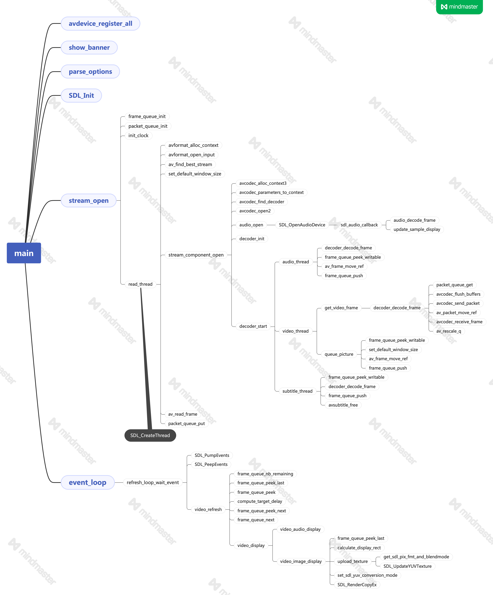
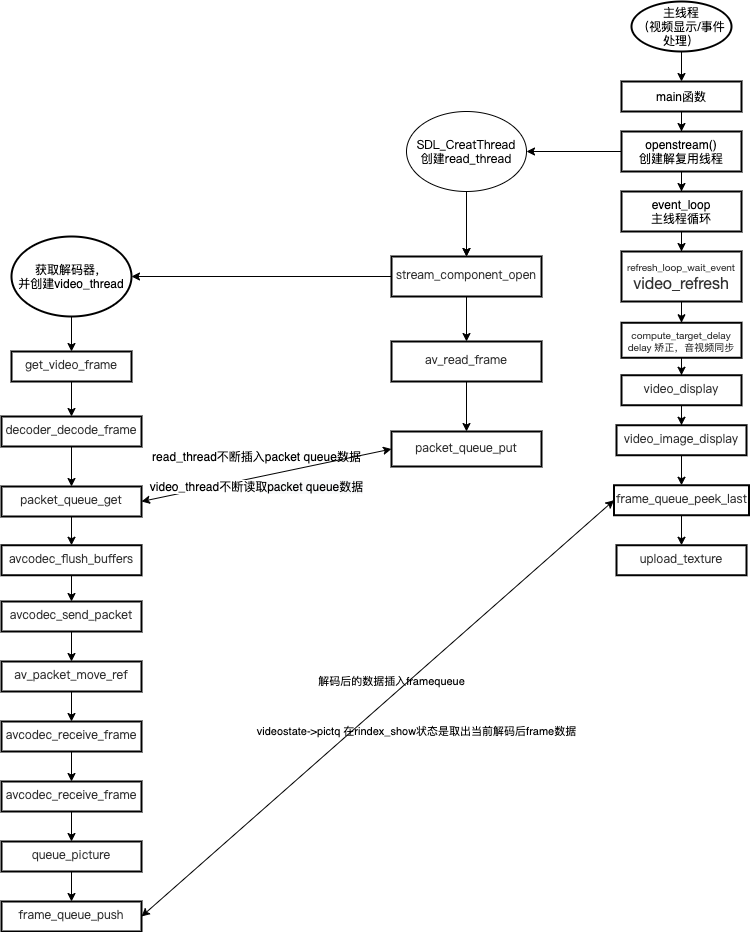

# ffplay源码分析

熟悉FFmpeg项目从源码看起，以下是我阅读FFplay的源代码的总结；FFplay是FFmpeg项目提供的播放器示例，它的源代码的量也是不少的，其中很多知识点是我们可以学习和借鉴的。

## 总结构图

参照雷神（[雷霄骅](https://blog.csdn.net/leixiaohua1020)）的FFplay的总体函数调用结构图，自己总结了一个最新版本的结构，其中还有诸多不足，以后有机会慢慢完善；如下图所示。




这就不对主要函数分别解析，我来学习一下其中关键性的思想和ffplay的体系结构。

## 视频部分

### ffplay video的线程模式



ffplay选择了sdl作为显示SDK，以实现跨平台支持；因为使用了SDL，而video的显示也依赖SDL的窗口显示系统，所以先从main函数的SDL初始化看起：

```c
int main(int argc, char **argv)
{
  ...
       /* register all codecs, demux and protocols */
#if CONFIG_AVDEVICE
    avdevice_register_all(); //注册所有解码器
#endif
    avformat_network_init();

    init_opts();

    signal(SIGINT, sigterm_handler);  /* Interrupt (ANSI).    */
    signal(SIGTERM, sigterm_handler); /* Termination (ANSI).  */

    show_banner(argc, argv, options); //打印ffmpag库版本信息，编译时间，编译选项，类库信息等

    parse_options(NULL, argc, argv, options, opt_input_file); //解析输入的命令。
...
     if (SDL_Init(flags))
    { //初始化sdl
        av_log(NULL, AV_LOG_FATAL, "Could not initialize SDL - %s\n", SDL_GetError());
        av_log(NULL, AV_LOG_FATAL, "(Did you set the DISPLAY variable?)\n");
        exit(1);
    }

    SDL_EventState(SDL_SYSWMEVENT, SDL_IGNORE);
    SDL_EventState(SDL_USEREVENT, SDL_IGNORE);
		
  	//注册flush packet 只是一个标记作用，用于packet队列中，在对packet队列分析时有说明
    av_init_packet(&flush_pkt);
    flush_pkt.data = (uint8_t *)&flush_pkt;
  
 ...
       if (!display_disable)
    {
        int flags = SDL_WINDOW_HIDDEN;
        if (alwaysontop)
#if SDL_VERSION_ATLEAST(2, 0, 5)
            flags |= SDL_WINDOW_ALWAYS_ON_TOP;
#else
            av_log(NULL, AV_LOG_WARNING, "Your SDL version doesn't support SDL_WINDOW_ALWAYS_ON_TOP. Feature will be inactive.\n");
#endif
        if (borderless)
            flags |= SDL_WINDOW_BORDERLESS;
        else
            flags |= SDL_WINDOW_RESIZABLE;
         //创建sdl 窗口
        window = SDL_CreateWindow(program_name, SDL_WINDOWPOS_UNDEFINED, SDL_WINDOWPOS_UNDEFINED, default_width, default_height, flags);
        SDL_SetHint(SDL_HINT_RENDER_SCALE_QUALITY, "linear");
        if (window)
        {
          //创建sdl 窗口的渲染器
            renderer = SDL_CreateRenderer(window, -1, SDL_RENDERER_ACCELERATED | SDL_RENDERER_PRESENTVSYNC);
            if (!renderer)
            {
                av_log(NULL, AV_LOG_WARNING, "Failed to initialize a hardware accelerated renderer: %s\n", SDL_GetError());
                renderer = SDL_CreateRenderer(window, -1, 0);
            }
            if (renderer)
            {
                if (!SDL_GetRendererInfo(renderer, &renderer_info))
                    av_log(NULL, AV_LOG_VERBOSE, "Initialized %s renderer.\n", renderer_info.name);
            }
        }
        if (!window || !renderer || !renderer_info.num_texture_formats)
        {
            av_log(NULL, AV_LOG_FATAL, "Failed to create window or renderer: %s", SDL_GetError());
            do_exit(NULL);
        }
    }

  	is = stream_open(input_filename, file_iformat); //创建read_thread
    if (!is)
    {
        av_log(NULL, AV_LOG_FATAL, "Failed to initialize VideoState!\n");
        do_exit(NULL);
    }

    event_loop(is); //主线程 ，sdl——event事件监听和处理

}
```

而这里我们主要的两个函数是`stream_open`和`event_loop`；`stream_open`函数的作用是创建`read_thread`，`read_thread`会打开文件，解析封装，获取`AVStream`信息，启动解码器（创建解码线程），并开始读取文件；`event_loop`函数的作用是处理SDL事件队列中的事件和刷新显示数据，下面会针对这两个函数视频部分的内容进行详细说明。

#### stream_open

其实在`stream_open`函数里的关键内容都是初始化一些参数，主要的处理逻辑在`read_thread`中进行。

```c
static VideoState *stream_open(const char *filename, AVInputFormat *iformat)
{
 VideoState *is;

    is = av_mallocz(sizeof(VideoState)); //创建VideoState 这个很重要，它贯穿整个ffplay
  ...
    /* start video display */ //初始化解码后的帧队列
    if (frame_queue_init(&is->pictq, &is->videoq, VIDEO_PICTURE_QUEUE_SIZE, 1) < 0)
        goto fail;
  ...
     //初始化解码前的帧队列
    if (packet_queue_init(&is->videoq) < 0 ||
        ...
        //创建读线程的条件信号
    if (!(is->continue_read_thread = SDL_CreateCond()))
    {
        av_log(NULL, AV_LOG_FATAL, "SDL_CreateCond(): %s\n", SDL_GetError());
        goto fail;
    }
    //初始化时钟
    init_clock(&is->vidclk, &is->videoq.serial);
    ...
    is->read_tid = SDL_CreateThread(read_thread, "read_thread", is); //创建读线程
    ...
    fail:
        stream_close(is);//出错free一些初始化参数
        return NULL;
}
```

**`VideoState`**结构的参数详细说明：

```c
/*视频状态器，贯穿整个ffplay的结构*/
typedef struct VideoState
{
    SDL_Thread *read_tid;      //解复用（或读）线程
    AVInputFormat *iformat;    //输入格式
    int abort_request;         //中止请求
    int force_refresh;         //强制刷新
    int paused;                //暂停
    int last_paused;           //最后一次暂停状态
    int queue_attachments_req; //队列附件请求
    int seek_req;              //快进请求
    int seek_flags;            //快进标志
    int64_t seek_pos;          //快进位置
    int64_t seek_rel;
    int read_pause_return; //读暂停
    AVFormatContext *ic;   //解码格式上下文
    int realtime;          //是否实时码流

    Clock audclk; //音频时钟
    Clock vidclk; //视频时钟
    Clock extclk; //外部时钟

    FrameQueue pictq; //视频队列
    FrameQueue subpq; //字幕队列
    FrameQueue sampq; //pcm流队列

    Decoder auddec; //音频解码器
    Decoder viddec; //视频解码器
    Decoder subdec; //字幕解码器

    int audio_stream; //音频码流id

    int av_sync_type; //时钟同步类型

    double audio_clock;
    int audio_clock_serial; //音频时钟序号
    double audio_diff_cum;  // 用于音频差分计算 /* used for AV difference average computation */
    double audio_diff_avg_coef;
    double audio_diff_threshold;        //音频差分阈值
    int audio_diff_avg_count;           // 平均差分数量
    AVStream *audio_st;                 // 音频码流
    PacketQueue audioq;                 // 音频源包队列
    int audio_hw_buf_size;              // 硬件缓冲大小
    uint8_t *audio_buf;                 // 音频缓冲区
    uint8_t *audio_buf1;                // 音频缓冲区1
    unsigned int audio_buf_size;        // 音频缓冲大小 /* in bytes */
    unsigned int audio_buf1_size;       // 音频缓冲大小 1
    int audio_buf_index; /* in bytes */ // 音频缓冲索引
    int audio_write_buf_size;           // 音频写入缓冲大小
    int audio_volume;                   // 音量
    int muted;                          // 是否静音
    struct AudioParams audio_src;       // 音频参数
#if CONFIG_AVFILTER
    struct AudioParams audio_filter_src; // 音频过滤器
#endif
    struct AudioParams audio_tgt; // 音频参数
    struct SwrContext *swr_ctx;   // 音频转码上下文
    int frame_drops_early;
    int frame_drops_late;

    enum ShowMode
    { // 显示类型
        SHOW_MODE_NONE = -1,
        SHOW_MODE_VIDEO = 0,
        SHOW_MODE_WAVES,
        SHOW_MODE_RDFT,
        SHOW_MODE_NB
    } show_mode;
    int16_t sample_array[SAMPLE_ARRAY_SIZE]; // 采样数组
    int sample_array_index;                  // 采样索引
    int last_i_start;                        // 上一开始
    RDFTContext *rdft;                       // 自适应滤波器上下文
    int rdft_bits;                           // 自使用比特率
    FFTSample *rdft_data;                    // 快速傅里叶采样
    int xpos;
    double last_vis_time;
    SDL_Texture *vis_texture; // 音频Texture
    SDL_Texture *sub_texture; // 字幕Texture
    SDL_Texture *vid_texture; // 视频Texture

    int subtitle_stream;   // 字幕码流Id
    AVStream *subtitle_st; // 字幕码流
    PacketQueue subtitleq; // 字幕源包队列

    double frame_timer;                 // 帧计时器
    double frame_last_returned_time;    // 上一次返回时间
    double frame_last_filter_delay;     // 上一个过滤器延时
    int video_stream;                   // 视频码流Id
    AVStream *video_st;                 // 视频码流
    PacketQueue videoq;                 // 视频包队列
    double max_frame_duration;          // 最大帧间显示时间     // maximum duration of a frame - above this, we consider the jump a timestamp discontinuity
    struct SwsContext *img_convert_ctx; // 视频转码上下文
    struct SwsContext *sub_convert_ctx; // 字幕转码上下文
    int eof;                            // 结束标志

    char *filename;                 // 文件名
    int width, height, xleft, ytop; // 宽高，其实坐标
    int step;

#if CONFIG_AVFILTER
    int vfilter_idx;                   // 过滤器索引
    AVFilterContext *in_video_filter;  // the first filter in the video chain
    AVFilterContext *out_video_filter; // the last filter in the video chain
    AVFilterContext *in_audio_filter;  // the first filter in the audio chain
    AVFilterContext *out_audio_filter; // the last filter in the audio chain
    AVFilterGraph *agraph;             // audio filter graph
#endif

    int last_video_stream, last_audio_stream, last_subtitle_stream;

    SDL_cond *continue_read_thread;
} VideoState;
```

#### 读取线程(read_thread)

read_thread主要按以下步骤执行：

1. 准备阶段：打开文件，检测Stream信息，打开解码器
2. 主循环读数据，解封装：读取Packet，存入PacketQueue

read_thread的函数比较长，这里不贴完整代码，直接根据其功能分步分析。

##### 准备阶段

主要执行一下几个步骤的函数：

1. `avformat_open_input`
2. `avformat_find_stream_info`
3. `av_find_best_stream`
4. `stream_component_open`

**`avformat_open_input`**用于打开输入流（这个包括文件和网络流，在ffmpeg内部会把每一个协议封装成`URLProtocol`，文件对于ffmpeg也是一种协议“file”）

```c
    ic = avformat_alloc_context(); //创建 AVformatContext
    if (!ic)
    {
        av_log(NULL, AV_LOG_FATAL, "Could not allocate context.\n");
        ret = AVERROR(ENOMEM);
        goto fail;
    }
    //设置解码中断回调方法 ，这很重要，在网络中断的时候，发生调用；不设置很容易造成阻塞
    ic->interrupt_callback.callback = decode_interrupt_cb;
    ic->interrupt_callback.opaque = is;
    if (!av_dict_get(format_opts, "scan_all_pmts", NULL, AV_DICT_MATCH_CASE))
    {
        av_dict_set(&format_opts, "scan_all_pmts", "1", AV_DICT_DONT_OVERWRITE);
        scan_all_pmts_set = 1;
    }
    err = avformat_open_input(&ic, is->filename, is->iformat, &format_opts); //打开文件或网络流
    if (err < 0)
    {
        print_error(is->filename, err);
        ret = -1;
        goto fail;
    }
```

重点强调：**`interrupt_callback`**用于ffmpeg内部在执行耗时操作时检查是否有退出请求，并提前中断，避免用户退出请求没有及时响应；

**`avformat_find_stream_info`**函数是通过读取媒体文件的部分数据来分析流信息；在一些缺少头信息的封装下特别有用，如注释：

```c
Read packets of a media file to get stream information. This
is useful for file formats with no headers such as MPEG. This
function also computes the real framerate in case of MPEG-2 repeat
rame mode.
The logical file position is not changed by this function;
examined packets may be buffered for later processing.
```

**`av_find_best_stream`**函数选择对应的媒体流，ffplay主要通过下述注释中的3个参数找到“最佳流”；

```c
int av_find_best_stream(AVFormatContext *ic,
                        enum AVMediaType type,//要选择的流类型
                        int wanted_stream_nb,//目标流索引
                        int related_stream,//参考流索引
                        AVCodec **decoder_ret,
                        int flags);
```

**`stream_component_open`**函数是根据目标流打开对应的解码器；`stream_component_open`的函数内容比较长，接下来就逐步分析一下ffplay是如何打开解码器的：

1. 创建和初始化`AVCodecContex`，然后通过`avcodec_parameters_to_context`把所选流的解码参数赋给`avctx`，最后设了`time_base`.代码如下：

```c
   //创建编解码器上下文
    avctx = avcodec_alloc_context3(NULL);
    if (!avctx)
        return AVERROR(ENOMEM);
    //从找到对应的流中的codecpar，codecpar其实是avcodec_parameters，
    // 然后将它完全复制到创建的AVCodecContext
    ret = avcodec_parameters_to_context(avctx, ic->streams[stream_index]->codecpar);
    if (ret < 0)
        goto fail;
    avctx->pkt_timebase = ic->streams[stream_index]->time_base;
```

2. 通过`avcodec_find_decoder`找到对应的解码器（`AVCodec`）,如果用户设置了`forced_codec_name`，则通过`avcodec_find_decoder_by_name`找到对应的解码器；在找到解码器后通过`avcodec_open2`是否能打开解码器

   ```c
       codec = avcodec_find_decoder(avctx->codec_id); //找到对应的解码器
   
       switch (avctx->codec_type)
       {
       case AVMEDIA_TYPE_AUDIO:
           is->last_audio_stream = stream_index;
           forced_codec_name = audio_codec_name;
           break;
       case AVMEDIA_TYPE_SUBTITLE:
           is->last_subtitle_stream = stream_index;
           forced_codec_name = subtitle_codec_name;
           break;
       case AVMEDIA_TYPE_VIDEO:
           is->last_video_stream = stream_index;
           forced_codec_name = video_codec_name;
           break;
       }
   
       //通过编码器的名字，来打开对应的解码器
       if (forced_codec_name)
           codec = avcodec_find_decoder_by_name(forced_codec_name);
       if (!codec)
       {
           if (forced_codec_name)
               av_log(NULL, AV_LOG_WARNING,
                      "No codec could be found with name '%s'\n", forced_codec_name);
           else
               av_log(NULL, AV_LOG_WARNING,
                      "No decoder could be found for codec %s\n", avcodec_get_name(avctx->codec_id));
           ret = AVERROR(EINVAL);
           goto fail;
       }
   ...
         //打开解码器
       if ((ret = avcodec_open2(avctx, codec, &opts)) < 0)
       {
           goto fail;
       }
   ```

3. 对于解码器特定参数的初始化和创建对应流的解码线程；（节选自AVMEDIA_TYPE_VIDEO分支）

   ```c
           is->video_stream = stream_index;
           is->video_st = ic->streams[stream_index];
   
           decoder_init(&is->viddec, avctx, &is->videoq, is->continue_read_thread);
           if ((ret = decoder_start(&is->viddec, video_thread, "video_decoder", is)) < 0)
               goto out;
           is->queue_attachments_req = 1;
   ```

   看看`decoder_init`和`decoder_start`两个函数的定义：

   ```c
   static void decoder_init(Decoder *d, AVCodecContext *avctx, PacketQueue *queue, SDL_cond *empty_queue_cond)
   {
       memset(d, 0, sizeof(Decoder));
       d->avctx = avctx;
       d->queue = queue;
       d->empty_queue_cond = empty_queue_cond;
       d->start_pts = AV_NOPTS_VALUE;
       d->pkt_serial = -1;
   }
   
   static int decoder_start(Decoder *d, int (*fn)(void *), const char *thread_name, void *arg)
   {
       packet_queue_start(d->queue);
       d->decoder_tid = SDL_CreateThread(fn, thread_name, arg);
       if (!d->decoder_tid)
       {
           av_log(NULL, AV_LOG_ERROR, "SDL_CreateThread(): %s\n", SDL_GetError());
           return AVERROR(ENOMEM);
       }
       return 0;
   }
   ```

   `decoder_init`比较简单，看`decoder_start`。`decoder_start`中“启动”了PacketQueue，并创建了一个名为"decoder"的线程专门用于解码，具体的解码流程由传入参数fn决定。比如对于视频，是`video_thread`。

##### 主循环读数据

在读线程中的主循环读数据阶段，主要的代码就`av_read_frame`和`packet_queue_put`，`av_read_frame`从文件中读取视频数据，并获取一个AVPacket，`packet_queue_put`把它放入到对应的PacketQueue中。

```c
    for (;;)
    {
        if (is->abort_request) //中断，结束播放
            break;
        if (is->paused != is->last_paused)//暂停/恢复的处理
        {
          ...
        }
       	if (is->seek_req)
        { //跳帧请求
         ...
       	}
      	   /* if the queue are full, no need to read more */ //数据队列满的情况
        if (infinite_buffer < 1 &&
            (is->audioq.size + is->videoq.size + is->subtitleq.size > MAX_QUEUE_SIZE || (stream_has_enough_packets(is->audio_st, is->audio_stream, &is->audioq) &&
                                                                                         stream_has_enough_packets(is->video_st, is->video_stream, &is->videoq) &&
                                                                                         stream_has_enough_packets(is->subtitle_st, is->subtitle_stream, &is->subtitleq))))
        {
            /* wait 10 ms */
            SDL_LockMutex(wait_mutex);
            SDL_CondWaitTimeout(is->continue_read_thread, wait_mutex, 10);
            SDL_UnlockMutex(wait_mutex);
            continue;
        }
      //循环播放处理
        if (!is->paused &&
            (!is->audio_st || (is->auddec.finished == is->audioq.serial && frame_queue_nb_remaining(&is->sampq) == 0)) &&
            (!is->video_st || (is->viddec.finished == is->videoq.serial && frame_queue_nb_remaining(&is->pictq) == 0)))
        {
            if (loop != 1 && (!loop || --loop))
            {
                stream_seek(is, start_time != AV_NOPTS_VALUE ? start_time : 0, 0, 0);
            }
            else if (autoexit)
            {
                ret = AVERROR_EOF;
                goto fail;
            }
        }
        ret = av_read_frame(ic, pkt); //将数据读取出，送入队列
        if (ret < 0)
        {
            if ((ret == AVERROR_EOF || avio_feof(ic->pb)) && !is->eof)
            {
                if (is->video_stream >= 0)
                    packet_queue_put_nullpacket(&is->videoq, is->video_stream);
                if (is->audio_stream >= 0)
                    packet_queue_put_nullpacket(&is->audioq, is->audio_stream);
                if (is->subtitle_stream >= 0)
                    packet_queue_put_nullpacket(&is->subtitleq, is->subtitle_stream);
                is->eof = 1;
            }
            if (ic->pb && ic->pb->error)
            {
                if (autoexit)
                    goto fail;
                else
                    break;
            }
            /*读取失败的话，读取失败的原因有很多，其他地方可能会重新Signal这个锁condition。如果没有singal这个condition的话，就会等待10ms之后，
            再释放，重新循环读取. 那这个continue_read_thread 到底是锁了哪呢？*/
            SDL_LockMutex(wait_mutex);
            SDL_CondWaitTimeout(is->continue_read_thread, wait_mutex, 10);
            SDL_UnlockMutex(wait_mutex);
            continue;
        }
        else
        {
            is->eof = 0;
        }
        /* check if packet is in play range specified by user, then queue, otherwise discard */
        //记录stream_start_time
        stream_start_time = ic->streams[pkt->stream_index]->start_time;
        //如果没有pts, 就用dts
        pkt_ts = pkt->pts == AV_NOPTS_VALUE ? pkt->dts : pkt->pts;
        /*判断是否在范围内。如果duration还没被定义的话，通过
        或者在定义的duration内才可以，用当前的pts-start_time .
        duration 会在解码器打开之后，才会被初始化*/
        pkt_in_play_range = duration == AV_NOPTS_VALUE ||
                            (pkt_ts - (stream_start_time != AV_NOPTS_VALUE ? stream_start_time : 0)) *
                                        av_q2d(ic->streams[pkt->stream_index]->time_base) -
                                    (double)(start_time != AV_NOPTS_VALUE ? start_time : 0) / 1000000 <=
                                ((double)duration / 1000000);
        // 将解复用得到的数据包添加到对应的待解码队列中
        if (pkt->stream_index == is->audio_stream && pkt_in_play_range)
        {
            packet_queue_put(&is->audioq, pkt);
        }
        else if (pkt->stream_index == is->video_stream && pkt_in_play_range && !(is->video_st->disposition & AV_DISPOSITION_ATTACHED_PIC))
        {
            packet_queue_put(&is->videoq, pkt);
        }
        else if (pkt->stream_index == is->subtitle_stream && pkt_in_play_range)
        {
            packet_queue_put(&is->subtitleq, pkt);
        }
        else
        {
            av_packet_unref(pkt);
        }
    }
```

