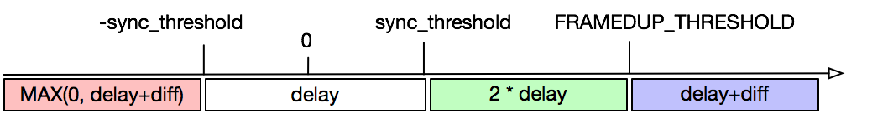

[TOC]


# ffplay源码分析

熟悉FFmpeg项目从源码看起，以下是我阅读FFplay的源代码的总结；FFplay是FFmpeg项目提供的播放器示例，它的源代码的量也是不少的，其中很多知识点是我们可以学习和借鉴的。

## 总结构图

参照雷神（[雷霄骅](https://blog.csdn.net/leixiaohua1020)）的FFplay的总体函数调用结构图，自己总结了一个最新版本的结构，其中还有诸多不足，以后有机会慢慢完善；如下图所示。


这就不对主要函数分别解析，我来学习一下其中关键性的思想和ffplay的体系结构。

## 视频部分

### ffplay video的线程模式


ffplay选择了sdl作为显示SDK，以实现跨平台支持；因为使用了SDL，而video的显示也依赖SDL的窗口显示系统，所以先从main函数的SDL初始化看起：

```c
int main(int argc, char **argv)
{
  ...
       /* register all codecs, demux and protocols */
#if CONFIG_AVDEVICE
    avdevice_register_all(); //注册所有解码器
#endif
    avformat_network_init();

    init_opts();

    signal(SIGINT, sigterm_handler);  /* Interrupt (ANSI).    */
    signal(SIGTERM, sigterm_handler); /* Termination (ANSI).  */

    show_banner(argc, argv, options); //打印ffmpag库版本信息，编译时间，编译选项，类库信息等

    parse_options(NULL, argc, argv, options, opt_input_file); //解析输入的命令。
...
     if (SDL_Init(flags))
    { //初始化sdl
        av_log(NULL, AV_LOG_FATAL, "Could not initialize SDL - %s\n", SDL_GetError());
        av_log(NULL, AV_LOG_FATAL, "(Did you set the DISPLAY variable?)\n");
        exit(1);
    }

    SDL_EventState(SDL_SYSWMEVENT, SDL_IGNORE);
    SDL_EventState(SDL_USEREVENT, SDL_IGNORE);
		
  	//注册flush packet 只是一个标记作用，用于packet队列中，在对packet队列分析时有说明
    av_init_packet(&flush_pkt);
    flush_pkt.data = (uint8_t *)&flush_pkt;
  
 ...
       if (!display_disable)
    {
        int flags = SDL_WINDOW_HIDDEN;
        if (alwaysontop)
#if SDL_VERSION_ATLEAST(2, 0, 5)
            flags |= SDL_WINDOW_ALWAYS_ON_TOP;
#else
            av_log(NULL, AV_LOG_WARNING, "Your SDL version doesn't support SDL_WINDOW_ALWAYS_ON_TOP. Feature will be inactive.\n");
#endif
        if (borderless)
            flags |= SDL_WINDOW_BORDERLESS;
        else
            flags |= SDL_WINDOW_RESIZABLE;
         //创建sdl 窗口
        window = SDL_CreateWindow(program_name, SDL_WINDOWPOS_UNDEFINED, SDL_WINDOWPOS_UNDEFINED, default_width, default_height, flags);
        SDL_SetHint(SDL_HINT_RENDER_SCALE_QUALITY, "linear");
        if (window)
        {
          //创建sdl 窗口的渲染器
            renderer = SDL_CreateRenderer(window, -1, SDL_RENDERER_ACCELERATED | SDL_RENDERER_PRESENTVSYNC);
            if (!renderer)
            {
                av_log(NULL, AV_LOG_WARNING, "Failed to initialize a hardware accelerated renderer: %s\n", SDL_GetError());
                renderer = SDL_CreateRenderer(window, -1, 0);
            }
            if (renderer)
            {
                if (!SDL_GetRendererInfo(renderer, &renderer_info))
                    av_log(NULL, AV_LOG_VERBOSE, "Initialized %s renderer.\n", renderer_info.name);
            }
        }
        if (!window || !renderer || !renderer_info.num_texture_formats)
        {
            av_log(NULL, AV_LOG_FATAL, "Failed to create window or renderer: %s", SDL_GetError());
            do_exit(NULL);
        }
    }

  	is = stream_open(input_filename, file_iformat); //创建read_thread
    if (!is)
    {
        av_log(NULL, AV_LOG_FATAL, "Failed to initialize VideoState!\n");
        do_exit(NULL);
    }

    event_loop(is); //主线程 ，sdl——event事件监听和处理

}
```

而这里我们主要的两个函数是`stream_open`和`event_loop`；`stream_open`函数的作用是创建`read_thread`，`read_thread`会打开文件，解析封装，获取`AVStream`信息，启动解码器（创建解码线程），并开始读取文件；`event_loop`函数的作用是处理SDL事件队列中的事件和刷新显示数据，下面会针对这两个函数视频部分的内容进行详细说明。

#### stream_open

其实在`stream_open`函数里的关键内容都是初始化一些参数，主要的处理逻辑在`read_thread`中进行。

```c
static VideoState *stream_open(const char *filename, AVInputFormat *iformat)
{
 VideoState *is;

    is = av_mallocz(sizeof(VideoState)); //创建VideoState 这个很重要，它贯穿整个ffplay
  ...
    /* start video display */ //初始化解码后的帧队列
    if (frame_queue_init(&is->pictq, &is->videoq, VIDEO_PICTURE_QUEUE_SIZE, 1) < 0)
        goto fail;
  ...
     //初始化解码前的帧队列
    if (packet_queue_init(&is->videoq) < 0 ||
        ...
        //创建读线程的条件信号
    if (!(is->continue_read_thread = SDL_CreateCond()))
    {
        av_log(NULL, AV_LOG_FATAL, "SDL_CreateCond(): %s\n", SDL_GetError());
        goto fail;
    }
    //初始化时钟
    init_clock(&is->vidclk, &is->videoq.serial);
    ...
    is->read_tid = SDL_CreateThread(read_thread, "read_thread", is); //创建读线程
    ...
    fail:
        stream_close(is);//出错free一些初始化参数
        return NULL;
}
```

**`VideoState`**结构的参数详细说明：

```c
/*视频状态器，贯穿整个ffplay的结构*/
typedef struct VideoState
{
    SDL_Thread *read_tid;      //解复用（或读）线程
    AVInputFormat *iformat;    //输入格式
    int abort_request;         //中止请求
    int force_refresh;         //强制刷新
    int paused;                //暂停
    int last_paused;           //最后一次暂停状态
    int queue_attachments_req; //队列附件请求
    int seek_req;              //快进请求
    int seek_flags;            //快进标志
    int64_t seek_pos;          //快进位置
    int64_t seek_rel;
    int read_pause_return; //读暂停
    AVFormatContext *ic;   //解码格式上下文
    int realtime;          //是否实时码流

    Clock audclk; //音频时钟
    Clock vidclk; //视频时钟
    Clock extclk; //外部时钟

    FrameQueue pictq; //视频队列
    FrameQueue subpq; //字幕队列
    FrameQueue sampq; //pcm流队列

    Decoder auddec; //音频解码器
    Decoder viddec; //视频解码器
    Decoder subdec; //字幕解码器

    int audio_stream; //音频码流id

    int av_sync_type; //时钟同步类型

    double audio_clock;
    int audio_clock_serial; //音频时钟序号
    double audio_diff_cum;  // 用于音频差分计算 /* used for AV difference average computation */
    double audio_diff_avg_coef;
    double audio_diff_threshold;        //音频差分阈值
    int audio_diff_avg_count;           // 平均差分数量
    AVStream *audio_st;                 // 音频码流
    PacketQueue audioq;                 // 音频源包队列
    int audio_hw_buf_size;              // 硬件缓冲大小
    uint8_t *audio_buf;                 // 音频缓冲区
    uint8_t *audio_buf1;                // 音频缓冲区1
    unsigned int audio_buf_size;        // 音频缓冲大小 /* in bytes */
    unsigned int audio_buf1_size;       // 音频缓冲大小 1
    int audio_buf_index; /* in bytes */ // 音频缓冲索引
    int audio_write_buf_size;           // 音频写入缓冲大小
    int audio_volume;                   // 音量
    int muted;                          // 是否静音
    struct AudioParams audio_src;       // 音频参数
#if CONFIG_AVFILTER
    struct AudioParams audio_filter_src; // 音频过滤器
#endif
    struct AudioParams audio_tgt; // 音频参数
    struct SwrContext *swr_ctx;   // 音频转码上下文
    int frame_drops_early;
    int frame_drops_late;

    enum ShowMode
    { // 显示类型
        SHOW_MODE_NONE = -1,
        SHOW_MODE_VIDEO = 0,
        SHOW_MODE_WAVES,
        SHOW_MODE_RDFT,
        SHOW_MODE_NB
    } show_mode;
    int16_t sample_array[SAMPLE_ARRAY_SIZE]; // 采样数组
    int sample_array_index;                  // 采样索引
    int last_i_start;                        // 上一开始
    RDFTContext *rdft;                       // 自适应滤波器上下文
    int rdft_bits;                           // 自使用比特率
    FFTSample *rdft_data;                    // 快速傅里叶采样
    int xpos;
    double last_vis_time;
    SDL_Texture *vis_texture; // 音频Texture
    SDL_Texture *sub_texture; // 字幕Texture
    SDL_Texture *vid_texture; // 视频Texture

    int subtitle_stream;   // 字幕码流Id
    AVStream *subtitle_st; // 字幕码流
    PacketQueue subtitleq; // 字幕源包队列

    double frame_timer;                 // 帧计时器
    double frame_last_returned_time;    // 上一次返回时间
    double frame_last_filter_delay;     // 上一个过滤器延时
    int video_stream;                   // 视频码流Id
    AVStream *video_st;                 // 视频码流
    PacketQueue videoq;                 // 视频包队列
    double max_frame_duration;          // 最大帧间显示时间     // maximum duration of a frame - above this, we consider the jump a timestamp discontinuity
    struct SwsContext *img_convert_ctx; // 视频转码上下文
    struct SwsContext *sub_convert_ctx; // 字幕转码上下文
    int eof;                            // 结束标志

    char *filename;                 // 文件名
    int width, height, xleft, ytop; // 宽高，其实坐标
    int step;

#if CONFIG_AVFILTER
    int vfilter_idx;                   // 过滤器索引
    AVFilterContext *in_video_filter;  // the first filter in the video chain
    AVFilterContext *out_video_filter; // the last filter in the video chain
    AVFilterContext *in_audio_filter;  // the first filter in the audio chain
    AVFilterContext *out_audio_filter; // the last filter in the audio chain
    AVFilterGraph *agraph;             // audio filter graph
#endif

    int last_video_stream, last_audio_stream, last_subtitle_stream;

    SDL_cond *continue_read_thread;
} VideoState;
```

#### 读取线程(read_thread)

read_thread主要按以下步骤执行：

1. 准备阶段：打开文件，检测Stream信息，打开解码器
2. 主循环读数据，解封装：读取Packet，存入PacketQueue

read_thread的函数比较长，这里不贴完整代码，直接根据其功能分步分析。

##### 准备阶段

主要执行一下几个步骤的函数：

1. `avformat_open_input`
2. `avformat_find_stream_info`
3. `av_find_best_stream`
4. `stream_component_open`

###### **`avformat_open_input`**

该函数用于打开输入流（这个包括文件和网络流，在ffmpeg内部会把每一个协议封装成`URLProtocol`，文件对于ffmpeg也是一种协议“file”）

```c
    ic = avformat_alloc_context(); //创建 AVformatContext
    if (!ic)
    {
        av_log(NULL, AV_LOG_FATAL, "Could not allocate context.\n");
        ret = AVERROR(ENOMEM);
        goto fail;
    }
    //设置解码中断回调方法 ，这很重要，在网络中断的时候，发生调用；不设置很容易造成阻塞
    ic->interrupt_callback.callback = decode_interrupt_cb;
    ic->interrupt_callback.opaque = is;
    if (!av_dict_get(format_opts, "scan_all_pmts", NULL, AV_DICT_MATCH_CASE))
    {
        av_dict_set(&format_opts, "scan_all_pmts", "1", AV_DICT_DONT_OVERWRITE);
        scan_all_pmts_set = 1;
    }
    err = avformat_open_input(&ic, is->filename, is->iformat, &format_opts); //打开文件或网络流
    if (err < 0)
    {
        print_error(is->filename, err);
        ret = -1;
        goto fail;
    }
```

重点强调：**`interrupt_callback`**用于ffmpeg内部在执行耗时操作时检查是否有退出请求，并提前中断，避免用户退出请求没有及时响应；

###### **`avformat_find_stream_info`**

该函数是通过读取媒体文件的部分数据来分析流信息；在一些缺少头信息的封装下特别有用，如注释：

```c
Read packets of a media file to get stream information. This
is useful for file formats with no headers such as MPEG. This
function also computes the real framerate in case of MPEG-2 repeat
rame mode.
The logical file position is not changed by this function;
examined packets may be buffered for later processing.
```

###### **`av_find_best_stream`**

该函数选择对应的媒体流，ffplay主要通过下述注释中的3个参数找到“最佳流”；

```c
int av_find_best_stream(AVFormatContext *ic,
                        enum AVMediaType type,//要选择的流类型
                        int wanted_stream_nb,//目标流索引
                        int related_stream,//参考流索引
                        AVCodec **decoder_ret,
                        int flags);
```

###### **`stream_component_open`**

该函数是根据目标流打开对应的解码器；`stream_component_open`的函数内容比较长，接下来就逐步分析一下ffplay是如何打开解码器的：

1. 创建和初始化`AVCodecContex`，然后通过`avcodec_parameters_to_context`把所选流的解码参数赋给`avctx`，最后设了`time_base`.代码如下：

```c
   //创建编解码器上下文
    avctx = avcodec_alloc_context3(NULL);
    if (!avctx)
        return AVERROR(ENOMEM);
    //从找到对应的流中的codecpar，codecpar其实是avcodec_parameters，
    // 然后将它完全复制到创建的AVCodecContext
    ret = avcodec_parameters_to_context(avctx, ic->streams[stream_index]->codecpar);
    if (ret < 0)
        goto fail;
    avctx->pkt_timebase = ic->streams[stream_index]->time_base;
```

2. 通过`avcodec_find_decoder`找到对应的解码器（`AVCodec`）,如果用户设置了`forced_codec_name`，则通过`avcodec_find_decoder_by_name`找到对应的解码器；在找到解码器后通过`avcodec_open2`是否能打开解码器

   ```c
       codec = avcodec_find_decoder(avctx->codec_id); //找到对应的解码器
   
       switch (avctx->codec_type)
       {
       case AVMEDIA_TYPE_AUDIO:
           is->last_audio_stream = stream_index;
           forced_codec_name = audio_codec_name;
           break;
       case AVMEDIA_TYPE_SUBTITLE:
           is->last_subtitle_stream = stream_index;
           forced_codec_name = subtitle_codec_name;
           break;
       case AVMEDIA_TYPE_VIDEO:
           is->last_video_stream = stream_index;
           forced_codec_name = video_codec_name;
           break;
       }
   
       //通过编码器的名字，来打开对应的解码器
       if (forced_codec_name)
           codec = avcodec_find_decoder_by_name(forced_codec_name);
       if (!codec)
       {
           if (forced_codec_name)
               av_log(NULL, AV_LOG_WARNING,
                      "No codec could be found with name '%s'\n", forced_codec_name);
           else
               av_log(NULL, AV_LOG_WARNING,
                      "No decoder could be found for codec %s\n", avcodec_get_name(avctx->codec_id));
           ret = AVERROR(EINVAL);
           goto fail;
       }
   ...
         //打开解码器
       if ((ret = avcodec_open2(avctx, codec, &opts)) < 0)
       {
           goto fail;
       }
   ```

3. 对于解码器特定参数的初始化和创建对应流的解码线程；（节选自AVMEDIA_TYPE_VIDEO分支）

   ```c
           is->video_stream = stream_index;
           is->video_st = ic->streams[stream_index];
   
           decoder_init(&is->viddec, avctx, &is->videoq, is->continue_read_thread);
           if ((ret = decoder_start(&is->viddec, video_thread, "video_decoder", is)) < 0)
               goto out;
           is->queue_attachments_req = 1;
   ```

   看看`decoder_init`和`decoder_start`两个函数的定义：

   ```c
   static void decoder_init(Decoder *d, AVCodecContext *avctx, PacketQueue *queue, SDL_cond *empty_queue_cond)
   {
       memset(d, 0, sizeof(Decoder));
       d->avctx = avctx;
       d->queue = queue;
       d->empty_queue_cond = empty_queue_cond;
       d->start_pts = AV_NOPTS_VALUE;
       d->pkt_serial = -1;
   }
   
   static int decoder_start(Decoder *d, int (*fn)(void *), const char *thread_name, void *arg)
   {
       packet_queue_start(d->queue);
       d->decoder_tid = SDL_CreateThread(fn, thread_name, arg);
       if (!d->decoder_tid)
       {
           av_log(NULL, AV_LOG_ERROR, "SDL_CreateThread(): %s\n", SDL_GetError());
           return AVERROR(ENOMEM);
       }
       return 0;
   }
   ```

   `decoder_init`比较简单，看`decoder_start`。`decoder_start`中“启动”了PacketQueue，并创建了一个名为"decoder"的线程专门用于解码，具体的解码流程由传入参数fn决定。比如对于视频，是`video_thread`。

##### 主循环读数据

在读线程中的主循环读数据阶段，主要的代码就`av_read_frame`和`packet_queue_put`，`av_read_frame`从文件中读取视频数据，并获取一个AVPacket，`packet_queue_put`把它放入到对应的PacketQueue中。

```c
    for (;;)
    {
        if (is->abort_request) //中断，结束播放
            break;
        if (is->paused != is->last_paused)//暂停/恢复的处理
        {
          ...
        }
       	if (is->seek_req)
        { //跳帧请求
         ...
       	}
      	   /* if the queue are full, no need to read more */ //数据队列满的情况
        if (infinite_buffer < 1 &&
            (is->audioq.size + is->videoq.size + is->subtitleq.size > MAX_QUEUE_SIZE || (stream_has_enough_packets(is->audio_st, is->audio_stream, &is->audioq) &&
                                                                                         stream_has_enough_packets(is->video_st, is->video_stream, &is->videoq) &&
                                                                                         stream_has_enough_packets(is->subtitle_st, is->subtitle_stream, &is->subtitleq))))
        {
            /* wait 10 ms */
            SDL_LockMutex(wait_mutex);
            SDL_CondWaitTimeout(is->continue_read_thread, wait_mutex, 10);
            SDL_UnlockMutex(wait_mutex);
            continue;
        }
      //循环播放处理
        if (!is->paused &&
            (!is->audio_st || (is->auddec.finished == is->audioq.serial && frame_queue_nb_remaining(&is->sampq) == 0)) &&
            (!is->video_st || (is->viddec.finished == is->videoq.serial && frame_queue_nb_remaining(&is->pictq) == 0)))
        {
            if (loop != 1 && (!loop || --loop))
            {
                stream_seek(is, start_time != AV_NOPTS_VALUE ? start_time : 0, 0, 0);
            }
            else if (autoexit)
            {
                ret = AVERROR_EOF;
                goto fail;
            }
        }
        ret = av_read_frame(ic, pkt); //将数据读取出，送入队列
        if (ret < 0)
        {
            if ((ret == AVERROR_EOF || avio_feof(ic->pb)) && !is->eof)
            {
                if (is->video_stream >= 0)
                    packet_queue_put_nullpacket(&is->videoq, is->video_stream);
                if (is->audio_stream >= 0)
                    packet_queue_put_nullpacket(&is->audioq, is->audio_stream);
                if (is->subtitle_stream >= 0)
                    packet_queue_put_nullpacket(&is->subtitleq, is->subtitle_stream);
                is->eof = 1;
            }
            if (ic->pb && ic->pb->error)
            {
                if (autoexit)
                    goto fail;
                else
                    break;
            }
            /*读取失败的话，读取失败的原因有很多，其他地方可能会重新Signal这个锁condition。如果没有singal这个condition的话，就会等待10ms之后，
            再释放，重新循环读取. 那这个continue_read_thread 到底是锁了哪呢？*/
            SDL_LockMutex(wait_mutex);
            SDL_CondWaitTimeout(is->continue_read_thread, wait_mutex, 10);
            SDL_UnlockMutex(wait_mutex);
            continue;
        }
        else
        {
            is->eof = 0;
        }
        /* check if packet is in play range specified by user, then queue, otherwise discard */
        //记录stream_start_time
        stream_start_time = ic->streams[pkt->stream_index]->start_time;
        //如果没有pts, 就用dts
        pkt_ts = pkt->pts == AV_NOPTS_VALUE ? pkt->dts : pkt->pts;
        /*判断是否在范围内。如果duration还没被定义的话，通过
        或者在定义的duration内才可以，用当前的pts-start_time .
        duration 会在解码器打开之后，才会被初始化*/
        pkt_in_play_range = duration == AV_NOPTS_VALUE ||
                            (pkt_ts - (stream_start_time != AV_NOPTS_VALUE ? stream_start_time : 0)) *
                                        av_q2d(ic->streams[pkt->stream_index]->time_base) -
                                    (double)(start_time != AV_NOPTS_VALUE ? start_time : 0) / 1000000 <=
                                ((double)duration / 1000000);
        // 将解复用得到的数据包添加到对应的待解码队列中
        if (pkt->stream_index == is->audio_stream && pkt_in_play_range)
        {
            packet_queue_put(&is->audioq, pkt);
        }
        else if (pkt->stream_index == is->video_stream && pkt_in_play_range && !(is->video_st->disposition & AV_DISPOSITION_ATTACHED_PIC))
        {
            packet_queue_put(&is->videoq, pkt);
        }
        else if (pkt->stream_index == is->subtitle_stream && pkt_in_play_range)
        {
            packet_queue_put(&is->subtitleq, pkt);
        }
        else
        {
            av_packet_unref(pkt);
        }
    }
```

###### 暂停/恢复处理：

```c
if (is->paused != is->last_paused) {//如果paused变量改变，说明暂停状态改变
    is->last_paused = is->paused;
    if (is->paused)//如果暂停调用av_read_pause
        is->read_pause_return = av_read_pause(ic);
    else//如果恢复播放调用av_read_play
        av_read_play(ic);
}
```

ffmpeg有专门针对暂停和恢复的函数，所以直接调用就可以了。

###### seek的处理：

主要的seek操作通过avformat_seek_file完成。根据avformat_seek_file的返回值，如果seek成功，需要：

1. 清除PacketQueue的缓存，并放入一个flush_pkt。放入的flush_pkt可以让PacketQueue的serial增1，以区分seek前后的数据;(在分析PacketQueue会详细说明)
2. 同步外部时钟；（在音视频同步部分会详细说明）
3. 最后清理一些变量，通过`step_to_next_frame`完成

```c
 						ret = avformat_seek_file(is->ic, -1, seek_min, seek_target, seek_max, is->seek_flags);
            if (ret < 0)
            {
                av_log(NULL, AV_LOG_ERROR,
                       "%s: error while seeking\n", is->ic->url);
            }
            else
            {
                //清空缓冲队列，向解码线程传入flush事件
                if (is->audio_stream >= 0)
                {
                    packet_queue_flush(&is->audioq);
                    packet_queue_put(&is->audioq, &flush_pkt);
                }
                if (is->subtitle_stream >= 0)
                {
                    packet_queue_flush(&is->subtitleq);
                    packet_queue_put(&is->subtitleq, &flush_pkt);
                }
                if (is->video_stream >= 0)
                {
                    packet_queue_flush(&is->videoq);
                    packet_queue_put(&is->videoq, &flush_pkt);
                }
              	//同步外部时钟信号
                if (is->seek_flags & AVSEEK_FLAG_BYTE)
                {
                    set_clock(&is->extclk, NAN, 0);
                }
                else
                {
                    set_clock(&is->extclk, seek_target / (double)AV_TIME_BASE, 0);
                }
            }
            is->seek_req = 0;
            is->queue_attachments_req = 1;
            is->eof = 0;
            if (is->paused)
                step_to_next_frame(is);
```

###### 缓冲区大小判断：

缓冲区大小满的情况判断有两种：

1. 所有流队列缓冲大小总和大于MAX_QUEUE_SIZE（15M）时；
2. 各种流的队列都已有够用的包；

```c
/* if the queue are full, no need to read more */ //数据队列满的情况
        if (infinite_buffer < 1 &&
            (is->audioq.size + is->videoq.size + is->subtitleq.size > MAX_QUEUE_SIZE //所有流队列缓冲大小总和大于MAX_QUEUE_SIZE（15M）时
            || (stream_has_enough_packets(is->audio_st, is->audio_stream, &is->audioq) //各种流都已有够用的包
            &&stream_has_enough_packets(is->video_st, is->video_stream, &is->videoq) 
            &&stream_has_enough_packets(is->subtitle_st, is->subtitle_stream, &is->subtitleq))))
        {
            /* wait 10 ms */
            SDL_LockMutex(wait_mutex);
            SDL_CondWaitTimeout(is->continue_read_thread, wait_mutex, 10);
            SDL_UnlockMutex(wait_mutex);
            continue;
        }
```

在看看函数`stream_has_enough_packets`是如何判断流队列都已有够用的包

```c
static int stream_has_enough_packets(AVStream *st, int stream_id, PacketQueue *queue)
{
    return stream_id < 0 ||
           queue->abort_request ||
           (st->disposition & AV_DISPOSITION_ATTACHED_PIC) ||
           queue->nb_packets > MIN_FRAMES && (!queue->duration || av_q2d(st->time_base) * queue->duration > 1.0);
}
```

从函数内部结构可以看出，在满足PacketQueue总时长为0，或总时长超过1s的前提下：

有这么几种情况包是够用的：

1. 流没有打开（stream_id < 0）
2. 有退出请求（queue->abort_request）
3. 配置了AV_DISPOSITION_ATTACHED_PIC，流以附件图片/“封面图片”的形式存储在文件；
4. 队列内包个数大于MIN_FRAMES（=25）

###### 在播放完的情况下处理：

```c
    if (!is->paused &&
            (!is->audio_st || (is->auddec.finished == is->audioq.serial 
                               && frame_queue_nb_remaining(&is->sampq) == 0)) 
        											&&(!is->video_st || (is->viddec.finished == is->videoq.serial 
                             && frame_queue_nb_remaining(&is->pictq) == 0)))
        {
            if (loop != 1 && (!loop || --loop))
            {
                stream_seek(is, start_time != AV_NOPTS_VALUE ? start_time : 0, 0, 0);
            }
            else if (autoexit)
            {
                ret = AVERROR_EOF;
                goto fail;
            }
        }
```

判断播放已完成的条件，需要满足：

1. 不在暂停状态
2. 音频未打开，或者打开了，但是解码已解码完毕，serial等于PacketQueue的serial，并且PacketQueue中没有节点了
3. 视频未打开，或者打开了，但是解码已解码完毕，serial等于PacketQueue的serial，并且PacketQueue中没有节点了

在确认已结束的情况下，用户有两个变量可以控制播放器行为：

1. loop: 控制播放次数（当前这次也算在内，也就是最小就是1次了），0表示无限次
2. autoexit：自动退出，也就是播放完成后自动退出。

###### 读（解复用）处理：

解复用处理的步骤如下：

1. 通过`av_read_frame`读取一个包（`AVPacket`）
2. 返回值处理，一些出错处理过程
3. `pkt_ts`重计算过程
4. `packet_queue_put`放入各自队列，或者丢弃

```c
 ret = av_read_frame(ic, pkt); //将数据读取出，送入队列
        if (ret < 0)
        {
             //文件读取完了，调用packet_queue_put_nullpacket通知解码线程
            if ((ret == AVERROR_EOF || avio_feof(ic->pb)) && !is->eof)
            {
                if (is->video_stream >= 0)
                    packet_queue_put_nullpacket(&is->videoq, is->video_stream);
                if (is->audio_stream >= 0)
                    packet_queue_put_nullpacket(&is->audioq, is->audio_stream);
                if (is->subtitle_stream >= 0)
                    packet_queue_put_nullpacket(&is->subtitleq, is->subtitle_stream);
                is->eof = 1;
            }
            //发生错误了，退出主循环
            if (ic->pb && ic->pb->error)
            {
                if (autoexit)
                    goto fail;
                else
                    break;
            }
            /*读取失败的话，读取失败的原因有很多，其他地方可能会重新Signal这个锁condition。
            如果没有singal这个condition的话，就会等待10ms之后，
            再释放，重新循环读取. 那这个continue_read_thread 到底是锁了哪呢？*/
            SDL_LockMutex(wait_mutex);
            SDL_CondWaitTimeout(is->continue_read_thread, wait_mutex, 10);
            SDL_UnlockMutex(wait_mutex);
            continue;
        }
        else
        {
            is->eof = 0;
        }
        /* check if packet is in play range specified by user, then queue, otherwise discard */
        //记录stream_start_time
        stream_start_time = ic->streams[pkt->stream_index]->start_time;
        //如果没有pts, 就用dts
        pkt_ts = pkt->pts == AV_NOPTS_VALUE ? pkt->dts : pkt->pts;
        /*判断是否在范围内。如果duration还没被定义的话，通过
        或者在定义的duration内才可以，用当前的pts-start_time .
        duration 会在解码器打开之后，才会被初始化*/
        pkt_in_play_range = duration == AV_NOPTS_VALUE ||
                            (pkt_ts - (stream_start_time != AV_NOPTS_VALUE ? stream_start_time : 0)) *
                                        av_q2d(ic->streams[pkt->stream_index]->time_base) -
                                    (double)(start_time != AV_NOPTS_VALUE ? start_time : 0) / 1000000 <=
                                ((double)duration / 1000000);
        // 将解复用得到的数据包添加到对应的待解码队列中
        if (pkt->stream_index == is->audio_stream && pkt_in_play_range)
        {
            packet_queue_put(&is->audioq, pkt);
        }
        else if (pkt->stream_index == is->video_stream 
                 && pkt_in_play_range 
                 && !(is->video_st->disposition 
                      & AV_DISPOSITION_ATTACHED_PIC))
        {
            packet_queue_put(&is->videoq, pkt);
        }
        else if (pkt->stream_index == is->subtitle_stream && pkt_in_play_range)
        {
            packet_queue_put(&is->subtitleq, pkt);
        }
        else
        {
            av_packet_unref(pkt);
        }
```

#### 视频解码线程(video_thread)

在read_thread中已经创建了对应需要的解码器(`AVCodec`)；而在video_thread中需要创建`AVFrame`,来接收解码后的数据；确定视频帧率，开启循环解码；

##### 参数初始化

创建AVFrame和得到大致的视频帧率

```c
  VideoState *is = arg;
    AVFrame *frame = av_frame_alloc(); //创建AVFrame
    double pts;
    double duration;
    int ret;
    AVRational tb = is->video_st->time_base;
    //猜测视频帧率
    AVRational frame_rate = av_guess_frame_rate(is->ic, is->video_st, NULL);
		 if (!frame)
        return AVERROR(ENOMEM);
```

##### 循环解码

循环解码的总流：

1. `get_video_frame`获取解码后的一帧图像
2. “计算”时长和pts
3. 调用`queue_picture`将一帧图像放入FrameQueue

```c
 for (;;)
    {
        ret = get_video_frame(is, frame);
        if (ret < 0)
            goto the_end;
        if (!ret)
            continue;
            //获取当前帧播放时长
            duration = (frame_rate.num && 
                        frame_rate.den ? 
                        av_q2d((AVRational){frame_rate.den, frame_rate.num}) : 0);
            //当前帧显示时间戳
            pts = (frame->pts == AV_NOPTS_VALUE) ? NAN : frame->pts * av_q2d(tb);
            // 将当前帧压入frame_queue
            ret = queue_picture(is, frame, pts, duration, frame->pkt_pos, is->viddec.pkt_serial);
            av_frame_unref(frame); //释放frame

        if (ret < 0)
            goto the_end;
    }
```

###### `get_video_frame`

​		调用`decoder_decode_frame`解码,获取成功后主要做丢帧处理，丢帧的主要条件是`diff - is->frame_last_filter_delay < 0`，`frame_last_filter_delay`与滤镜有关，可以先忽略，也就是`diff < 0`的时候丢帧——`pts < get_master_clock(is)`的时候丢帧。`decoder_decode_frame`真正解码函数；

```c

static int get_video_frame(VideoState *is, AVFrame *frame)
{
    int got_picture;

    if ((got_picture = decoder_decode_frame(&is->viddec, frame, NULL)) < 0)
        return -1;

    if (got_picture)//解码是否成功，主要做丢帧处理
    {
        double dpts = NAN;

        if (frame->pts != AV_NOPTS_VALUE)//通过 pts*av_q2d(timebase)可以得到准确的时间
            dpts = av_q2d(is->video_st->time_base) * frame->pts;

        //重新得到视频的比例
        frame->sample_aspect_ratio = av_guess_sample_aspect_ratio(is->ic, is->video_st, frame);

        if (framedrop > 0 || (framedrop && get_master_sync_type(is) != AV_SYNC_VIDEO_MASTER))
        {
            if (frame->pts != AV_NOPTS_VALUE)
            {
                //得到的是当前的时间和时间钟之间的差值。
                double diff = dpts - get_master_clock(is);
                if (!isnan(diff) && fabs(diff) < AV_NOSYNC_THRESHOLD &&
                    diff - is->frame_last_filter_delay < 0 &&
                    is->viddec.pkt_serial == is->vidclk.serial &&
                    is->videoq.nb_packets)
                {
                    is->frame_drops_early++;
                    av_frame_unref(frame);
                    got_picture = 0;
                }
            }
        }
    }

    return got_picture;
}
```

###### `decoder_decode_frame`

`decoder_decode_frame`的主干代码是一个循环，要拿到一帧解码数据，或解码出错、文件结束，才会返回。

循环总共3个步骤：

1.  流连续的情况下，不断调用avcodec_receive_frame获取解码后的frame
2. 取一个packet，顺带过滤“过时”的packet
3. 将packet送入解码器

有一个`packet_pending`的概念，用于在send失败时重新发送；当收到flush_pkt时进行相应的flush事件处理，PacketQueue发生改变时第一个pkt将是flush_pkt，根据ffmpeg的API要求，需要调用`avcodec_flush_buffers`。

```c
static int decoder_decode_frame(Decoder *d, AVFrame *frame, AVSubtitle *sub)
{
    int ret = AVERROR(EAGAIN);

    for (;;)
    {
        AVPacket pkt;
        //1. 流连续的情况下，不断调用avcodec_receive_frame获取解码后的frame
        if (d->queue->serial == d->pkt_serial)
        {
            do
            {
                if (d->queue->abort_request)
                    return -1;

                switch (d->avctx->codec_type)
                {
                case AVMEDIA_TYPE_VIDEO:
                    ret = avcodec_receive_frame(d->avctx, frame);
                    if (ret >= 0)
                    {
                        if (decoder_reorder_pts == -1)
                        {
                            frame->pts = frame->best_effort_timestamp;
                        }
                        else if (!decoder_reorder_pts)
                        {
                            frame->pts = frame->pkt_dts;
                        }
                    }
                    break;
                      if (ret == AVERROR_EOF)
                {
                    d->finished = d->pkt_serial;
                    avcodec_flush_buffers(d->avctx);
                    return 0;
                }
                if (ret >= 0)
                    return 1;
            } while (ret != AVERROR(EAGAIN));
        }
         //2. 取一个packet，顺带过滤“过时”的packet
        do
        {
            // 队列为空
            if (d->queue->nb_packets == 0)
                SDL_CondSignal(d->empty_queue_cond);
            //如果有待重发的pkt，则先取待重发的pkt，否则从队列中取一个pkt
            if (d->packet_pending)
            {
                av_packet_move_ref(&pkt, &d->pkt);
                d->packet_pending = 0;
            }
            else
            {
                //取出下一帧
                if (packet_queue_get(d->queue, &pkt, 1, &d->pkt_serial) < 0)
                    return -1;
            }
            //队列的序列不相同时
            if (d->queue->serial == d->pkt_serial)
                break;
            av_packet_unref(&pkt);
        } while (1);
				//针对flush_pkt的处理
        if (pkt.data == flush_pkt.data)
        {
            avcodec_flush_buffers(d->avctx);
            d->finished = 0;
            d->next_pts = d->start_pts;
            d->next_pts_tb = d->start_pts_tb;
        }
        else
        {
                //3. 将packet送入解码器
                if (avcodec_send_packet(d->avctx, &pkt) == AVERROR(EAGAIN))
                {
                    av_log(d->avctx, AV_LOG_ERROR, "Receive_frame and send_packet both returned EAGAIN, which is an API violation.\n");
                    d->packet_pending = 1;
                    av_packet_move_ref(&d->pkt, &pkt);
                }
   
            av_packet_unref(&pkt);
        }
    }
}
```

###### `queue_picture`

`queue_picture`主要用于把`get_video_frame`函数取到正确解码后的一帧数据放入FrameQueue；

1. `frame_queue_peek_writable`取FrameQueue的当前写节点；
2. 把该解码后的帧数据拷贝给节点(struct Frame)保存
3. `frame_queue_push`，“push”节点到队列中

AVFrame的拷贝是通过`av_frame_move_ref`实现的，所以拷贝后`src_frame`就是无效的；

```c

static int queue_picture(VideoState *is, AVFrame *src_frame, double pts, double duration, int64_t pos, int serial)
{
    Frame *vp;

#if defined(DEBUG_SYNC)
    printf("frame_type=%c pts=%0.3f\n",
           av_get_picture_type_char(src_frame->pict_type), pts);
#endif

    if (!(vp = frame_queue_peek_writable(&is->pictq))) //判断是否有空间可以写入，并取FrameQueue的当前写节点
        return -1;

    vp->sar = src_frame->sample_aspect_ratio;
    vp->uploaded = 0;

    vp->width = src_frame->width;
    vp->height = src_frame->height;
    vp->format = src_frame->format;

    vp->pts = pts;
    vp->duration = duration;
    vp->pos = pos;
    vp->serial = serial;
    //修改窗口大小
    set_default_window_size(vp->width, vp->height, vp->sar);

    av_frame_move_ref(vp->frame, src_frame); //将src_frame的内存空间指向vp->frame
    frame_queue_push(&is->pictq);            //重新推入
    return 0;
}
```

### ffplay audio输出的线程分析

ffplay audio的解码过程与video的一样，都在`decoder_decode_frame`函数中执行，在 video已经进行分析，这里就不做单独分析了，主要分析audio的输出；ffplay的audio输出同样也是通过SDL实现的;audio输出相关内容，且尽量不涉及音视频同步知识，音视频同步将专门一个章节分析。

audio的输出在SDL下是被动输出，即在开启SDL会在需要输出时，回调通知，在回调函数中，SDL会告知要发送多少的数据。

sdl通过sdl_audio_callback函数向ffplay要音频数据，ffplay将sampq中的数据通过`audio_decode_frame`函数取出，放入`is->audio_buf`，然后送出给sdl。在后续回调时先找`audio_buf`要数据，数据不足的情况下，再调用`audio_decode_frame`补充`audio_buf`

#### sdl打开音频输出

在`stream_component_open`中的audio分支进行调用`audio_open`打开sdl音频输出；代码如下：

```c
case AVMEDIA_TYPE_AUDIO: //音频相关
#if CONFIG_AVFILTER          //过滤器
    {
        AVFilterContext *sink;
        //从avctx(即AVCodecContext)中获取音频格式参数
        is->audio_filter_src.freq = avctx->sample_rate;
        is->audio_filter_src.channels = avctx->channels;
        is->audio_filter_src.channel_layout = get_valid_channel_layout(avctx->channel_layout, avctx->channels);
        is->audio_filter_src.fmt = avctx->sample_fmt;
        if ((ret = configure_audio_filters(is, afilters, 0)) < 0)
            goto fail;
        sink = is->out_audio_filter;
        sample_rate = av_buffersink_get_sample_rate(sink);
        nb_channels = av_buffersink_get_channels(sink);
        channel_layout = av_buffersink_get_channel_layout(sink);
    }
#else
        sample_rate = avctx->sample_rate;
        nb_channels = avctx->channels;
        channel_layout = avctx->channel_layout;
#endif

        /* prepare audio output */ //打开音频输出通道
        /*调用audio_open打开sdl音频输出，实际打开的设备参数保存在audio_tgt，返回值表示输出设备的缓冲区大小*/
        if ((ret = audio_open(is, channel_layout, nb_channels, sample_rate, &is->audio_tgt)) < 0)
            goto fail;
        is->audio_hw_buf_size = ret;
        is->audio_src = is->audio_tgt;
        //初始化audio_buf相关参数
        is->audio_buf_size = 0;
        is->audio_buf_index = 0;

        /* init averaging filter */
        is->audio_diff_avg_coef = exp(log(0.01) / AUDIO_DIFF_AVG_NB);
        is->audio_diff_avg_count = 0;
        /* since we do not have a precise anough audio FIFO fullness,
           we correct audio sync only if larger than this threshold */
        is->audio_diff_threshold = (double)(is->audio_hw_buf_size) / is->audio_tgt.bytes_per_sec;

        is->audio_stream = stream_index;
        is->audio_st = ic->streams[stream_index];

        decoder_init(&is->auddec, avctx, &is->audioq, is->continue_read_thread); //初始化对应的解码线程
        if ((is->ic->iformat->flags & (AVFMT_NOBINSEARCH | AVFMT_NOGENSEARCH | AVFMT_NO_BYTE_SEEK)) && !is->ic->iformat->read_seek)
        {
            is->auddec.start_pts = is->audio_st->start_time;
            is->auddec.start_pts_tb = is->audio_st->time_base;
        }
        if ((ret = decoder_start(&is->auddec, audio_thread, "audio_decoder", is)) < 0) // 正式开启解码线程。
            goto out;
        SDL_PauseAudioDevice(audio_dev, 0);
        break;
```

由于不同的音频输出设备支持的参数不同，音轨的参数不一定能被输出设备支持（此时就需要重采样了），`audio_tgt`就保存了输出设备参数。

介绍下audio_buf相关的几个变量：

- audio_buf: 从要输出的AVFrame中取出的音频数据（PCM），如果有必要，则对该数据重采样。
- audio_buf_size: audio_buf的总大小
- audio_buf_index: 下一次可读的audio_buf的index位置。
- audio_write_buf_size：audio_buf已经输出的大小，即audio_buf_size - audio_buf_index

#### 音频输出逻辑

在`audio_open`函数内，通过通过`SDL_OpenAudioDevice`注册`sdl_audio_callback`函数为音频输出的回调函数。那么，主要的音频输出的逻辑就在`sdl_audio_callback`函数内了。

```c
/* prepare a new audio buffer */
static void sdl_audio_callback(void *opaque, Uint8 *stream, int len)
{
    VideoState *is = opaque;
    int audio_size, len1;

    audio_callback_time = av_gettime_relative();

    while (len > 0)//循环发送，直到发够所需数据长度
    {
       //如果audio_buf消耗完了，就调用audio_decode_frame重新填充audio_buf
        if (is->audio_buf_index >= is->audio_buf_size)
        {
            audio_size = audio_decode_frame(is);//填充audio_buf
            if (audio_size < 0)
            {
                /* if error, just output silence */
                is->audio_buf = NULL;
                is->audio_buf_size = SDL_AUDIO_MIN_BUFFER_SIZE / is->audio_tgt.frame_size * is->audio_tgt.frame_size;
            }
            else
            {
                if (is->show_mode != SHOW_MODE_VIDEO)
                    update_sample_display(is, (int16_t *)is->audio_buf, audio_size);
                is->audio_buf_size = audio_size;
            }
            is->audio_buf_index = 0;
        }
       	//根据缓冲区剩余大小量力而行
        len1 = is->audio_buf_size - is->audio_buf_index;
        if (len1 > len)
            len1 = len;
      	//根据audio_volume决定如何输出audio_buf
        if (!is->muted && is->audio_buf && is->audio_volume == SDL_MIX_MAXVOLUME)
            memcpy(stream, (uint8_t *)is->audio_buf + is->audio_buf_index, len1);
        else
        {
            memset(stream, 0, len1);
            if (!is->muted && is->audio_buf)
                SDL_MixAudioFormat(stream, (uint8_t *)is->audio_buf + is->audio_buf_index, AUDIO_S16SYS, len1, is->audio_volume);
        }
       	//调整各buffer
        len -= len1;
        stream += len1;
        is->audio_buf_index += len1;
    }
    is->audio_write_buf_size = is->audio_buf_size - is->audio_buf_index;
    /* Let's assume the audio driver that is used by SDL has two periods. */
    if (!isnan(is->audio_clock))//更新audclk
    {
        set_clock_at(&is->audclk, is->audio_clock - (double)(2 * is->audio_hw_buf_size + is->audio_write_buf_size) / is->audio_tgt.bytes_per_sec, is->audio_clock_serial, audio_callback_time / 1000000.0);
        sync_clock_to_slave(&is->extclk, &is->audclk);
    }
}
```

`sdl_audio_callback`的缓冲区输出过程:

1. 输出audio_buf到stream，如果audio_volume为最大音量，则只需memcpy复制给stream即可。否则，可以利用SDL_MixAudioFormat进行音量调整和混音
2. 如果audio_buf消耗完了，就调用`audio_decode_frame`重新填充audio_buf
3. set_clock_at更新audclk时，完整的帧包含的时间戳-实际写入的帧数+2个硬件buffer的延迟，audio_clock是当前audio_buf的显示结束时间(pts+duration)，由于audio driver本身会持有一小块缓冲区，典型地，会是两块交替使用，所以有`2 * is->audio_hw_buf_size`. 因为我们的写入的时候，还需要考虑传入的buffer的大小，预期情况下，如果buffer相同，则这里就是原来的pts-硬件延迟的时间。

#### 填充audio_buf

调用`audio_decode_frame`重新填充audio_buf，`audio_decode_frame`并没有真正意义上的`decode`代码，最多是进行了重采样。主流程有以下步骤：

1. 从sampq取一帧，必要时丢帧。如发生了seek，此时serial会不连续，就需要丢帧处理
2. 计算这一帧的字节数。通过av_samples_get_buffer_size可以方便计算出结果
3. 获取这一帧的数据。对于frame格式和输出设备不同的，需要重采样；如果格式相同，则直接拷贝指针输出即可。总之，需要在audio_buf中保存与输出设备格式相同的音频数据
4. 更新audio_clock，audio_clock_serial。用于设置audclk.

```c
/**
 * Decode one audio frame and return its uncompressed size.
 *
 * The processed audio frame is decoded, converted if required, and
 * stored in is->audio_buf, with size in bytes given by the return
 * value.
 */
static int audio_decode_frame(VideoState *is)
{
    int data_size, resampled_data_size;
    int64_t dec_channel_layout;
    av_unused double audio_clock0;
    int wanted_nb_samples;
    Frame *af;

    if (is->paused)//暂停状态，返回-1，sdl_audio_callback会处理为输出静音
        return -1;

    do
    {
#if defined(_WIN32)
        while (frame_queue_nb_remaining(&is->sampq) == 0)
        {
            if ((av_gettime_relative() - audio_callback_time) > 1000000LL * is->audio_hw_buf_size / is->audio_tgt.bytes_per_sec / 2)
                return -1;
            av_usleep(1000);
        }
#endif
        if (!(af = frame_queue_peek_readable(&is->sampq)))//1. 从sampq取一帧，必要时丢帧
            return -1;
        frame_queue_next(&is->sampq);
    } while (af->serial != is->audioq.serial);
    //2. 计算这一帧的字节数
    data_size = av_samples_get_buffer_size(NULL, af->frame->channels,
                                           af->frame->nb_samples,
                                           af->frame->format, 1);
    //[]计算dec_channel_layout，用于确认是否需要重新初始化重采样
    dec_channel_layout =
        (af->frame->channel_layout && af->frame->channels == av_get_channel_layout_nb_channels(af->frame->channel_layout)) ? af->frame->channel_layout : av_get_default_channel_layout(af->frame->channels);
    wanted_nb_samples = synchronize_audio(is, af->frame->nb_samples);

     //[]判断是否需要重新初始化重采样
    if (af->frame->format != is->audio_src.fmt ||
        dec_channel_layout != is->audio_src.channel_layout ||
        af->frame->sample_rate != is->audio_src.freq ||
        (wanted_nb_samples != af->frame->nb_samples && !is->swr_ctx))
    {
        swr_free(&is->swr_ctx);
        //创建和设置swr
        is->swr_ctx = swr_alloc_set_opts(NULL,
                                         is->audio_tgt.channel_layout, is->audio_tgt.fmt, is->audio_tgt.freq,
                                         dec_channel_layout, af->frame->format, af->frame->sample_rate,
                                         0, NULL);
        if (!is->swr_ctx || swr_init(is->swr_ctx) < 0)
        {
            av_log(NULL, AV_LOG_ERROR,
                   "Cannot create sample rate converter for conversion of %d Hz %s %d channels to %d Hz %s %d channels!\n",
                   af->frame->sample_rate, av_get_sample_fmt_name(af->frame->format), af->frame->channels,
                   is->audio_tgt.freq, av_get_sample_fmt_name(is->audio_tgt.fmt), is->audio_tgt.channels);
            swr_free(&is->swr_ctx);
            return -1;
        }
        is->audio_src.channel_layout = dec_channel_layout;
        is->audio_src.channels = af->frame->channels;
        is->audio_src.freq = af->frame->sample_rate;
        is->audio_src.fmt = af->frame->format;
    }
    //3. 获取这一帧的数据
    if (is->swr_ctx)//[]如果初始化了重采样，则对这一帧数据重采样输出
    {
        const uint8_t **in = (const uint8_t **)af->frame->extended_data;
        uint8_t **out = &is->audio_buf1;
        int out_count = (int64_t)wanted_nb_samples * is->audio_tgt.freq / af->frame->sample_rate + 256;
        int out_size = av_samples_get_buffer_size(NULL, is->audio_tgt.channels, out_count, is->audio_tgt.fmt, 0);
        int len2;
        if (out_size < 0)
        {
            av_log(NULL, AV_LOG_ERROR, "av_samples_get_buffer_size() failed\n");
            return -1;
        }
        if (wanted_nb_samples != af->frame->nb_samples)
        {
            if (swr_set_compensation(is->swr_ctx, (wanted_nb_samples - af->frame->nb_samples) * is->audio_tgt.freq / af->frame->sample_rate,
                                     wanted_nb_samples * is->audio_tgt.freq / af->frame->sample_rate) < 0)
            {
                av_log(NULL, AV_LOG_ERROR, "swr_set_compensation() failed\n");
                return -1;
            }
        }
        av_fast_malloc(&is->audio_buf1, &is->audio_buf1_size, out_size);
        if (!is->audio_buf1)
            return AVERROR(ENOMEM);
        //进行转换
        len2 = swr_convert(is->swr_ctx, out, out_count, in, af->frame->nb_samples);
        if (len2 < 0)
        {
            av_log(NULL, AV_LOG_ERROR, "swr_convert() failed\n");
            return -1;
        }
        if (len2 == out_count)
        {
            av_log(NULL, AV_LOG_WARNING, "audio buffer is probably too small\n");
            if (swr_init(is->swr_ctx) < 0)
                swr_free(&is->swr_ctx);
        }
        is->audio_buf = is->audio_buf1;
        //重新计算采样的数据大小，并返回
        resampled_data_size = len2 * is->audio_tgt.channels * av_get_bytes_per_sample(is->audio_tgt.fmt);
    }
    else
    {
        is->audio_buf = af->frame->data[0];
        resampled_data_size = data_size;
    }
    //audio_clock0用于打印调试信息
    audio_clock0 = is->audio_clock;
    /* update the audio clock with the pts */
    //4. 更新audio_clock，audio_clock_serial,更新pts  这个pts 等于当前的帧包含的所有帧数
    if (!isnan(af->pts)) 
        is->audio_clock = af->pts + (double)af->frame->nb_samples / af->frame->sample_rate;
    else
        is->audio_clock = NAN;
    is->audio_clock_serial = af->serial;
#ifdef DEBUG
    {
        static double last_clock;
        printf("audio: delay=%0.3f clock=%0.3f clock0=%0.3f\n",
               is->audio_clock - last_clock,
               is->audio_clock, audio_clock0);
        last_clock = is->audio_clock;
    }
#endif
    return resampled_data_size;//返回audio_buf的数据大小
}
```

### ffplay时间同步

由于音频和视频的输出不在同一个线程，而且，也不一定会同时解出同一个pts的音频帧和视频帧。因此，在进行音频和视频的播放时，需要对音频和视频的播放速度、播放时刻进行控制，以实现音频和视频保持同步，即所谓的音视频同步。

在ffplay中，音频（audio）和视频（video）有各自的输出线程，其中音频的输出线程是sdl的音频输出回调线程，video的输出线程是程序的主线程。

音视频的同步策略，一般有如下几种：

- 视频同步到音频，即音频为主时钟
- 音频同步到视频，即视频为主时钟
- 视频、音频同步到外部时钟，即外部时钟（系统时间）为主时钟
- 视频和音频各自输出，即不作同步处理，或称之为各自为主时钟

由于人耳对于声音变化的敏感度比视觉高，因此，一般采样的策略是将视频同步到音频，即对画面进行适当的丢帧或重复以追赶或等待音频。

#### DTS和PTS

在音视频流中的包都含有**DTS**和**PTS**，我们以此作为选择基准，到底是播放快了还是慢了，或者正以同步的速度播放。

- DTS：Decoding Time Stamp 解码时间戳——告诉解码器packet解码顺序
- PTS：Presenting Time Stamp 显示时间戳——指示从packet中解码出来的数据的显示顺序

#### 计算视频Frame的显示时间

要想知道ffmpeg如果计算视频一帧的显示时间，就需先了解ffmpeg的timebase；因为pts的单位就是timebase；

timebase的类型是结构体AVRational（用于表示分数），如下：

```c
typedef struct AVRational{
    int num; ///< Numerator
    int den; ///< Denominator
} AVRational;
```

如`timebase={1, 1000}`表示千分之一秒，那么pts=1000，即为1秒，那么这一帧就需要在第一秒的时候呈现在ffplay中，将pts转化为秒，一般做法是：`pts * av_q2d(timebase)`

"时钟"的概念，ffplay定义的结构体是Clock：

```c
typedef struct Clock
{
    double pts;       /* clock base */// 时钟基准
    double pts_drift; /* clock base minus time at which we updated the clock */// 更新时钟的差值
    double last_updated;// 上一次更新的时间
    double speed;// 速度
    int serial;  // 时钟基于使用该序列的包 /* clock is based on a packet with this serial */
    int paused;// 停止标志
    int *queue_serial; // 指向当前数据包队列序列的指针，用于过时的时钟检测 /* pointer to the current packet queue serial, used for obsolete clock detection */
} Clock;
```

时钟的工作原理：

1. 通过`set_clock_at`不断对时；
2. 获取的时间是一个估算值。估算是通过对时时记录的pts_drift估算的

```javascript
/**
 * 更新视频的pts
 * @param is     [description]
 * @param pts    [description]
 * @param pos    [description]
 * @param serial [description]
 */
static void update_video_pts(VideoState *is, double pts, int64_t pos, int serial) {
    /* update current video pts */
    set_clock(&is->vidclk, pts, serial);
   //将尾部的时间钟，用视频的时机钟来进行同步
    sync_clock_to_slave(&is->extclk, &is->vidclk);
}

static void set_clock(Clock *c, double pts, int serial)
{
    double time = av_gettime_relative() / 1000000.0;
    set_clock_at(c, pts, serial, time);
}

//使用当前的事来计算这几个值。也就是这一帧送显之前的操作的时间。
static void set_clock_at(Clock *c, double pts, int serial, double time)
{
    c->pts = pts;
    c->last_updated = time;
    c->pts_drift = c->pts - time;
    c->serial = serial;
}
```

以一个时间轴，从左往右看。首先我们调用`set_clock_at`进行一次对时，假设这时的`pts`是落后系统时间`time`的，那么计算`pts_drift = pts - time`。

接着，过了一会儿，且在下次对时前，通过`get_clock`来查询时间，因为这时的`pts`已经过时，不能直接拿pts当做这个时钟的时间。不过我们前面计算过`pts_drift`，也就是`pts`和`time`的差值，所以我们可以通过当前时刻的系统时间来估算这个时刻的pts：`pts = time + pts_drift`.

当然，由于pts_drift是一直在变动的(drift与漂移、抖动的意思)，所以get_clock是估算值，真实的pts可能落在比如图示虚线圆的位置。


```c
static double get_clock(Clock *c)
{
    if (*c->queue_serial != c->serial)
        return NAN;
    if (c->paused)
    {
        return c->pts;
    }
    else
    {
        //pts_drift 是更新的时间钟的差值？
        //最后的时间是 更新的差值+ 当前的时间-当前的时间和上一次更新的时间之间的差值*速度
        //默认的情况下，根据上一次的drift计算下一次要出现的时间。
        double time = av_gettime_relative() / 1000000.0;
        return c->pts_drift + time - (time - c->last_updated) * (1.0 - c->speed);
    }
}
```

#### 以音频为主时钟同步

接下来主要讲以音频为主时钟的部分，大致流程如下：


在这个流程中，“计算上一帧显示时长”这一步骤至关重要。代码如下：

```c
/* called to display each frame */
static void video_refresh(void *opaque, double *remaining_time)
{
  if (is->video_st)
      {
      retry:
          if (frame_queue_nb_remaining(&is->pictq) == 0)
          { //判断队列是否有数据
              // nothing to do, no picture to display in the queue
          }
          else
          {
              double last_duration, duration, delay;
              Frame *vp, *lastvp;
              //lastvp上一帧，vp当前帧 ，nextvp下一帧

              /* dequeue the picture */ //出队
              lastvp = frame_queue_peek_last(&is->pictq);
              vp = frame_queue_peek(&is->pictq);
              /*
              1、刚开始的时候（第一帧）lastvp == vp ，因为还没有调用frame_queue_next f->rindex_shown还未为1
              2、调用frame_queue_next，将f->rindex_shown置1，还没有增加f->rindex
              3、第二帧开始lastvp上一帧，vp 将要显示的一帧
              */

             /*如果将要显示的一帧的序列与现在解码的不同就直接抛弃*/
              if (vp->serial != is->videoq.serial)
              { 
                  frame_queue_next(&is->pictq);//移动读索引
                  goto retry;//重新获取
              }

              //如果上一帧序号不等于将要显示的一帧序号，表示将要显示的一帧是新的播放序列
              /*
              新的播放序列重置当前时间，这样就会走到正常显示将要显示的一帧（新序的第一帧）
              */
              if (lastvp->serial != vp->serial)
                  is->frame_timer = av_gettime_relative() / 1000000.0; //获取当前时间，用于帧间对比

              if (is->paused) //暂停后重新开
                  goto display;

              /* compute nominal last_duration */
              last_duration = vp_duration(is, lastvp, vp);//计算上一帧的持续时长
              delay = compute_target_delay(last_duration, is); //音视频同步信息，参考audio clock计算上一帧真正的持续时

              time = av_gettime_relative() / 1000000.0;//取系统时刻
              /*delay ： 是上一帧要持续显示的时长，也就是将要显示的一帧的开始显示时间
              is->frame_timer ： 上一帧显示的时间
              is->frame_timer + delay ： 将要显示这一帧的时间
              如果time 还没达到显示这一帧的时间，就计算等待时间用于上一层等待，继续显示上一帧
              如果seek后，delay = 0 ，time 就会大于is->frame_timer + delay，就往下走显示
              */
              if (time < is->frame_timer + delay)//如果上一帧显示时长未满，重复显示上一帧
              { //进入视频显示，计算一个等待时间返回上一层，现在视频快了，让视频继续显示上一帧等待
                  *remaining_time = FFMIN(is->frame_timer + delay - time, *remaining_time);
                  goto display;
              }
              /*第一帧数据时is->frame_timer = 0，会执行到time - is->frame_timer > AV_SYNC_THRESHOLD_MAX
              如果与系统时间的偏离太大，则修正为系统时间*/
              is->frame_timer += delay;//frame_timer更新为上一帧结束时刻，也是当前帧开始时刻
              if (delay > 0 && time - is->frame_timer > AV_SYNC_THRESHOLD_MAX)
                  is->frame_timer = time;//如果与系统时间的偏离太大，则修正为系统时间

              SDL_LockMutex(is->pictq.mutex);
              /*更新视频时钟
              注意：这个更新视频时钟在丢帧之前，那么如果这帧pts设置视频时钟后
              下面又将这帧丢弃，视频时钟就是被丢弃的这一帧*/
              if (!isnan(vp->pts))
                  update_video_pts(is, vp->pts, vp->pos, vp->serial); //更新视频时钟检测
              SDL_UnlockMutex(is->pictq.mutex);

              /*drop帧处理
              队列要有将要显示这一帧的下一帧
              第一帧，队列内有2帧
              后面就是，队列内有3帧，因为保留了上一帧（显示帧）*/
              //丢帧逻辑
              if (frame_queue_nb_remaining(&is->pictq) > 1)
              {
                  Frame *nextvp = frame_queue_peek_next(&is->pictq);//获取将要显示帧的下一帧
                  duration = vp_duration(is, vp, nextvp);//当前帧显示时长
                  //如果系统时间已经大于当前帧，则丢弃当前帧
                  if (!is->step //非逐帧模式播放情况下
                  && (framedrop > 0 //允许drop帧处理
                  || (framedrop && get_master_sync_type(is) != AV_SYNC_VIDEO_MASTER)) //主时钟不是视频
                  && time > is->frame_timer + duration)//当前时间已经到了nextvp的播放时间，
                  {
                      //此时is->frame_timer就是将要显示这一帧vp的播放时间了
                      is->frame_drops_late++;//丢帧统计
                      frame_queue_next(&is->pictq);//丢弃将要显示这一帧，移动读索引读到下一帧
                      goto retry;//回到函数开始位置，继续重试(这里不能直接while丢帧，因为很可能audio clock重新对时了，这样delay值需要重新计算)
                  }
              }
              /*上一帧与将要显示这一帧之间的duration用来计算将要显示这一帧的播放时间
              将要显示这一帧与上一帧之间的duration用来计算是否丢弃将要显示这一帧*/
            ...
              frame_queue_next(&is->pictq); 
              is->force_refresh = 1;//刷新画面

              if (is->step && !is->paused)
                  stream_toggle_pause(is);
          }
      display:
          /* display picture */
          if (!display_disable 
              && is->force_refresh 
              && is->show_mode == SHOW_MODE_VIDEO 
              && is->pictq.rindex_shown)
              video_display(is);//显示视频
      }
}
```

如果视频播放过快，则重复播放上一帧，以等待音频；如果视频播放过慢，则丢帧追赶音频。实现的方式是，参考audio clock，计算上一帧（在屏幕上的那个画面）还应显示多久（含帧本身时长），然后与系统时刻对比，是否该显示下一帧了。

##### `frame_timer`

`frame_timer`:可以理解为帧显示时刻，如更新前，是上一帧的显示时刻；对于更新后（`is->frame_timer += delay`），则为当前帧显示时刻。

上一帧显示时刻加上delay（还应显示多久（含帧本身时长））即为上一帧应结束显示的时刻。具体原理看如下示意图：


这里给出了3种情况的示意图：

- time1：系统时刻小于lastvp结束显示的时刻（frame_timer+dealy），即虚线圆圈位置。此时应该继续显示lastvp
- time2：系统时刻大于lastvp的结束显示时刻，但小于vp的结束显示时刻（vp的显示时间开始于虚线圆圈，结束于黑色圆圈）。此时既不重复显示lastvp，也不丢弃vp，即应显示vp
- time3：系统时刻大于vp结束显示时刻（黑色圆圈位置，也是nextvp预计的开始显示时刻）。此时应该丢弃vp。

##### dealy计算

lastvp的显示时长delay是如何计算的，主要在`compute_target_delay`中实现，代码如下：

```c
static double compute_target_delay(double delay, VideoState *is)
{
    double sync_threshold, diff = 0;

    /* update delay to follow master synchronisation source */
    //只有同步时钟不是视频时钟时才计算，
    if (get_master_sync_type(is) != AV_SYNC_VIDEO_MASTER)
    { // 判断同步类型，
        /* if video is slave, we try to correct big delays by
           duplicating or deleting a frame */
        /*
        get_clock(&is->vidclk) ：返回经过从上次设置时钟到现在数据时间到了什么时间位置
        get_master_clock(is) ： 返回主时钟到了什么时间位置（音频时钟或者外部时钟）
        diff ： 就是当前视频播放的位置与主时钟之前的差值
        <0 ： 视频慢了
        >0 ：视频快了
        */
        diff = get_clock(&is->vidclk) - get_master_clock(is);

        /* skip or repeat frame. We take into account the
           delay to compute the threshold. I still don't know
           if it is the best guess */
        /*AV_SYNC_THRESHOLD_MIN 同步阀值最小范围：0.04 （秒） 1/25帧的时间
        AV_SYNC_THRESHOLD_MAX 同步阀值最大范围：0.1 （秒） 1/10帧的时间
        delay ： 理论上的两帧之间的时间
        返回一个同步阀值在同步阀值范围内，使用delay设置
        因为delay上层传来是两帧之间的时间，那只要在阀值范围内，这个时间就是sync_threshold*/
        sync_threshold = FFMAX(AV_SYNC_THRESHOLD_MIN, FFMIN(AV_SYNC_THRESHOLD_MAX, delay));
        if (!isnan(diff) && fabs(diff) < is->max_frame_duration)
        {
            //根据阀值判断是快了还是慢了
            if (diff <= -sync_threshold)//差值已经超出阀值最小，视频慢了
                delay = FFMAX(0, delay + diff);/*上一帧需要加快，delay + -diff，这样算出来的delay基本都是0，上一帧还要显示delay时间*/
            else if (diff >= sync_threshold && delay > AV_SYNC_FRAMEDUP_THRESHOLD)
                delay = delay + diff;/*视频快了，上一帧就要减慢，delay+diff，AV_SYNC_FRAMEDUP_THRESHOLD 0.1秒，如果帧持续时间超过这个值，它将不会被成倍来补偿进行同步*/
            else if (diff >= sync_threshold)
                delay = 2 * delay;/*视频快了，delay 相当上一帧显示两次，因为diff == sync_threshold也是快了一帧*/
        }
    }

    av_log(NULL, AV_LOG_TRACE, "video: delay=%0.3f A-V=%f\n",
           delay, -diff);

    return delay;
}
```

##### `sync_threshold`理解：



从图上可以看出来sync_threshold是建立一块区域，在这块区域内无需调整lastvp的显示时长，直接返回delay即可。也就是在这块区域内认为是准同步的。

如果小于-sync_threshold，那就是视频播放较慢，需要适当丢帧。具体是返回一个最大为0的值。根据前面frame_timer的图，至少应更新画面为vp。

如果大于sync_threshold，那么视频播放太快，需要适当重复显示lastvp。具体是返回2倍的delay，也就是2倍的lastvp显示时长，也就是让lastvp再显示一帧。

##### 总结

- 基本策略是：如果视频播放过快，则重复播放上一帧，以等待音频；如果视频播放过慢，则丢帧追赶音频。
- 这一策略的实现方式是：引入frame_timer概念，标记帧的显示时刻和应结束显示的时刻，再与系统时刻对比，决定重复还是丢帧。
- lastvp的应结束显示的时刻，除了考虑这一帧本身的显示时长，还应考虑了video clock与audio clock的差值。
- 并不是每时每刻都在同步，而是有一个“准同步”的差值区域。

### `FrameQueue`的分析

ffplay 是通过`FrameQueue`来保存解码后的数据；

#### `Frame`结构体

`Frame`是用来存储解码后的一帧数据，其中包括视频、音频和字幕；

```c
typedef struct Frame
{
    AVFrame *frame;//音视频解码数据
    AVSubtitle sub;//字幕解码数据
    int serial;
    double pts;      /* presentation timestamp for the frame */
    double duration; /* estimated duration of the frame */
    int64_t pos;     /* byte position of the frame in the input file */
    int width;
    int height;
    int format;
    AVRational sar;
    int uploaded;
    int flip_v;
} Frame;
```

#### `FrameQueue`结构体

`FrameQueue`是用来表示整个帧队列；

```c
typedef struct FrameQueue
{
    Frame queue[FRAME_QUEUE_SIZE];//队列元素，用数组模拟队列
    int rindex;//读指针
    int windex;//写指针
    int size;//当前存储的节点个数
    int max_size;//最大允许存储的节点个数
    int keep_last;//是否要保留最后一个读节点
    int rindex_shown;//当前节点是否已经显示
    SDL_mutex *mutex;
    SDL_cond *cond;
    PacketQueue *pktq;//关联的PacketQueue
} FrameQueue;
```

`FrameQueue`的设计思想是通过数组实现队列（环形缓冲区）；

设计理念：

- 高效率的读写模型
- 高效的内存模型
- 环形缓冲区设计，同时可以访问上一读节点

#### `FrameQueue`实现函数分析

##### 初始化函数

`FrameQueue`的初始化函数是`frame_queue_init`;

```c
static int frame_queue_init(FrameQueue *f, PacketQueue *pktq, int max_size, int keep_last)
{
    int i;
    memset(f, 0, sizeof(FrameQueue));
    if (!(f->mutex = SDL_CreateMutex()))
    {
        av_log(NULL, AV_LOG_FATAL, "SDL_CreateMutex(): %s\n", SDL_GetError());
        return AVERROR(ENOMEM);
    }
    if (!(f->cond = SDL_CreateCond()))
    {
        av_log(NULL, AV_LOG_FATAL, "SDL_CreateCond(): %s\n", SDL_GetError());
        return AVERROR(ENOMEM);
    }
    f->pktq = pktq;
    f->max_size = FFMIN(max_size, FRAME_QUEUE_SIZE);
    f->keep_last = !!keep_last;
    for (i = 0; i < f->max_size; i++)
        if (!(f->queue[i].frame = av_frame_alloc()))
            return AVERROR(ENOMEM);
    return 0;
}
```

其中主要是内存初始化和锁初始化，关键参数是`max_size`和`keep_last`;`max_size`是最大允许存储的节点个数,最大不能超过

`FRAME_QUEUE_SIZE`，`FRAME_QUEUE_SIZE`定义如下：

```c
#define VIDEO_PICTURE_QUEUE_SIZE 3 //视频显示缓存最大帧数
#define SUBPICTURE_QUEUE_SIZE 16   //字幕缓存最大帧数
#define SAMPLE_QUEUE_SIZE 9        //默认最大帧数
#define FRAME_QUEUE_SIZE FFMAX(SAMPLE_QUEUE_SIZE, FFMAX(VIDEO_PICTURE_QUEUE_SIZE, SUBPICTURE_QUEUE_SIZE))
```

如此看来最大不能超过16；

`keep_last`是一个bool值，表示是否在环形缓冲区的读写过程中保留最后一个读节点不被覆写。`f->keep_last = !!keep_last;`里的双感叹号是C中的一种技巧，旨在让int参数规整为0/1的“bool值”。

数组queue中的每个元素的frame(AVFrame*)的字段调用`av_frame_alloc`分配内存。

##### 反初始化函数

```c
static void frame_queue_destory(FrameQueue *f)
{
    int i;
    for (i = 0; i < f->max_size; i++)
    {
        Frame *vp = &f->queue[i];
        frame_queue_unref_item(vp);
        av_frame_free(&vp->frame);
    }
    SDL_DestroyMutex(f->mutex);
    SDL_DestroyCond(f->cond);
}
```

queue元素的释放分两步；

1. `frame_queue_unref_item`,释放的内存都是**关联**的内存，而非结构体自身内存;
2. `av_frame_free`,`av_frame_free`与初始化中的`av_frame_alloc`对应，用于释放AVFrame.

`frame_queue_unref_item`定义如下：

```c
static void frame_queue_unref_item(Frame *vp)
{
    av_frame_unref(vp->frame);//frame计数减1
    avsubtitle_free(&vp->sub);//sub关联的内存释放
}
```

AVFrame内部有许多的AVBufferRef类型字段，而AVBufferRef只是AVBuffer的引用，AVBuffer通过引用计数自动管理内存（简易垃圾回收机制）。因此AVFrame在不需要的时候，需要通过`av_frame_unref`减少引用计数。(这个还在学习阶段)

##### FrameQueue的‘写’操作

FrameQueue的‘写’操作分为两个步骤；

1. `frame_queue_peek_writable`获取一个可写节点；
2. `frame_queue_push`告知FrameQueue“存入”该节点。

FrameQueue始终是一个线程写，另一个线程读。读写没有其他线程产生竞争，唯一需要的是读与写线程间的同步。FrameQueue的整个优化和设计思路正是基于这一点的。这个设计思想类似于Linux内核中的kfifo。

`frame_queue_peek_writable`定义如下：

```c
static Frame *frame_queue_peek_writable(FrameQueue *f)
{
    /* wait until we have space to put a new frame */
    SDL_LockMutex(f->mutex);
    while (f->size >= f->max_size &&
           !f->pktq->abort_request)
    {
        SDL_CondWait(f->cond, f->mutex);
    }
    SDL_UnlockMutex(f->mutex);

    if (f->pktq->abort_request)
        return NULL;

    return &f->queue[f->windex];
}
```

函数分3步：

1. 加锁情况下，等待直到队列有空余空间可写（`f->size < f->max_size`）
2. 如果有退出请求（`f->pktq->abort_request`），则返回NULL
3. 返回`windex`位置的元素（`windex`指向当前应写位置）


## 参考链接：

https://www.zhihu.com/column/avtec

https://cloud.tencent.com/developer/article/1373966