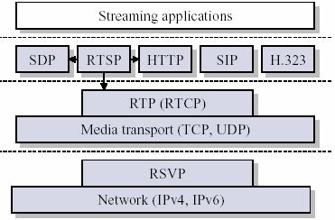
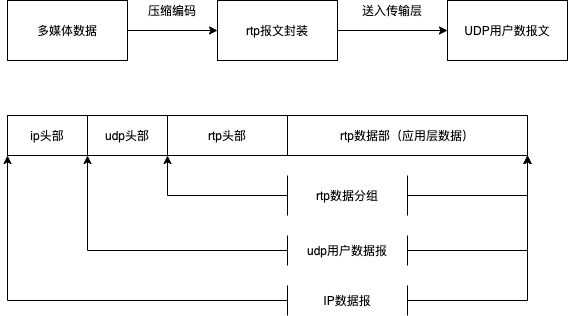
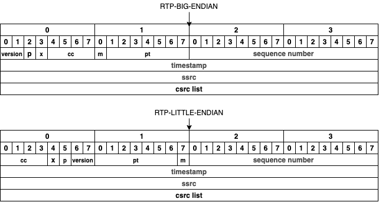
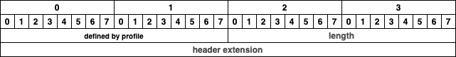

# rtp协议解析

​	rtp (实时传输协议)是一个网络传输协议，属于应用层协议

​	RTP协议详细说明了在互联网上传递音频和视频的标准数据包格式。它一开始被设计为一个多播协议，但后来被用在很多单播应用中。RTP协议常用于流媒体系统（配合RTSP协议），视频会议和一键通（Push to Talk）系统（配合H.323或SIP），使它成为IP电话产业的技术基础。RTP协议和RTP控制协议RTCP一起使用，而且它是创建在UDP协议上的。

​	rtp被划分在传输层，建立在udp上。同UDP协议一样，**为了实现其实时传输功能，RTP也有固定的封装形式。RTP用来为端到端的实时传输提供时间信息和流同步，但并不保证服务质量。服务质量由RTCP来提供。**

## Rtp协议封装

​	rtp传输过程中，根据以太网的MTU一般为1500字节，去除ip协议包头、udp协议包头和PPPoE协议内容，rtp数据分组最大值应为1400字节（这个只是标准值，实际值应该按照MTU大小来决定）。

​	注意 RTP 本身没有提供任何的机制来确保实时的传输或其他的服务质量保证，而是由低层的服务来完成。它不保证传输或防止乱序传输,它不假定下层网络是否可靠,是否按顺序传送数据包。RTP 包含的序列号允许接受方重构发送方的数据包顺序，但序列号也用来确定一个数据包的正确位置,例如,在视频解码的时候不用按顺序的对数据包进行解码。

## rtp head

​		

​	rtp头结构体的定义中大端和小端模式是有区别的，需要区分对待。

​	前 12 个字节出现在每个 RTP 包中，仅仅在被混合器插入时，才出现 CSRC 识别符列表。各个域的含义如下所示：

1. 版本(version)：2 比特，此域定义了 RTP 的版本。此协议定义的版本是 2。(值 1 被 RTP 草案版本使用,值 0 用在最初"vat"语音工具使用的协议中。)

2. 填充(P)：1 比特，若填料比特被设置,则此包包含一到多个附加在末端的填充比特,填充比特不算作负载的一部分。填充的最后一个字节指明可以忽略多少个填充比特。填充可能用于某些具有固定长度的加密算法，或者用于在底层数据单元中传输多个 RTP 包。

3. 扩展(X)：1 比特，若设置扩展比特,固定头(仅)后面跟随一个头扩展。

4. CSRC 计数(CC)：4 比特，CSRC 计数包含了跟在固定头后面 CSRC 识别符的数目。

5. 标志(M)：1 比特，标志的解释由具体协议规定。它用来允许在比特流中标记重要的事件,如帧边界。

6. 负载类型(PT)：7 比特，此域定义了负载的格式，由具体应用决定其解释，协议可以规定负载类型码和负载格式之间一个默认的匹配。其他的负载类型码可以通过非 RTP 方法动态定义。RTP发送端在任意给定时间发出一个单独的 RTP 负载类型；此域不用来复用不同的媒体流。

7. 序列号(sequence number)：16 比特，每发送一个 RTP 数据包,序列号加 1，接收端可以据此检测丢包和重建包序列。序列号的初始值是随机的(不可预测),以使即便在源本身不加密时(有时包要通过翻译器,它会这样做)，对加密算法泛知的普通文本攻击也会更加困难。

8. 时间戳(timestamp) ：32 比特，时间戳反映了 RTP 数据包中第一个字节的采样时间。时钟频率依赖于负载数据格式,并在描述文件(profile)中进行描述。也可以通过 RTP 方法对负载格式动态描述。

9. SSRC：32 比特，用以识别同步源。标识符被随机生成，以使在同一个 RTP 会话期中没有任何两个同步源有相同的 SSRC 识别符。尽管多个源选择同一个 SSRC 识别符的概率很低，所有 RTP 实现工具都必须准备检测和解决冲突。若一个源改变本身的源传输地址，必须选择新的SSRC 识别符，以避免被当作一个环路源。

   如音频编码。SSRC 标识符是一个随机选取的值，它在特定的 RTP 会话中是全局唯一(globally unique)的。参与者并不需要在一个多媒体会议的所有 RTP 会话中，使用相同的 SSRC 标识符；SSRC 标识符的绑定通过RTCP。如果参与者在一个 RTP 会话中生成了多个流，例如来自多个摄影机，则每个摄影机都必须标识成单独的同步源。

10. CSRC 列表：0 到 15 项，每项 32 比特，CSRC 列表识别在此包中负载的所有贡献源。识别符的数目在 CC 域中给定。若有贡献源多于 15 个，仅识别 15 个。CSRC 识别符由混合器插入，并列出所有贡献源的 SSRC 识别符。例如语音包，混合产生新包的所有源的 SSRC 标识符都被列出，以在接收端处正确指示参与者。

    提供信源用来标志对一个*RTP*混合器产生的新包有贡献的所有*RTP*包的源。是指当**混合器**接收到一个或多个同步信源的RTP报文后，经过混合处理产生一个新的组合RTP报文，并把混合器作为组合RTP报文的SSRC，而将原来所有的SSRC都作为CSRC传送给接收者，使接收者知道组成组合报文的各个SSRC。

<u>注：基本的RTP说明并不定义任何头扩展本身，如果遇到X=1，需要特殊处理</u>

若 RTP 固定头中的扩展比特位置 1，则一个长度可变的头扩展部分被加到 RTP 固定头之后，其格式如下：

​	头扩展包含 16 比特的长度域，指示扩展项中 32 比特字的个数，不包括 4 个字节扩展头(因此零是有效值)。RTP 固定头之后只允许有一个头扩展。为允许多个互操作实现独立生成不同的头扩展，或某种特定实现有多种不同的头扩展,扩展项的前 16 比特用以识别标识符或参数。这 16 比特的格式由具体实现的上层协议定义。基本的 RTP 说明并不定义任何头扩展本身。

