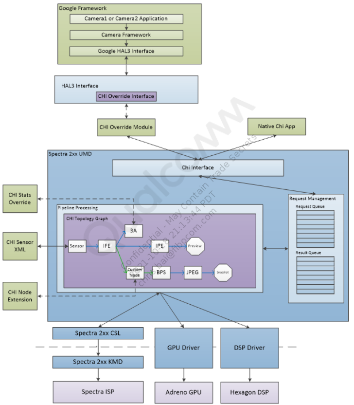
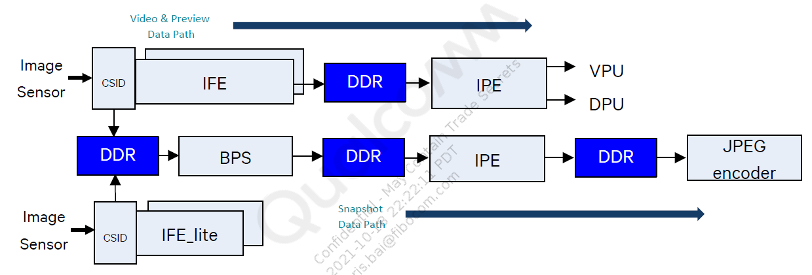

# camx

## 高通camx框架

目前高通主流芯片使用camera框架基本都是camx架构。 之前旧的架构叫做mm-camera，camx架构和之前架构代码更加复杂、具有较强的客制化。 我们先来看下camx整体的架构图：

- camx的框架入口为camx包中的`camxhal3entry.cpp`，代码路径在`vendor/qcom/proprietary/camx/`下,编译结果是`camera.qcom.so`
- Camx通过`chxentensionInterface`调用到chi-cdk包下的代码，这里面一般是手机厂商自己定制功能的地方，代码目录在`vendor/qcom/proprietary/chi-cdk/`，编译结果是`com.qti.chi.override.so`
- Chi对Camx的操作，需要通过`ExtensionModule`进行操作，因此，CamX对外提供的接口扩展需要通过`ExtensionModule`进行，里面一个重要的变量就是`g_chiContextOps`。
- Camx对Chi的操作，是通过`HAL3Module`接口的`m_ChiAppCallbacks`进行的，因此chi里面释放的接口，都会在`m_ChiAppCallbacks`里面体现。

## camera数据通路

在camx框架上大致的camera数据流向如下图：

- CSID: 摄像机串行接口解码器模块
- IFE：图像前端
- IFE_Lite：图像前端 lite
- BPS：Bayer处理区段
- IFE：图像处理引擎
- VPU：视频处理单元（编解码器）
- DPU：显示处理单元

这些都是表示的是芯片内部的一个硬件处理单元，数据在这些单元内部的处理还是比较复杂的，在不同的处理单元里面，会进行一些复杂的算法处理；有个认识，有个基本概念。

## Camx基本组件及概念

### usecase

是一种抽象概念；高通的介绍是*A set of streams configured by the client combined with a set of static properties specifying the processing of those streams*(由客户端配置的一组流，这组流是有着一系列静态属性相结合描述的流。)*See createCaptureSession in the Android CameraDevice documentation；*

具体实现是在CHI中通过Usecase类完成的，该类主要负责了其中的业务处理以及资源的管理。 简单说明：按照android 的Camera2 API来说；把预览的surface和录像的surface都设进去，然后去创建session，就是表示我预览和录像都需要拿到camera数据。假设我预览设置的size是1080 x 720，录像是1080p的，那这个1080 x 720预览+1080p录像就是一个usecase（用例）。

`CameraUsecaseBase`作为Usecase类的基类提供了一系列通用接口，其中，`AdvancedCameraUsecase`

又继承于`CameraUsecaseBase`，相机中绝大部分场景会通过实例化`AdvancedCameraUsecase`

来完成，它包括了几个主要接口：

- `create`创建`AdvancedCameraUsecase`实例，并获取相对应的Usecase配置信息
- `ExecuteCaptureRequest`用于下发一次Request
- `ProcessResultCb`在创建session时作为回调方法注册到其中，一旦Session数据处理完成的时候便会调用该方法将结果发送到`AdvancedCameraUsecase`中。
- `ProcessDriverPartialCaptureResult`在创建session时作为回调方法注册到其中，一旦Session中产生了partial meta data的时候，便会调用该方法将其发送至`AdvancedCameraUsecase`中。
- `ProcessMessageCb`在创建session时作为回调方法注册到其中，一旦Session产生任何事件，便会调用该方法通知到`AdvancedCameraUsecase`中。
- `ExecuteFlush`用于刷新`AdvancedCameraUsecase`。
- `Destroy`用于安全销毁`AdvancedCameraUsecase`。

### Feature

代表一个特定的功能。高通上的feature有HDR(高动态范围)、SuperNight（超级夜景）、MFNR（多帧降噪）等等,usecase选择相应的feature，然后关联一组pipeline，上层下发request请求，hal层会根据request去选择对应的feature。（*feature2内部代码相对复杂，目前还不太了解，还在学习过程中*）

### Node

单个具有独立处理功能的抽象模块，可以是软件单元也可以是硬件单元。Node是camx中非常重要的一个父类，是处理camera 请求的一个中间节点，用于处理pipeline下发的请求。Node 节点在camx chi架构中至关重要，数据的处理都是通过封装好的Node节点来进行的。 Node类其主要方法如下：

- `Create`: 用于实例化一个Node对象。
- `ExecuteProcessRequest`: 该方法用于针对hwl node下发request的操作。
- `ProcessRequestIdDone`: 一旦该Node当前request已经处理完成，便会通过调用该方法通知Pipeline。
- `ProcessMetadataDone`: 一旦该Node的当前request的metadata已经生成，便会通过调用该方法通知到Pipeline。
- `ProcessPartialMetadataDone`: 一旦该Node的当前request的partial metadata已经生成，便会通过调用该方法通知到Pipeline。
- `CreateImageBufferManager`: 创建`ImageBufferManager`

### Port

作为Node的输入输出的端口，每一个Node都可以根据需要使用一个或者多个输入输出端口，使用OutputPort以及InputPort结构体来进行在代码中定义。

### Link

用于定义不同Port的连接，一个Port可以根据需要建立多条与其它从属于不同Node的Port的连接,它通过标签来进行定义，其中包括了作为输入端口，作为输出端口。 一个Link中包含了一个SrcPort和一个DstPort，分别代表了输入端口和输出端口，然后BufferProperties用于表示两个端口之间的buffer配置。

### pipeline

作为提供单一特定功能的所有资源的集合，维护着所有硬件资源以及数据的流转，每一个Pipeline包括了其中的Node/Link，在CamX中通过Pipeline类进行实现，负责整条Pipeline的软硬件资源的维护以及业务逻辑的处理，接下来我们简单看下该类的几个主要接口：

- `Create`: 根据传入的`PipelineCreateInputData`信息来实例化一个Pipeline对象。
- `StreamOn`: 通知`Pipeline`开始硬件的数据传输
- `StreamOff`: 通知Pipeline停止硬件的数据传输
- `FinalizePipeline`: 用于完成Pipeline的设置工作
- `penRequest`: open一个CSL用于流转的Request
- `ProcessRequest`: 下发Request
- `NotifyNodeMetadataDone`: 该方法是Pipeline提供给Node，当Node内部生成了metadata,便会调用该方法来通知metadata已经完成，最后当所有Node都通知Pipeline metadata已经完成，Pipeline 便会调用`ProcessMetadataRequestIdDone`通知Session。
- `NotifyNodePartialMetadataDone`: 该方法是Pipeline提供给Node，当Node内部生成了partial metadata,便会调用该方法来通知metadata已经完成，最后当所有Node都通知Pipeline metadata已经完成，Pipeline 便会调用`ProcessPartialMetadataRequestIdDone`通知Session。
- `SinkPortFenceSignaled`: 用来通知Session 某个sink port的fence处于被触发的状态。
- `NonSinkPortFenceSignaled`: 用来通知Session 某个non sink port的fence处于被触发的状态。
