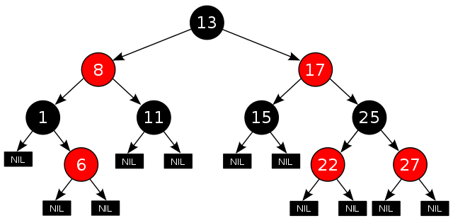
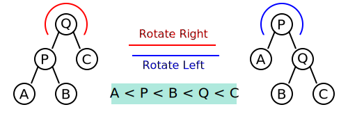
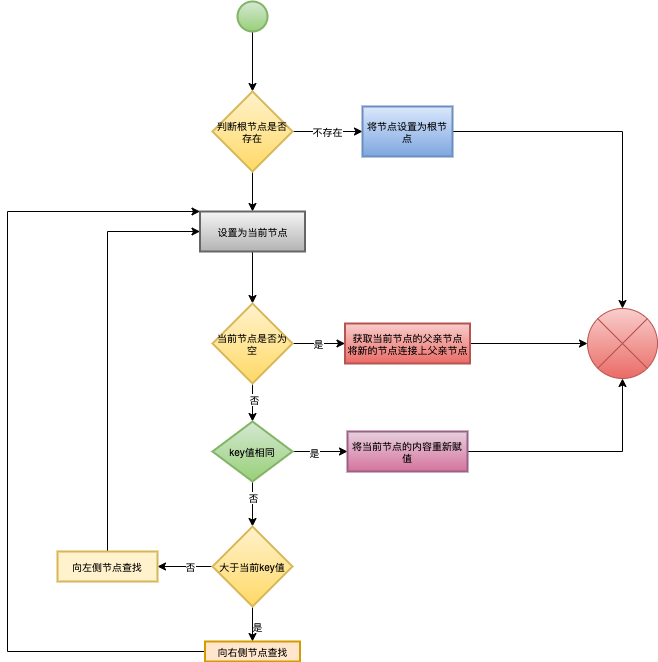

# 红黑树

​		**红黑树**（英语：Red–black tree）是一种自平衡二叉查找树,红黑树的结构复杂，但它的操作有着良好的最坏情形运行时间，查找、插入和删除时间复杂度为O(logn)。

​		其实红黑树也是二叉查找树的一种，二叉查找树在最坏的情形下可能会变成一个链表（当所有 节点按从小到大的顺序依次插入后）；这样树的平衡性被破坏，要提高查询效率需要维持这种平衡和降低树的高度，而其中可性的做法就是用策略在每次修改树的内容之后进行结构调整，使其保持一定的平衡条件；而红黑树就是其中一员。

## 优点

​	红黑树在插入时间、删除时间和查找时间提供最好可能的最坏情形担保，多数用时间敏感或者实时性强的应用中。

​	红黑树相对于AVL树来说，牺牲了部分平衡性以换取插入和删除操作时少量的旋转操作，整体来说性能要优于AVL树

## 性质

​	红黑树是每个节点都带有颜色属性的二叉查找树，颜色为红色或黑色。还需遵循以下规则：

1. 节点分为红色或者黑色
2. 根节点比必须是黑色
3. 所有叶子都是黑色（叶子是NIL节点，或者称为空（NULL）叶子）
4. 每个红色节点必须有两个黑色的子节点。（从每个叶子到根的所有路径上不能有两个连续的红色节点。）
5. 从任一节点到其每个叶子的所有简单路径都包含相同数目的黑色节点。

**红黑树的图例：**




## 操作

​			在红黑树上进行插入操作和删除操作会导致不再符合红黑树的性质，因此需对红黑树进行性质的恢复，但必须做到少量.svg)的颜色变更,而且不超过三次树旋转（对于插入操作是两次）；由此可以看出红黑树的插入和删除复杂，但是操作时间仍然可以保持O(logn)

### 树旋转

​		**树旋转**是不影响元素顺序，但会改变树的结构，将一个节点上移、一个节点下移；

​		左孩子旋转到父节点的位置为**右旋**；

​		右孩子旋转到父节点的位置为**左旋**；				

​		

红黑树的左旋代码如下：

```c
static void __rb_rotate_left(struct rb_node *node, struct rb_root *root)
{
	struct rb_node *right = node->rb_right;//取出node的右节点
	struct rb_node *parent = rb_parent(node);//取出node的父亲节点

	if ((node->rb_right = right->rb_left))//node的右子节点指向right的左子节点时
		rb_set_parent(right->rb_left, node);//并将right的左子节点与right脱离，right的左子节点的父亲节点指向node
	right->rb_left = node;//将right的左子节点重新指向node
	/****  到现在就完成了，node右侧树与node脱离，接下来就是将脱离的右侧树重新连接parent  *****/
	rb_set_parent(right, parent);//将right的父亲节点指向node父亲节点
  
	if (parent)//node非根节点
	{
		if (node == parent->rb_left)//判断node所在parent的方向并将parent对应的节点重新指向right
			parent->rb_left = right;
		else
			parent->rb_right = right;
	}
	else //node是根节点，那将right设置为根节点
		root->rb_node = right;
	rb_set_parent(node, right);//最后将node的父亲节点设置为right
}
```

红黑树的右旋代码如下：

```c
static void __rb_rotate_right(struct rb_node *node, struct rb_root *root)
{
	struct rb_node *left = node->rb_left;//取出node的左节点
	struct rb_node *parent = rb_parent(node);//取出node的父亲节点

	if ((node->rb_left = left->rb_right))//将node的左子节点指向left的右子节点
		rb_set_parent(left->rb_right, node);//将left的右子节点的父亲节点指向node
	left->rb_right = node;//将left的右子节点重新指向node
	/****  到现在就完成了，node左侧树与node脱离，接下来就是将脱离的左侧树重新连接parent  *****/
	rb_set_parent(left, parent);//将left的父亲节点指向node父亲节点

	if (parent)//node非根节点
	{
		if (node == parent->rb_right)//判断node所在parent的方向并将parent对应的节点重新指向left
			parent->rb_right = left;
		else
			parent->rb_left = left;
	}
	else//node是根节点，那将left设置为根节点
		root->rb_node = left;
	rb_set_parent(node, left);//最后将node的父亲节点设置为left
}
```

### 颜色调换

​		保持红黑树的性质，结点不能乱挪，还得靠变色了；具体怎么样来调整颜色还要看插入和删除的情形来定，在说明插入和删除操作的时候来详细说明，所以现在只需记住**红黑树总是通过旋转和变色达到自平衡**。

### 插入

​		首先在增加节点时，将其标记成红色，如果设置为黑色就会导致根到叶子的路径上有一条路上，多一个额外的黑节点，这个是很难调整的。但是设为红色节点后，可能会导致出现两个连续红色节点的冲突，那么可以通过颜色调换（color flips）和树旋转来调整。

流程图如下：



完成以上流程只是找到具体的插入位置，但在插入之后需重新调整平衡来保持红黑树的基本属性，进行重新调整平衡实现代码如下：

```c
void rb_insert_color(struct rb_node *node, struct rb_root *root)//已经查找到相应的位置，进行重新调整平衡
{
	struct rb_node *parent, *gparent;

	while ((parent = rb_parent(node)) && rb_is_red(parent))//取出父亲节点，并父亲节点是红色的时候
	{
		gparent = rb_parent(parent);//获取祖父节点

		if (parent == gparent->rb_left)//如果父亲节点是在祖父节点左侧
		{
			{
				register struct rb_node *uncle = gparent->rb_right;
				if (uncle && rb_is_red(uncle))//存在在叔叔节点，父亲节点和叔叔节点都为红色，当父亲节点在祖父节点左侧
				{
					rb_set_black(uncle);//将父亲节点和叔叔节点都置为黑色
					rb_set_black(parent);
					rb_set_red(gparent);//再将祖父节点置为红色 （保持性质5）
					node = gparent;//将祖父节点当成是新加入的节点进行各种情形的檢查
					continue;
				}
			}

      //情形4、当父亲节点为红色，叔叔节点缺失或为黑色，新节点为其父亲节点的右侧时，其父亲节点在祖父节点左侧
			if (parent->rb_right == node)
			{
				register struct rb_node *tmp;
				__rb_rotate_left(parent, root);//针对父亲节点进行一次左旋转，并将新节点位置和其父亲节点位置进行交换
				tmp = parent;
				parent = node;
				node = tmp;
			}
      //完成情形4，还需解决仍然失效的性质4；
      //情形5、将父亲节点置为黑色，在将祖父节点置为红色，并针对祖父节点进行一次右旋转，使其结果满足性质4
			rb_set_black(parent);
			rb_set_red(gparent);
			__rb_rotate_right(gparent, root);
		} else {//如果父亲节点是在祖父节点右侧，
     
			{
				register struct rb_node *uncle = gparent->rb_left;
				if (uncle && rb_is_red(uncle))//存在在叔叔节点，父亲节点和叔叔节点都为红色，当父亲节点在祖父节点右侧
				{
					rb_set_black(uncle);//将父亲节点和叔叔节点都置为黑色
					rb_set_black(parent);
					rb_set_red(gparent);//再将祖父节点置为红色 （保持性质5）
					node = gparent;//将祖父节点当成是新加入的节点进行各种情形的檢查
					continue;
				}
			}
 			//因为父亲节点是在祖父节点右侧，情形4和情形5中的左和右应当对调。
			if (parent->rb_left == node)
			{
				register struct rb_node *tmp;
				__rb_rotate_right(parent, root);
				tmp = parent;
				parent = node;
				node = tmp;
			}

			rb_set_black(parent);
			rb_set_red(gparent);
			__rb_rotate_left(gparent, root);
		}
	}

	rb_set_black(root->rb_node);//将根节点设置为黑色（保持性质2）
}
```

#### 情形一

​		新节点在树的根节点上，只需将根节点重置为黑色，保持性质2。

#### 情形二

​		新节点的父亲节点为黑色，所以性质4没有失效，由于每次新增加的节点都为红色，尽管新节点存在两个黑色叶子节点，但是通過它的每个子节点的路径和它所取代的黑色的叶子的路径具有相同数目的黑色节点，所以满足性质5

#### 情形三

​		存在在叔叔节点，父亲节点和叔叔节点都为红色，将父亲节点和叔叔节点都置为黑色，再将祖父节点置为红色 ，这样就保持了性质5；紅色的祖父节点可能是根节点，这就违反了性质2，也有可能祖父节点的父节点是紅色的，这就违反了性质4；这种情形下需将祖父节点当成是新加入的节点进行各种情形的檢查。


**注意：***<u>在余下的情形下，假设父亲节点是在祖父节点左侧，如果父亲节点是在祖父节点右侧，情形4和情形5中的左和右应当对调。</u>*

#### 情形四

​		当父亲节点为红色，叔叔节点缺失或为黑色，新节点为其父亲节点的右侧时，其父亲节点在祖父节点左侧；针对父亲节点进行一次左旋转，并将新节点位置和其父亲节点位置进行交换；完成这种情形后，还需解决仍然失效的性质4，那就进行情形5处理；


#### 情形五

​		当父亲节点为红色，叔叔节点缺失或为黑色，新节点为其父亲节点的左侧时，其父亲节点在祖父节点左侧；将父亲节点置为黑色，在将祖父节点置为红色，并针对祖父节点进行一次右旋转，使其结果满足性质4；性质5也仍然保持滿足，因为通过这三個节点中任何一個的所有路径以前都通过祖父节点，現在它們都通过以前的父节点。在各自的情形下，这都是三个节点中唯一的黑色节点。


### 删除

​		删除是红黑树最复杂的操作；红黑树的删除操作也包括两部分工作：一查找目标结点；二是删除后重新调整平衡。

具体代码如下：

```c
void rb_erase(struct rb_node *node, struct rb_root *root)
{
	struct rb_node *child, *parent;
	int color;

	if (!node->rb_left)//不存在左子节点
		child = node->rb_right;
	else if (!node->rb_right)//不存在右子节点
		child = node->rb_left;
	else//存在两个子节点
	{
		struct rb_node *old = node, *left;

		node = node->rb_right;//将右孩子节点设置当前节点
		while ((left = node->rb_left) != NULL)//找到old节点右侧的最小值节点
			node = left;
    //将old节点与其父亲节点脱离，并将其位置替换其右侧最小值节点
		if (rb_parent(old)) {
			if (rb_parent(old)->rb_left == old)
				rb_parent(old)->rb_left = node;
			else
				rb_parent(old)->rb_right = node;
		} else
			root->rb_node = node;

		child = node->rb_right;
		parent = rb_parent(node);
		color = rb_color(node);
    
		if (parent == old) {
			parent = node;
		} else {
      //node节点脱离原先的位置，如果node节点存在右子节点，将其的位置由右子节点代替
			if (child)
				rb_set_parent(child, parent);
			parent->rb_left = child;
      //node节点继承old节点的右孩子节点
			node->rb_right = old->rb_right;
			rb_set_parent(old->rb_right, node);
		}
   //并继承old节点的父亲节点和左子节点
		node->rb_parent_color = old->rb_parent_color;
		node->rb_left = old->rb_left;
		rb_set_parent(old->rb_left, node);

		goto color;//重新调整平衡
	}
  
  //old节点只存在一个孩子节点或者没有孩子节点
	parent = rb_parent(node);
	color = rb_color(node);

	if (child)
		rb_set_parent(child, parent);
	if (parent)
	{
		if (parent->rb_left == node)
			parent->rb_left = child;
		else
			parent->rb_right = child;
	}
	else
		root->rb_node = child;

 color:
  //如果存在两个子节点时，如何新的节点时黑色，需重新调整平衡
  //如果old节点存在一个或者不存在子节点，old节点为黑色，也需重新调整平衡
	if (color == RB_BLACK)
		__rb_erase_color(child, parent, root);
}


static void __rb_erase_color(struct rb_node *node, struct rb_node *parent,
			     struct rb_root *root)
{
	struct rb_node *other;

	while ((!node || rb_is_black(node)) && node != root->rb_node)//node节点是黑色，而不为根节点
	{
		if (parent->rb_left == node)//node节点在其父亲节点左侧时
		{
			other = parent->rb_right;
			if (rb_is_red(other))
			{
        //情形二：当node的兄弟节点为红色时，将node节点和其兄弟节点设置为黑色，父节点设置为黑色，并且针对父节点进行左旋转一次
				rb_set_black(other);
				rb_set_red(parent);
				__rb_rotate_left(parent, root);
				other = parent->rb_right;
			}
      
			if ((!other->rb_left || rb_is_black(other->rb_left)) &&
			    (!other->rb_right || rb_is_black(other->rb_right)))
			{
        //情形三
        //如果兄弟节点的不存在孩子节点或者孩子节点都为黑色时，将兄弟节点置成红色，并且找到祖父节点
				rb_set_red(other);
				node = parent;
				parent = rb_parent(node);
        //针对node的父亲节点重新调整平衡，重新回到循环
			}
			else
			{
				if (!other->rb_right || rb_is_black(other->rb_right))
				{// 如果兄弟节点的不存在右子节点或者右子节点为黑色；
          //将兄弟节点的左孩子置为黑色，自己置成红色，并且针对兄弟节点进行一些右旋转一次
					rb_set_black(other->rb_left);
					rb_set_red(other);
					__rb_rotate_right(other, root);
					other = parent->rb_right;//找到新的兄弟节点
				}
				rb_set_color(other, rb_color(parent));//将兄弟节点的颜色设置成与父节点相同
				rb_set_black(parent);//将父节点设置成黑色
				rb_set_black(other->rb_right);//兄弟的节点的右子节点设置为黑色
				__rb_rotate_left(parent, root);//在针对父节点左旋转一次
				node = root->rb_node;//退出循环，已经为保证红黑树的基本属性
				break;
			}
		}
		else
		{//node节点在其父亲节点右侧时，和在左侧的处理方式一样，
			other = parent->rb_left;
			if (rb_is_red(other))
			{
				rb_set_black(other);
				rb_set_red(parent);
				__rb_rotate_right(parent, root);
				other = parent->rb_left;
			}
			if ((!other->rb_left || rb_is_black(other->rb_left)) &&
			    (!other->rb_right || rb_is_black(other->rb_right)))
			{
				rb_set_red(other);
				node = parent;
				parent = rb_parent(node);
			}
			else
			{
				if (!other->rb_left || rb_is_black(other->rb_left))
				{
					rb_set_black(other->rb_right);
					rb_set_red(other);
					__rb_rotate_left(other, root);
					other = parent->rb_left;
				}
				rb_set_color(other, rb_color(parent));
				rb_set_black(parent);
				rb_set_black(other->rb_left);
				__rb_rotate_right(parent, root);
				node = root->rb_node;
				break;
			}
		}
	}
	if (node)//将根节点置成黑色
		rb_set_black(node);
}
```

#### 情形一

新节点在树的根节点上，删除黑色的根节点。

**注意**：<u>*在情形2、5和6下，我们假定N是它父亲的左儿子。如果它是右儿子，则在这些情形下的左和右应当对调。*</u>

#### 情形二

当node的兄弟节点为红色时，并且针对父节点进行左旋转一次，把红色兄弟转换成node的祖父，我们接着对调node的父亲和祖父的颜色。尽管所有路径上黑色节点的数目没有改变，但现在N有了一个黑色的兄弟和一个红色的父亲，所以我们可以接下去按**情形4**、**情形5**或**情形6**来处理。


#### 情形三

在父节点和兄弟节点、兄弟节点的孩子节点都是黑色的情况下，将兄弟节点置成红色，。结果是通过兄弟节点的所有路径，它们就是以前不通过node的那些路径，都少了一个黑色节点。因为删除N的初始的父亲使通过N的所有路径少了一个黑色节点，这使事情都平衡了起来。但是，通过父节点的所有路径现在比不通过父节点的路径少了一个黑色节点，所以仍然违反性质5。所以需针对node的父亲节点重新调整平衡；


#### 情形四

兄弟节点是黑色，兄弟节点的左儿子是红色，兄弟节点的右儿子是黑色，而node是它父亲的左儿子。在这种情形下我们在兄弟节点上做右旋转，这样兄弟节点的左儿子成为兄弟节点的父亲和node的新兄弟。我们接着交换兄弟节点和它的新父亲的颜色。所有路径仍有同样数目的黑色节点，但是现在node有了一个黑色兄弟，他的右儿子是红色的，所以我们进入了**情形6**。node和它的父亲都不受这个变换的影响。


#### 情形五

 兄弟节点和兄弟节点的儿子都是黑色，但是node的父亲是红色。在这种情形下，我们简单的交换N的兄弟和父亲的颜色。这不影响不通过N的路径的黑色节点的数目，但是它在通过N的路径上对黑色节点数目增加了一，添补了在这些路径上删除的黑色节点。


#### 情形六

兄弟节点是黑色，兄弟节点的右儿子是红色，而node是它父亲的左儿子。在这种情形下我们在N的父亲上做左旋转，这样兄弟节点成为N的父亲节点和兄弟节点的右儿子的父亲。我们接着交换N的父亲和兄弟节点的颜色，并使兄弟节点的右儿子为黑色。子树在它的根上的仍是同样的颜色，所以性质3没有被违反。但是，N现在增加了一个黑色祖先：要么node的父亲变成黑色，要么它是黑色而兄弟节点被增加为一个黑色祖父。所以，通过node的路径都增加了一个黑色节点。

此时，如果一个路径不通过node，则有两种可能性：

- 它通过node的新兄弟。那么它以前和现在都必定通过兄弟节点和node的父亲，而它们只是交换了颜色。所以路径保持了同样数目的黑色节点。
- 它通过node的新叔父，兄弟节点的右儿子。那么它以前通过兄弟节点、兄弟节点的父亲和兄弟节点的右儿子，但是现在只通过兄弟节点，它被假定为它以前的父亲的颜色，和S的右儿子，它被从红色改变为黑色。合成效果是这个路径通过了同样数目的黑色节点。

在任何情况下，在这些路径上的黑色节点数目都没有改变。所以我们恢复了性质4。在示意图中的白色节点可以是红色或黑色，但是在变换前后都必须指定相同的颜色。


### 	外部链接

参考维基百科和linux内核中的红黑树，以帮助自我记忆和学习；

[维基百科](https://zh.wikipedia.org/wiki/%E7%BA%A2%E9%BB%91%E6%A0%91)

 [Linux内核实现的红黑树](https://www.jianshu.com/p/e136ec79235c)

[某大神](https://www.jianshu.com/p/e136ec79235c)

